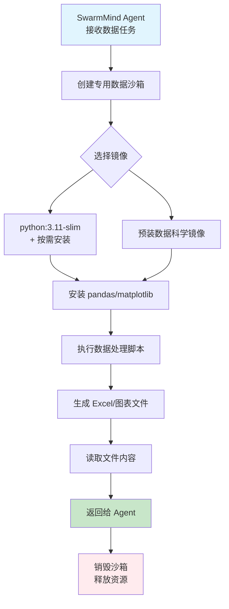

# OpenSandbox 操作指南（启动、资源分配、命令执行）

> 面向 SwarmMind 项目的实操手册：如何把 OpenSandbox 跑起来，并稳定用于“多智能体任务执行环境”。

---

## 1. OpenSandbox 在你的系统里扮演什么角色

OpenSandbox 是 **沙箱控制平面**：
- 负责创建/查询/销毁 sandbox（生命周期 API）
- 把 sandbox 跑在 Docker 或 Kubernetes
- 对 sandbox 内提供命令执行、文件操作、代码执行能力（通过 execd）

建议你在 SwarmMind 内使用“适配层”调用 OpenSandbox，而不是直接写 Docker/K8s 指令。

---

## 2. 运行前准备（Windows 场景）

## 2.1 基础依赖

- Python 3.10+
- `uv`（推荐）或 `pip`
- Docker Desktop（启用 WSL2）
- 如果要上 K8s：可用集群 + `kubectl`

## 2.2 Windows 注意事项

- 官方推荐运行环境是 Linux/macOS，Windows 建议通过 WSL2 使用。
- 若 OpenSandbox Server 在容器中运行，且用 bridge 网络，请设置 `host_ip`（例如 `host.docker.internal`）。

---

## 3. 最快启动（Docker 本地）

## 3.1 安装 server

```powershell
uv pip install opensandbox-server
```

## 3.2 生成配置

```powershell
opensandbox-server init-config ~/.sandbox.toml --example docker
```

## 3.3 编辑配置（最小可用模板）

```toml
[server]
host = "0.0.0.0"
port = 45698
log_level = "INFO"
api_key = "change-me-strong-key"

[runtime]
type = "docker"
execd_image = "opensandbox/execd:v1.0.6"

[docker]
network_mode = "bridge"    # 推荐 bridge；host 模式隔离较弱且并发受限
host_ip = "host.docker.internal"

# 可选安全增强
drop_capabilities = ["AUDIT_WRITE", "MKNOD", "NET_ADMIN", "NET_RAW", "SYS_ADMIN", "SYS_MODULE", "SYS_PTRACE", "SYS_TIME", "SYS_TTY_CONFIG"]
no_new_privileges = true
pids_limit = 512
```

## 3.4 启动服务

```powershell
opensandbox-server --config ~/.sandbox.toml
```

## 3.5 健康检查

```powershell
curl http://localhost:45698/health
```

预期：

```json
{"status":"healthy"}
```

---

## 4. 如何“分配资源”（CPU/内存/GPU）

资源不是在 server 全局配置里固定，而是 **创建 sandbox 时按请求指定**。

## 4.1 生命周期 API 中传资源

`POST /v1/sandboxes` 请求体示例：

```json
{
  "image": {"uri": "python:3.11-slim"},
  "entrypoint": ["python", "-m", "http.server", "8000"],
  "timeout": 3600,
  "resourceLimits": {
    "cpu": "500m",
    "memory": "512Mi",
    "gpu": "1"
  },
  "env": {
    "PYTHONUNBUFFERED": "1"
  },
  "metadata": {
    "task_id": "task-123",
    "agent_id": "coder-agent"
  }
}
```

## 4.2 资源规划建议（给 SwarmMind）

- `py-basic`：`cpu=500m~1`, `memory=512Mi~1Gi`
- `test-heavy`：`cpu=1~2`, `memory=2Gi`
- `browser/GUI`：`cpu>=2`, `memory>=4Gi`
- 每类任务绑定 profile，避免 agent 随意申请资源。

---

## 5. 生命周期 API：完整控制流程

假设 API Key 放在环境变量：

```powershell
$env:OPEN_SANDBOX_API_KEY="change-me-strong-key"
```

Ubuntu/Linux（bash/zsh）：

```bash
export OPEN_SANDBOX_API_KEY="osb_4f9d1c3a7b8e2f6049a1d5e7c2b3f8a6c9d0e1f2a3b4c5d6"
```

## 5.1 创建 sandbox

```bash
curl -X POST "http://localhost:45698/v1/sandboxes" \
  -H "OPEN-SANDBOX-API-KEY: $OPEN_SANDBOX_API_KEY" \
  -H "Content-Type: application/json" \
  -d '{
    "image":{"uri":"python:3.11-slim"},
    "entrypoint":["python","-m","http.server","8000"],
    "timeout":3600,
    "resourceLimits":{"cpu":"500m","memory":"512Mi"}
  }'
```

## 5.2 查询 sandbox

```bash
export OPEN_SANDBOX_ID="0109325f-4322-4b24-a6b8-57f26e40116c"
```

```powershell
curl -H "OPEN-SANDBOX-API-KEY: $env:OPEN_SANDBOX_API_KEY" \
  "http://localhost:45698/v1/sandboxes/<sandbox_id>"
```

```bash
curl -H "OPEN-SANDBOX-API-KEY: $OPEN_SANDBOX_API_KEY" \
  "http://localhost:45698/v1/sandboxes/$OPEN_SANDBOX_ID"
```

## 5.3 获取端口访问地址

```powershell
curl -H "OPEN-SANDBOX-API-KEY: $env:OPEN_SANDBOX_API_KEY" \
  "http://localhost:45698/v1/sandboxes/<sandbox_id>/endpoints/8000"
```

```bash
curl -H "OPEN-SANDBOX-API-KEY: $OPEN_SANDBOX_API_KEY" \
  "http://localhost:45698/v1/sandboxes/$OPEN_SANDBOX_ID/endpoints/8000"
```

## 5.4 续期（TTL）

```powershell
curl -X POST "http://localhost:45698/v1/sandboxes/<sandbox_id>/renew-expiration" `
  -H "OPEN-SANDBOX-API-KEY: $env:OPEN_SANDBOX_API_KEY" `
  -H "Content-Type: application/json" `
  -d '{"expiresAt":"2026-03-05T15:00:00Z"}'
```

## 5.5 删除 sandbox

```powershell
curl -X DELETE \
  -H "OPEN-SANDBOX-API-KEY: $env:OPEN_SANDBOX_API_KEY" \
  "http://localhost:45698/v1/sandboxes/<sandbox_id>"
```

---

## 6. 如何“接收命令并执行”

你有两种方式：

## 6.1 方式 A（推荐）：通过 OpenSandbox SDK

适合 SwarmMind 的 `SandboxProvider` 适配层，最稳定。

```python
import asyncio
from datetime import timedelta
from opensandbox import Sandbox
from opensandbox.models import WriteEntry

async def main():
    sandbox = await Sandbox.create(
        "opensandbox/code-interpreter:v1.0.1",
        entrypoint=["/opt/opensandbox/code-interpreter.sh"],
        timeout=timedelta(minutes=10),
    )

    async with sandbox:
        # 执行命令
        execution = await sandbox.commands.run("echo 'hello from sandbox'")
        print(execution.logs.stdout[0].text)

        # 写文件
        await sandbox.files.write_files([
            WriteEntry(path="/tmp/a.txt", data="hello", mode=644)
        ])

        # 读文件
        content = await sandbox.files.read_file("/tmp/a.txt")
        print(content)

    await sandbox.kill()

asyncio.run(main())
```

> 建议：SwarmMind 的 Agent 不要直接碰 SDK，而是通过你自己的 `run_command/read_file/write_file` 工具封装。

## 6.2 方式 B：直接调用 execd HTTP API

适合你要做“协议级控制”或流式输出（SSE）时使用。

execd 关键接口（官方 specs）：
- `POST /command`：执行 shell 命令（支持流式输出）
- `GET /command/status/{session}`：查会话状态
- `GET /command/output/{session}`：取 stdout/stderr
- `POST /code`：执行代码
- `GET /metrics`：资源指标

认证头为：`X-EXECD-ACCESS-TOKEN`

> 注意：access token 的获取与透传应由生命周期层/SDK 管理，建议优先 SDK 方式，减少你自己维护协议细节的成本。

---

## 7. 容器内数据操作与任务执行（Excel/图表）

> 针对 SwarmMind 中需要处理数据分析、生成报表、绘制图表的智能体任务。

## 7.1 为什么要在容器内操作 Excel/图表

- **环境隔离**：Excel 处理依赖 pandas、openpyxl、matplotlib 等库，版本冲突常见。
- **资源控制**：生成大型 Excel 或复杂图表可能消耗较多 CPU/内存，容器可限制上限。
- **文件安全**：容器销毁后自动清理临时文件，避免磁盘残留。
- **依赖预装**：可使用预装好数据科学工具的专用镜像。

## 7.2 专用 Python 容器镜像选择

OpenSandbox 支持任何 Docker 镜像，推荐：

| 镜像 | 预装工具 | 适用场景 |
|------|----------|----------|
| `python:3.11-slim` | 仅 Python 基础 | 需自行 pip install 依赖 |
| `opensandbox/code-interpreter:v1.0.1` | Python + 基础数据科学库 | 通用代码执行 |
| `jupyter/datascience-notebook` | pandas, numpy, matplotlib, seaborn | 数据分析与图表 |
| `custom/swarmmind-data`（自定义） | 按需固化依赖 | 生产环境稳定版本 |

## 7.3 完整示例：生成 Excel 并绘制图表

以下示例演示如何在 sandbox 中：
1. 安装必要包（pandas, openpyxl, matplotlib）
2. 生成模拟数据
3. 写入 Excel 文件
4. 创建图表并保存为图片
5. 读取生成的文件内容

```python
import asyncio
from datetime import timedelta
from opensandbox import Sandbox
from opensandbox.models import WriteEntry

async def generate_excel_and_chart():
    # 1. 创建包含 Python 环境的 sandbox
    sandbox = await Sandbox.create(
        "python:3.11-slim",
        entrypoint=["tail", "-f", "/dev/null"],  # 保持容器运行
        timeout=timedelta(minutes=15),
        resourceLimits={"cpu": "1", "memory": "1Gi"},
        env={"PYTHONUNBUFFERED": "1"}
    )

    async with sandbox:
        # 2. 安装依赖（如果镜像未预装）
        await sandbox.commands.run("pip install pandas openpyxl matplotlib seaborn")

        # 3. 写入 Python 脚本到容器内
        script = """
import pandas as pd
import numpy as np
import matplotlib.pyplot as plt
import seaborn as sns
from datetime import datetime, timedelta

# 生成模拟销售数据
dates = pd.date_range('2024-01-01', periods=30, freq='D')
categories = ['电子产品', '服装', '食品', '家居', '图书']
data = []
for date in dates:
    for cat in categories:
        sales = np.random.randint(100, 1000)
        profit = sales * np.random.uniform(0.1, 0.3)
        data.append({
            '日期': date,
            '品类': cat,
            '销售额': sales,
            '利润': round(profit, 2)
        })

df = pd.DataFrame(data)

# 1. 保存为 Excel 文件（多个 sheet）
with pd.ExcelWriter('/tmp/sales_report.xlsx', engine='openpyxl') as writer:
    df.to_excel(writer, sheet_name='原始数据', index=False)

    # 添加汇总 sheet
    summary = df.groupby('品类').agg({
        '销售额': ['sum', 'mean', 'count'],
        '利润': 'sum'
    }).round(2)
    summary.columns = ['销售额_总和', '销售额_均值', '订单数', '利润_总和']
    summary.to_excel(writer, sheet_name='品类汇总')

    # 添加日期汇总
    daily = df.groupby(df['日期'].dt.date).agg({'销售额': 'sum', '利润': 'sum'})
    daily.to_excel(writer, sheet_name='每日汇总')

print("Excel 文件生成完成: /tmp/sales_report.xlsx")

# 2. 生成图表
plt.figure(figsize=(12, 8))

# 子图1: 品类销售额柱状图
plt.subplot(2, 2, 1)
category_sales = df.groupby('品类')['销售额'].sum().sort_values(ascending=False)
category_sales.plot(kind='bar', color='skyblue')
plt.title('各品类销售额对比')
plt.ylabel('销售额')
plt.xticks(rotation=45)

# 子图2: 每日销售额趋势
plt.subplot(2, 2, 2)
daily_sales = df.groupby(df['日期'].dt.date)['销售额'].sum()
daily_sales.plot(kind='line', marker='o', color='green')
plt.title('每日销售额趋势')
plt.ylabel('销售额')
plt.xticks(rotation=45)

# 子图3: 品类利润饼图
plt.subplot(2, 2, 3)
category_profit = df.groupby('品类')['利润'].sum()
plt.pie(category_profit, labels=category_profit.index, autopct='%1.1f%%')
plt.title('各品类利润占比')

# 子图4: 销售额与利润散点图
plt.subplot(2, 2, 4)
plt.scatter(df['销售额'], df['利润'], alpha=0.6, color='purple')
plt.xlabel('销售额')
plt.ylabel('利润')
plt.title('销售额 vs 利润关系')

plt.tight_layout()
plt.savefig('/tmp/sales_charts.png', dpi=150, bbox_inches='tight')
print("图表生成完成: /tmp/sales_charts.png")

# 3. 输出统计信息
print(f"数据总量: {len(df)} 行")
print(f"时间范围: {df['日期'].min()} 到 {df['日期'].max()}")
print(f"总销售额: {df['销售额'].sum():,.0f}")
print(f"总利润: {df['利润'].sum():,.2f}")
"""

        await sandbox.files.write_files([
            WriteEntry(path="/tmp/generate_report.py", data=script, mode=644)
        ])

        # 4. 执行脚本
        execution = await sandbox.commands.run("python /tmp/generate_report.py")
        print("脚本输出:", execution.logs.stdout[0].text)

        # 5. 读取生成的 Excel 文件（前几行）
        excel_content = await sandbox.files.read_file("/tmp/sales_report.xlsx", encoding="utf-8")
        print(f"Excel 文件大小: {len(excel_content)} 字节")

        # 6. 读取图表图片
        chart_content = await sandbox.files.read_file("/tmp/sales_charts.png", encoding="utf-8")
        print(f"图表文件大小: {len(chart_content)} 字节")

        # 7. 可选：将文件下载到本地
        # 这里可以添加代码将文件通过 HTTP 或其他方式传输到 SwarmMind 存储

        print("任务完成！")

    await sandbox.kill()

# 运行示例
asyncio.run(generate_excel_and_chart())
```

## 7.4 简化封装：SwarmMind DataAgent 工具函数

在实际 SwarmMind 项目中，建议封装为可重用的工具函数：

```python
from opensandbox import Sandbox
from typing import Optional, Dict, Any
import base64

class DataProcessor:
    def __init__(self, sandbox_provider):
        self.sandbox_provider = sandbox_provider

    async def generate_excel_report(
        self,
        data: Dict[str, Any],
        template: Optional[str] = None
    ) -> bytes:
        """生成 Excel 报表并返回文件内容"""
        sandbox = await self.sandbox_provider.create_sandbox(
            image="jupyter/datascience-notebook",
            resource_limits={"cpu": "1", "memory": "2Gi"}
        )

        try:
            # 将数据写入容器
            await sandbox.files.write_json("/tmp/input_data.json", data)

            # 执行报表生成脚本
            result = await sandbox.commands.run(
                "python /app/generate_report.py /tmp/input_data.json /tmp/output.xlsx"
            )

            if result.exit_code != 0:
                raise RuntimeError(f"报表生成失败: {result.logs.stderr}")

            # 读取生成的 Excel
            excel_bytes = await sandbox.files.read_file("/tmp/output.xlsx", binary=True)
            return excel_bytes

        finally:
            await sandbox.kill()

    async def create_chart(
        self,
        data: Dict[str, Any],
        chart_type: str = "bar",
        title: str = "Chart"
    ) -> bytes:
        """生成图表并返回 PNG 图片"""
        # 类似实现，使用 matplotlib/seaborn
        pass
```

## 7.5 性能优化与最佳实践

1. **镜像预热**：对高频使用的数据镜像提前 pull 到本地，减少创建时间。
2. **依赖缓存**：在自定义镜像中固化 pandas、matplotlib 等依赖，避免每次安装。
3. **资源调整**：
   - 小型 Excel（<10MB）：`cpu=500m`, `memory=512Mi`
   - 中型报表（10-100MB）：`cpu=1`, `memory=2Gi`
   - 大型数据处理（>100MB）：`cpu=2`, `memory=4Gi` + 考虑分片处理
4. **文件传输优化**：
   - 小文件：直接通过 files API 读取二进制
   - 大文件：使用容器内 HTTP server 流式下载
5. **错误处理**：
   - 监控 sandbox 内存溢出（OOMKilled）
   - 设置合理的命令超时（默认 30 秒，大数据任务需延长）
   - 实现重试机制，对临时失败自动重试

## 7.6 任务流程图



---

## 8. 网络与安全（生产必做）

## 7.1 API 鉴权

- server 配置 `api_key` 后，除 `/health` `/docs` `/redoc` 外均需 `OPEN-SANDBOX-API-KEY`。
- 生产必须启用非空 key，并放到 Secret 管理系统。

## 7.2 网络模式

- `docker.network_mode=host`：性能优先，但隔离弱、并发受限。
- `docker.network_mode=bridge`：隔离更好，推荐生产；必要时用 proxy endpoint。

## 7.3 外网访问控制（networkPolicy）

- 如需按域名白名单控制 egress，需配置 `[egress].image`。
- 仅 bridge 模式支持 networkPolicy。

## 7.4 安全基线

- 非 root 运行容器
- `no_new_privileges=true`
- `drop_capabilities` 最小化
- 合理 `pids_limit`
- 敏感日志脱敏（token/path/key）

---

## 8. K8s 部署要点（第二阶段）

## 8.1 初始化配置

```powershell
opensandbox-server init-config ~/.sandbox.toml --example k8s
```

## 8.2 关键配置项

```toml
[runtime]
type = "kubernetes"
execd_image = "opensandbox/execd:v1.0.5"

[kubernetes]
kubeconfig_path = "~/.kube/config"
namespace = "opensandbox"
workload_provider = "batchsandbox"  # 或 agent-sandbox
```

## 8.3 生产建议

- 配置 namespace 资源配额（ResourceQuota）
- 按租户打标签并限流
- 接入 OTel 追踪：`task_id/sandbox_id/agent_id`
- 结合 HPA/VPA 做弹性

---

## 9. 给 SwarmMind 的最小落地路径（建议一周内完成）

### 第一阶段：基础能力（1-2天）
1. 本地 Docker 模式跑通 server + 创建/删除 sandbox。
2. 封装 `SandboxProvider`（`create/run_command/write/read/kill`）。
3. 把 CoderAgent、TesterAgent 的执行都路由到该 provider。

### 第二阶段：数据任务扩展（2-3天）
4. 为 DataAgent 添加专用数据镜像支持（python:3.11-slim + 数据科学套件）。
5. 实现 Excel/图表生成工具函数（参考第 7.4 节）。
6. 在 `SandboxProvider` 中添加资源 profile：
   - `data-light`: `cpu=500m, memory=1Gi`（小型数据处理）
   - `data-medium`: `cpu=1, memory=2Gi`（Excel/图表生成）
   - `data-heavy`: `cpu=2, memory=4Gi`（大型数据分析）

### 第三阶段：生产就绪（2天）
7. 在每次创建请求写入 `metadata.task_id/agent_id/subtask_id`。
8. 接入 TTL 续期与兜底清理（任务结束必须删除 sandbox）。
9. 增加失败重试：创建失败指数退避 2~3 次。
10. 添加监控指标：sandbox 创建成功率、任务执行时长、资源使用率。

### 数据任务路由示例
当 DataAgent 收到"生成销售报表"任务时：

```python
# 在 DataAgent 的 execute 方法中
if task.type == "generate_report":
    excel_bytes = await data_processor.generate_excel_report(
        data=task.data,
        template=task.template
    )
    # 将文件保存到共享存储或返回给用户
    await self.save_file(f"report_{task.id}.xlsx", excel_bytes)
```

---

## 10. 常见问题排查

- `401/403`：检查 `OPEN-SANDBOX-API-KEY` 是否与 server 配置一致。
- sandbox 能创建但端口访问不到：bridge 模式下检查 `host_ip` 与 endpoint 解析。
- networkPolicy 不生效：确认 bridge 模式 + 已配置 `[egress].image`。
- 资源超限失败：下调并发或提高 profile 的 CPU/内存上限。
- sandbox 泄漏：启用 TTL + 周期性清理任务 + 任务结束强制 delete。

---

## 11. 你下一步可以直接执行的命令

```powershell
uv pip install opensandbox-server
opensandbox-server init-config ~/.sandbox.toml --example docker
opensandbox-server --config ~/.sandbox.toml
curl http://localhost:45698/health
```

确认健康后，再用第 5 节的 `POST /v1/sandboxes` 创建第一个沙箱。
