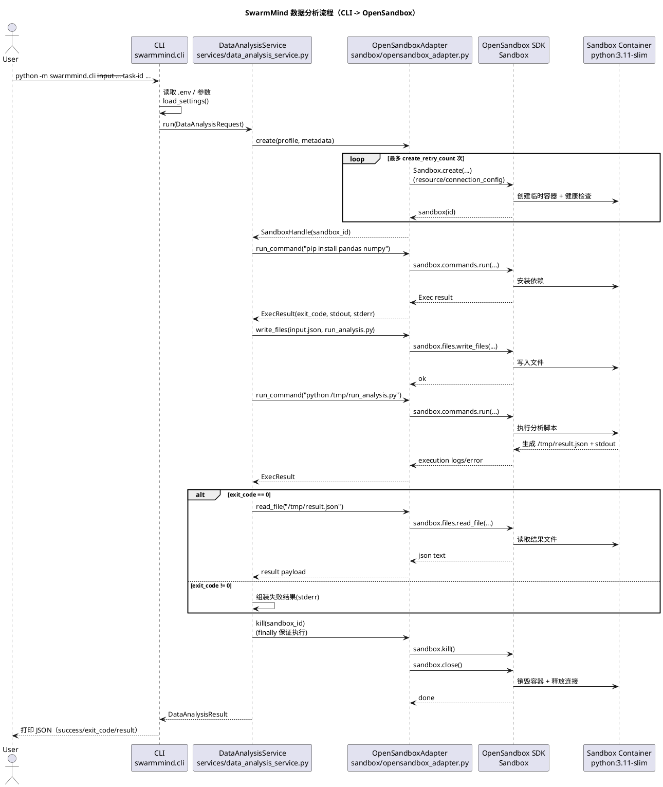

# SwarmMind Sandbox Data Analysis Demo

This project demonstrates a complete flow for sandboxed Python data analysis:

1. Create an ephemeral OpenSandbox container.
2. Prepare environment inside the sandbox.
3. Write and execute analysis code.
4. Read back analysis results.
5. Destroy the sandbox in `finally`.

## Project Layout

- `swarmmind/sandbox/provider.py`: provider abstraction and core models.
- `swarmmind/sandbox/opensandbox_adapter.py`: OpenSandbox SDK implementation.
- `swarmmind/sandbox/profiles.py`: profile-to-resource mapping.
- `swarmmind/services/data_analysis_service.py`: data analysis task service.
- `swarmmind/cli.py`: command-line entrypoint.
- `examples/sales.json`: sample input data.

## Prerequisites

- Python 3.10+
- Running OpenSandbox server (default: `http://localhost:45698`)
- `OPEN_SANDBOX_API_KEY` set in your shell

## Install

```bash
pip install -e .
```

## Environment Variables

```bash
export OPEN_SANDBOX_API_KEY="change-me-strong-key"
export OPEN_SANDBOX_BASE_URL="http://localhost:45698"
export OPEN_SANDBOX_CREATE_RETRIES="3"
export OPEN_SANDBOX_CREATE_BACKOFF_SECONDS="1.0"
```

## Run Example

```bash
python -m swarmmind.cli \
  --input examples/sales.json \
  --task-id task-001 \
  --agent-id data-agent \
  --subtask-id analysis-01 \
  --profile data-medium
```

Expected output is a JSON payload with:

- `sandbox_id`
- `success`
- `stdout` / `stderr`
- `result` (row count, columns, numeric stats, optional `sales_summary`)

## Notes

- The service installs `pandas` and `numpy` in the sandbox on each run.
- For production, use a prebuilt image with dependencies baked in.
- Sandbox cleanup is guaranteed by a `finally` block in the service.


