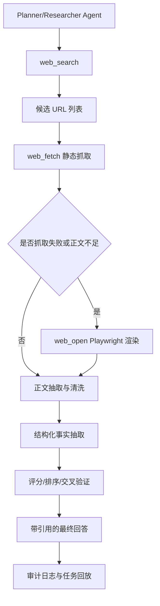

# SwarmMind Web Search 方案

## 1. 目标

本文档定义 SwarmMind 中“必须联网检索”的搜索方案，重点解决以下问题：

1. Agent 在需要外部事实时，不能只靠模型内知识作答。
2. 搜索过程需要可追踪、可审计、可回放。
3. 搜索结果既要支持快速检索，也要支持动态网页渲染。
4. 执行环境应能运行在容器内，并与现有 sandbox 体系兼容。

典型任务示例：

- “搜索新能源车 20-30 万推荐，并给出依据与引用来源”
- “搜索某个 Python 库最新 breaking changes，并总结迁移建议”
- “搜索某个云服务定价与限制，并给出选型建议”

## 2. 设计结论

不建议只用单一方式实现搜索。

推荐采用混合方案：

1. 搜索层：负责根据 query 找到候选 URL。
2. 抓取层：负责读取网页正文，优先静态抓取，必要时启用 Playwright。
3. 抽取层：负责将页面转成结构化文本与元信息。
4. 推理层：基于搜索证据生成答案，并强制附带引用。

核心原则：

1. 搜索和浏览解耦。
2. 浏览器只用于“必须渲染”的页面，不作为默认路径。
3. 所有搜索操作都要留下日志与中间产物。
4. 任务如果声明 `must_web_search=true`，则没有搜索证据时必须失败。

## 3. 为什么不建议只用 Playwright

纯浏览器方案可行，但不适合做默认搜索引擎实现，原因如下：

1. 搜索引擎页面反爬严格，验证码与风控常见。
2. 浏览器开销高，CPU 和内存成本明显高于 HTTP 抓取。
3. 并发能力较差，不适合大规模批量检索。
4. 稳定性不如标准搜索 API 或自建搜索聚合服务。

因此，推荐的职责划分是：

1. `web_search` 负责找链接。
2. `web_open` 或 `web_fetch` 负责读页面。
3. Playwright 仅作为动态页面渲染回退路径。

## 4. 整体架构



## 5. 组件拆分

### 5.1 搜索层

职责：把自然语言查询转成候选链接。

可选实现：

1. 外部搜索 API
   - Brave Search API
   - Bing Web Search API
   - SerpAPI
2. 自建搜索聚合服务
   - SearxNG

建议：

1. MVP 优先接现成 API 或 SearxNG。
2. 对外统一暴露 `web_search(query, top_k)` 接口。
3. 返回标准结构，不泄露底层后端差异。

建议输出结构：

```json
{
  "query": "新能源车 20-30万 推荐",
  "results": [
    {
      "title": "示例标题",
      "url": "https://example.com/article",
      "snippet": "摘要",
      "source": "brave",
      "rank": 1
    }
  ]
}
```

### 5.2 抓取层

职责：根据 URL 获取页面内容。

建议实现两级路径：

1. 快路径：普通 HTTP 抓取
   - `httpx`
   - 带超时、重试、User-Agent
2. 慢路径：Playwright 渲染
   - 用于 JS 重页面、懒加载内容、反爬较轻的网站

推荐决策逻辑：

1. 先走 HTTP 抓取。
2. 如果返回为空、正文过短、状态异常或页面依赖 JS，再走 Playwright。
3. Playwright 成功后返回渲染后的 HTML、可选截图、最终跳转 URL。

### 5.3 抽取层

职责：从原始 HTML 中提取可用正文。

推荐工具：

1. `trafilatura`
2. `readability-lxml`
3. `beautifulsoup4`

建议输出字段：

```json
{
  "url": "https://example.com/article",
  "final_url": "https://example.com/article",
  "title": "页面标题",
  "published_at": "2026-03-01T10:00:00Z",
  "author": "作者",
  "text": "正文文本",
  "excerpt": "摘要",
  "status_code": 200,
  "used_browser": false
}
```

### 5.4 推理与引用层

职责：把多个页面抽取的事实进行归纳、交叉验证和输出。

强制要求：

1. 回答必须包含引用 URL。
2. 关键事实优先双来源交叉验证。
3. 有冲突的信息要显示“来源差异”，不能强行合并。

## 6. MCP 工具设计

推荐至少定义以下工具：

### 6.1 `web_search`

输入：

```json
{
  "query": "新能源车 20-30万 推荐",
  "top_k": 10,
  "lang": "zh-CN"
}
```

输出：

```json
{
  "query": "新能源车 20-30万 推荐",
  "results": [
    {
      "title": "标题",
      "url": "https://...",
      "snippet": "摘要",
      "rank": 1,
      "source": "search-backend"
    }
  ]
}
```

### 6.2 `web_fetch`

输入：

```json
{
  "url": "https://example.com",
  "prefer_browser": false
}
```

输出：

```json
{
  "url": "https://example.com",
  "status_code": 200,
  "html": "...",
  "used_browser": false
}
```

### 6.3 `web_open`

用途：显式使用 Playwright 渲染页面。

输入：

```json
{
  "url": "https://example.com",
  "wait_until": "networkidle",
  "screenshot": true
}
```

输出：

```json
{
  "url": "https://example.com",
  "final_url": "https://example.com",
  "html": "...",
  "text": "...",
  "screenshot_path": "/artifacts/web/example.png"
}
```

### 6.4 `web_extract`

输入 HTML 或 URL，输出正文抽取结果。

### 6.5 `web_screenshot`

调试工具，用于页面留证与回放。

## 7. 容器内 Playwright 方案

### 7.1 运行形态

建议把 Playwright 运行在单独容器或单独 sandbox profile 中，而不是直接塞进所有普通执行容器。

推荐 profile：

1. `research-net`
   - 允许外网访问
   - 用于搜索与网页抓取
2. `browser-net`
   - 带 Playwright 与浏览器依赖
   - 用于 JS 渲染、截图、交互

### 7.2 推荐镜像

可基于官方 Playwright 镜像：

```text
mcr.microsoft.com/playwright/python:v1.52.0-jammy
```

镜像内预装：

1. Chromium
2. Python
3. Playwright runtime
4. 可选文本抽取依赖

### 7.3 容器职责

容器内浏览器建议只暴露有限能力：

1. 打开页面
2. 等待页面稳定
3. 获取 HTML
4. 获取文本
5. 截图
6. 可选执行少量 DOM 查询

不建议默认开放任意浏览器自动化脚本执行权限给上层 Agent。

## 8. 执行流程

以任务“搜索新能源车 20-30 万推荐”为例：

1. Planner 识别任务带有 `must_web_search=true`。
2. Researcher 调 `web_search("新能源车 20-30万 推荐")`。
3. 对结果做域名去重，优先保留官方站、媒体评测、车主口碑平台。
4. 对每个 URL 先执行 `web_fetch`。
5. 失败或正文不足时，执行 `web_open` 用 Playwright 渲染。
6. 把页面结果交给 `web_extract` 抽正文。
7. 对结构化事实做归纳、交叉验证和打分。
8. 最终输出推荐结果，并附全部引用。

## 9. 数据模型建议

```python
from dataclasses import dataclass


@dataclass(slots=True)
class SearchResult:
    title: str
    url: str
    snippet: str
    source: str
    rank: int


@dataclass(slots=True)
class FetchedPage:
    url: str
    final_url: str
    status_code: int
    html: str
    used_browser: bool


@dataclass(slots=True)
class ExtractedPage:
    url: str
    title: str
    text: str
    excerpt: str
    published_at: str | None
    author: str | None
    used_browser: bool
```

## 10. 失败处理与回退

需要覆盖的失败场景：

1. 搜索 API 超时
2. 搜索结果为空
3. 页面返回 403/429
4. 页面正文为空
5. Playwright 启动失败
6. 页面无限加载或重定向循环

建议回退策略：

1. 搜索 API 重试 2 到 3 次。
2. 搜索后端失败时切换备用后端。
3. HTTP 抓取失败时降级到 Playwright。
4. Playwright 失败时保留错误日志并跳过该 URL。
5. 如果最终可用来源数少于阈值，则任务失败而不是编造答案。

## 11. 安全与合规

必须考虑以下约束：

1. 默认最小网络权限。
2. 浏览器容器非 root 运行。
3. 设置 CPU、内存和执行超时。
4. 对外部站点可配置白名单或黑名单。
5. 不跨任务复用 cookie、session 和本地存储。
6. 搜索与抓取日志中避免记录敏感凭证。

## 12. 可观测性与审计

每次搜索任务建议记录：

1. `task_id`
2. `agent_id`
3. `sandbox_id`
4. 原始 query
5. 搜索返回 URL 列表
6. 每个 URL 的抓取方式
7. 状态码、错误码、耗时
8. 最终引用列表

推荐产物：

1. 搜索结果 JSON
2. 页面正文抽取 JSON
3. 可选 screenshot
4. 最终回答与引用映射

## 13. 与现有 SwarmMind 的集成建议

建议新增以下模块：

```text
swarmmind/
  tools/
    web_search.py
    web_fetch.py
    web_extract.py
    web_browser.py
```

建议新增 profile：

1. `research-net`
   - 普通网络访问
   - 适合 API 搜索与静态抓取
2. `browser-net`
   - 搭载 Playwright
   - 适合动态网页渲染

建议在任务约束中新增字段：

```json
{
  "must_web_search": true,
  "min_sources": 5,
  "allow_browser": true
}
```

## 14. MVP 分阶段实现

### Phase 1

目标：先跑通搜索和正文抓取。

包含：

1. `web_search`
2. `web_fetch`
3. `web_extract`
4. 引用输出

不包含：

1. Playwright
2. 截图
3. 浏览器交互

### Phase 2

目标：补齐动态网页渲染能力。

包含：

1. `web_open`
2. Playwright 容器
3. screenshot 产物
4. 抓取失败自动回退到浏览器

### Phase 3

目标：增强稳定性与治理。

包含：

1. 多搜索后端切换
2. 域名策略控制
3. 更完整的审计与回放
4. 抽取质量评分

## 15. 最终建议

推荐采用以下默认路线：

1. 搜索：优先搜索 API 或 SearxNG。
2. 抓取：优先 HTTP，失败后回退 Playwright。
3. 浏览器：只做动态渲染和留证，不负责主搜索。
4. Agent：若任务声明必须联网，则必须先调用搜索工具。
5. 输出：每条关键结论必须带引用。

这套方案兼顾了可实现性、稳定性、成本控制和后续扩展性，适合作为 SwarmMind 的默认 Web Search 架构。