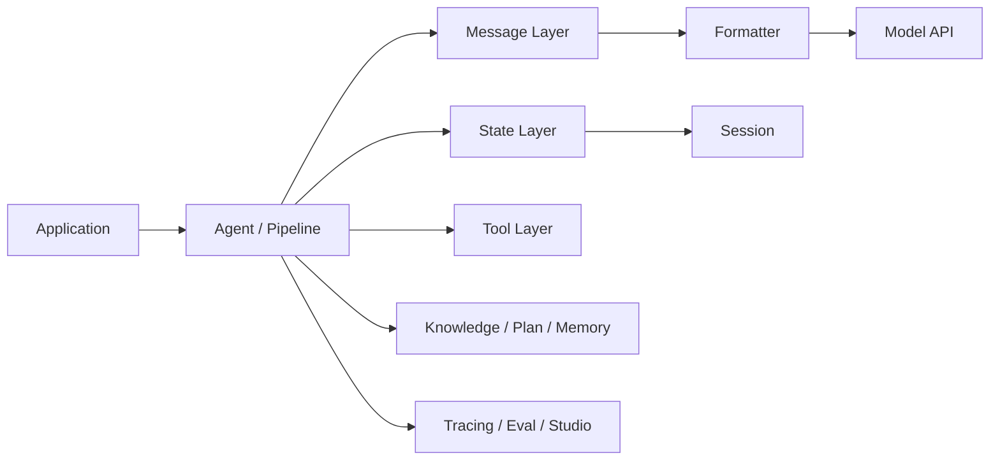

# AgentScope 总体设计

## 先从源码结构看它到底在搭什么

如果从包结构切进去，AgentScope 的设计主轴其实很清楚：

1. `agentscope.message` 定义统一消息载体。
2. `agentscope.formatter` 把统一消息转成不同模型 API 需要的输入格式。
3. `agentscope.model` 负责真正的模型调用与返回结构。
4. `agentscope.module.StateModule` 给运行时对象提供可序列化状态。
5. `agentscope.agent` 把一次 Agent 执行组织成 reply/observe/reasoning/acting 等生命周期。
6. `agentscope.tool`、`agentscope.rag`、`agentscope.plan` 作为外挂能力接入到 Agent 运行时。
7. `agentscope.workflow`、`agentscope.tracing`、`agentscope.evaluate` 负责协作与工程治理。

也就是说，AgentScope 并不是“先有一个万能 Agent，再不断往里塞功能”，而是先把运行时骨架拆成多个相对稳定的抽象层，然后让上层能力往这些抽象层上挂。

## 架构分层

这张图里的关键点是：

1. `Message Layer` 负责“统一表示”。
2. `Formatter` 负责“适配不同模型 API”。
3. `State Layer` 负责“保存和恢复执行现场”。
4. `Agent/Pipeline` 负责“组织执行顺序与协作关系”。
5. `Tracing/Eval` 负责“可观察与可比较”。

## 为什么先有消息和状态，再有 Agent

这点是理解 AgentScope 的关键。

很多框架先定义“智能体对象”，然后再补消息协议、工具协议和记忆；AgentScope 反过来，先把 `Msg` 和 `StateModule` 放在更底层。

这样做有两个直接结果：

1. Agent 不再是一个临时 prompt 包装器，而是一个有状态、可恢复、可观察的运行时节点。
2. 工具、计划、记忆、RAG 这些能力不需要各自发明一套状态和消息协议，而是复用同一套底座。

从源码角度看，这就是为什么 `AgentBase`、`Toolkit`、`PlanNotebook` 这些对象都会继承 `StateModule`。框架作者是在刻意把“长生命周期对象”拉到同一个恢复模型里。

## 官方教程背后的主线

官方教程看起来分成很多页，但实际可以归纳为四条主线：

1. 单 Agent 运行时：消息、格式化、模型、ReAct。
2. 多 Agent 编排：Conversation、MsgHub、Routing、Handoffs、Pipeline。
3. 外部能力接入：Toolkit、MCP、Skill、RAG、Plan、TTS。
4. 工程化落地：State/Session、Tracing、Studio、Evaluation、Tuner。

## 设计理念

### 1. 显式优于隐式

AgentScope 很多能力都强调显式结构：

1. 消息是结构化 block，而不是只传纯文本。
2. structured output 用 `Pydantic` 模型，而不是靠 prompt 约束。
3. plan 是显式 plan/subtask，而不是把计划只留在 LLM 文本里。

### 2. 统一接口优于强绑定厂商

模型厂商在工具调用、多模态、推理块、流式输出上的差异很大。AgentScope 没有试图把这些差异“完全消灭”，而是把它们压缩在 formatter 和 model 这一层边界里。这样上层 Agent 代码可以更稳定，但底层仍保留足够的能力差异。

### 3. 运行时对象必须可恢复

Agent、Toolkit、Memory、Plan 都是长生命周期对象。只要应用进入真实环境，就会遇到中断、重试、跨会话恢复、前后端分离。这也是 `StateModule` 成为基础设施的原因。

## 怎么使用这套架构

如果你只是想快速做一个能调工具的 Agent，直接实例化 `ReActAgent` 就够了；但如果你要做稳定应用，建议按下面的顺序落地：

1. 先确定消息与 formatter 方案，明确模型输入输出协议。
2. 再确定 memory、session、state 的保存恢复策略。
3. 然后再决定是不是使用默认 `ReActAgent`，还是自己扩展 `ReActAgentBase`。
4. 最后再逐步挂工具、RAG、计划和工作流。

## 怎么扩展更稳妥

1. 要改消息表达，优先改 message/formatter 层，不要直接在 Agent 里拼奇怪 prompt。
2. 要改一次 reply 的执行方式，优先扩展 `ReActAgentBase` 或 `ReActAgent`。
3. 要接外部能力，优先走 Toolkit、KnowledgeBase、PlanNotebook 这种正式扩展点。
4. 要做日志、鉴权、追踪、实验性改写，优先用 hook、middleware、tracing，而不是侵入业务代码。

如果顺序反过来，很容易把 AgentScope 误解成“带很多 feature 的聊天机器人封装层”。