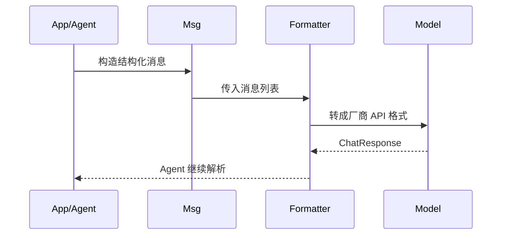

# 消息、格式化与模型

## 先从源码链路看三者关系

在 AgentScope 里，`Msg`、formatter、model 不是三个并列 feature，而是一条严格前后相接的链路：

如果只理解其中一层，很容易犯两类错误：

1. 以为模型直接吃 `Msg`。
2. 以为所有模型的工具调用格式都相同。

## `Msg` 在源码里负责什么

从 `agentscope.message._message_base.Msg` 来看，消息层做的事情很克制：它不是一个复杂对话管理器，而是一个统一消息容器。`Msg` 负责保存：

1. 普通文本。
2. 图像、音频、视频等多模态内容。
3. 推理内容，如 `ThinkingBlock`。
4. 工具调用与工具返回，如 `ToolUseBlock`、`ToolResultBlock`。
5. 额外的结构化数据，通过 `metadata` 承载。

并且源码里提供了几个很关键的基础方法：

1. `to_dict()` / `from_dict()` 负责跨边界序列化。
2. `get_text_content()` 负责抽取纯文本视图。
3. `get_content_blocks()` 负责把字符串内容标准化为 block 列表，并按类型过滤。

这说明 AgentScope 的消息层重点不是“帮你做对话推理”，而是保证上层运行时永远面对统一的数据结构。

### 关键设计点

#### `name` 和 `role` 同时存在

这是 AgentScope 很重要但很容易忽略的设计。

1. `role` 用来适配大多数 LLM API 的最小角色体系，通常只有 `system/user/assistant`。
2. `name` 用来区分多个身份实体，比如 Alice、Bob、Moderator。

所以 AgentScope 区分的是“协议角色”和“语义身份”。多 Agent 场景真正依赖的是 `name`，不是 `role`。

#### `metadata` 不进入默认提示构建

官方教程明确建议把结构化输出放在 `metadata`。这样做的意义是把“给模型看的内容”和“给系统逻辑看的内容”分开，避免二者相互污染。从源码视角看，这相当于保留了一条独立的系统侧数据通道。

## `FormatterBase` 在源码里负责什么

很多框架把 formatter 理解成 prompt template。AgentScope 里的 formatter 更接近“模型边界适配器”。

从 `agentscope.formatter._formatter_base.FormatterBase` 可以看出，它的核心职责只有两类：

1. `format()`：把 `Msg` 列表翻译成具体模型 API 需要的消息格式。
2. 一组静态辅助函数，例如 `assert_list_of_msgs()` 和 `convert_tool_result_to_string()`，用于把工具返回、多模态内容压到厂商 API 能接受的形式。

所以 formatter 并不是“把 prompt 拼成字符串”，而是在做协议转换。

它承担的典型工作有：

1. 把 `Msg` 转成具体厂商 API 需要的输入格式。
2. 在需要时做截断、校验与提示工程。
3. 在多身份场景下，把多实体历史压缩成模型能理解的单轮输入。

### ChatFormatter vs MultiAgentFormatter

这是理解 AgentScope 的关键分水岭。

1. `ChatFormatter` 假定角色体系足够区分对话双方，适用于 user-assistant 对话。
2. `MultiAgentFormatter` 假定存在多个语义身份，必须依赖 `name` 重写历史。

多实体历史通常会被折叠成一个带 `<history>` 标签的用户消息。这不是“奇怪的 prompt hack”，而是因为大多数模型 API 根本没有原生的多身份消息协议。也就是说，formatter 在这里是在弥补底层模型协议缺口。

## model 层在这里的作用

model 层的作用是把不同供应商能力统一暴露给上层 Agent。文档里常看到统一的输入大致是：

1. `messages`
2. `tools`
3. `tool_choice`

返回统一的 `ChatResponse`。`ChatResponse` 里又统一承载：

1. 文本内容。
2. 推理块。
3. 工具调用块。
4. usage 信息。

这让上层 Agent 不需要直接理解 OpenAI、DashScope、Gemini、Anthropic 各自不同的返回结构。框架真正做的是“统一上层运行时依赖的最小公共面”，而不是假装所有模型完全一样。

## 为什么流式返回设计成“累积式”

官方教程强调 AgentScope 的流式 chunk 是累积式的，而不是只返回增量。

这样做有两个实际收益：

1. 前端和打印层可以直接覆盖式刷新，而不用自己拼接。
2. 对工具调用、多模态输出、TTS 这类下游模块更稳定，因为它们拿到的是“当前完整状态”。

代价是每个 chunk 更大，但对 Agent 运行时来说，这种一致性通常比极致省流量更重要。

## 为什么 token 计数独立成模块

token counting 不只是给开发者看统计数字，它直接影响 formatter 的截断策略、压缩策略与成本控制。

AgentScope 把 token 计数独立出来，是因为：

1. 不同模型厂商不一定提供官方 token API。
2. 截断逻辑属于运行时能力，而不是模型调用后的附属统计。
3. memory compression、长上下文控制都要复用这套能力。

## 设计思想

这三层背后的设计思想可以概括成一句话：消息表达、模型协议、模型调用必须拆层，否则任何厂商差异都会直接污染 Agent 运行时。

可以把这三层理解为：

1. `Msg` 决定“表达什么”。
2. formatter 决定“怎么翻译给模型”。
3. model 决定“向哪个推理引擎发请求”。

这也是为什么 AgentScope 在模型兼容性上比“纯 prompt 拼接”方案更稳。它不是假设所有模型都一样，而是承认差异，然后把差异关进 formatter 和 model 边界里。

## 怎么使用

1. 普通单 Agent 对话优先使用面向聊天场景的 formatter。
2. 多 Agent 历史明确依赖 `name` 时，使用多实体 formatter，不要拿 chat formatter 硬顶。
3. 结构化结果优先走 `metadata`，不要混进普通文本。
4. 工具结果里有图片、音频、视频时，注意 formatter 是否需要把它们降级成文本提示或资源路径。

## 怎么扩展

1. 想适配新模型厂商，优先新增 formatter 和 model 适配，不要改 `Msg`。
2. 想扩展新的内容块，先考虑 `Msg` block 语义，再考虑 formatter 如何降级或映射。
3. 想改提示构造方式，优先放在 formatter 层，而不是到 Agent 里拼历史。

## 一句话总结

`Msg` 负责统一表达，formatter 负责协议翻译，model 负责实际调用。把这三层拆开，是 AgentScope 能同时支持多模型、多工具、多模态而不把 Agent 主循环写乱的前提。