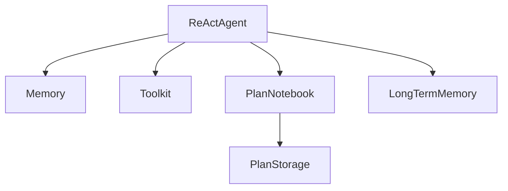

# 状态、记忆与会话

## 为什么 Agent 系统必须先把状态层搭稳

普通脚本只要跑完就结束，但 Agent 应用不是。

它会遇到：

1. 对话中断后恢复。
2. 多用户、多 session 隔离。
3. 工具装备状态变化。
4. 计划执行到一半继续。
5. 长期记忆与短期记忆并存。

所以 AgentScope 把 `StateModule` 放在底层，而不是把状态管理作为高层 feature。

## `StateModule` 在源码里具体做什么

从 `agentscope.module._state_module.StateModule` 看，它做的事情非常明确：

1. 通过 `__setattr__` 自动识别嵌套的 `StateModule` 子对象，并记录到 `_module_dict`。
2. 通过 `register_state()` 显式登记普通属性，并允许自定义 `to_json` / `from_json`。
3. 通过 `state_dict()` 递归导出整个对象树状态。
4. 通过 `load_state_dict()` 把状态重新灌回对象树。

### 设计思想

这里最重要的理念是：

“初始化”和“状态恢复”是两件不同的事。

对象先通过构造函数建立运行所需依赖，再通过 `load_state_dict` 恢复到某个历史快照。这样才能既支持复杂对象图，又避免把所有状态都硬塞进构造参数。

这也是为什么 AgentScope 的很多运行时对象都先正常构造，再单独加载 session state，而不是靠一个巨大的构造函数恢复一切。

## 嵌套状态为什么重要

AgentScope 中一个 Agent 往往不是单对象，而是组合对象：

如果状态不能嵌套，开发者就必须手写一整套 save/load 编排逻辑。`StateModule` 的意义就在于，让“组合式运行时”天然可序列化。

## `MemoryBase` 的职责边界

从 `agentscope.memory._working_memory._base.MemoryBase` 看，短期记忆层的职责也很克制。它主要提供：

1. `add()`、`delete()`、`clear()`、`size()` 这类存储操作。
2. `get_memory()` 这类取回操作，支持按 mark 过滤和是否 prepend summary。
3. `_compressed_summary` 这类被 Agent 压缩后写回的摘要状态。
4. `update_messages_mark()` / `delete_by_mark()` 这类标记管理接口。

也就是说，memory 负责“存”和“筛”，但不主导“何时压缩、何时总结、何时注入”。

这点非常合理，因为“存储”和“策略”是两类问题：

1. memory 负责保存、删除、筛选、标记消息。
2. agent 决定什么时候压缩、什么时候注入 hint、什么时候读取长期记忆。

如果把压缩策略也做进 memory，memory 就会和具体 Agent 算法强耦合。

## 短期记忆的三种典型实现

AgentScope 官方教程给了三类：

1. `InMemoryMemory`
2. `AsyncSQLAlchemyMemory`
3. `RedisMemory`

它们的差异不在“接口”，而在“持久化位置与部署形态”。AgentScope 刻意保持同一套 API，这样应用代码能先在内存里开发，再切到数据库或 Redis，而不改 Agent 主逻辑。

## 为什么标记机制比“直接删消息”更重要

在 `ReActAgent` 的记忆压缩里，消息不是被暴力替换，而是被打上 `COMPRESSED` 之类的 mark，再通过过滤逻辑排除。

这样做的好处：

1. 保留原始轨迹，便于审计与调试。
2. 可以用不同策略重建上下文，而不是只有一份不可逆摘要。
3. 让“压缩”变成可回溯操作，而不是 destructive rewrite。

## 长期记忆为什么分 `agent_control` 和 `static_control`

这是 AgentScope 在长期记忆设计上最有意思的一点。

1. `static_control`：开发者显式决定何时 record/retrieve。
2. `agent_control`：把长期记忆暴露成工具，让 Agent 自主调用。
3. `both`：二者并存。

这背后的设计观不是“哪种更高级”，而是承认长期记忆有两种完全不同的使用哲学：

1. 程序员主导，强调可控性。
2. Agent 主导，强调灵活性与个性化。

官方教程明确说“一切需求驱动”，这说明框架作者并不强行规定唯一范式。

## `Session` 在源码里负责什么

`StateModule` 管的是单对象或对象树，`Session` 管的是应用级状态集合。以 `JSONSession` 为例，源码里的职责很直接：

1. 接收一组命名的 `StateModule` 实例。
2. 保存时把每个对象的 `state_dict()` 收集成一个大字典。
3. 读取时再按名字把状态回灌给对应对象。

这说明 session 不是第二套状态系统，而是“多份 StateModule 状态的封装协议”。

例如一个 session 里可以同时保存：

1. 一个 `ReActAgent`
2. 另一个 `UserAgent`
3. 一个 plan storage
4. 一个 toolkit 状态

`JSONSession` 的意义不在于 JSON 本身，而在于定义了一套“会话边界”的保存与加载协议。

## 怎么使用

1. 任何长生命周期对象都优先继承 `StateModule` 或作为其子对象挂进去。
2. 普通可 JSON 化字段直接 `register_state()`；复杂对象则提供 `custom_to_json` / `custom_from_json`。
3. 短期记忆只负责存和筛，压缩、注入、长期记忆协同由 Agent 控制。
4. 需要跨会话恢复时，用 `Session` 一次性保存整组对象，而不是分别手写 save/load。

## 怎么扩展

1. 想给一个新模块做可恢复状态，优先让它继承 `StateModule`。
2. 想换 session 存储后端，扩展 `SessionBase`，不要改各个 Agent。
3. 想加新的记忆策略，先决定它属于 working memory、long-term memory，还是 Agent 层调度逻辑，不要把三层混在一起。

## 一句话总结

AgentScope 的状态体系不是附属工具，而是运行时底座：`StateModule` 解决对象可恢复，`Memory` 解决消息存取与标记，`Session` 解决多对象会话恢复。没有这层，Agent 很难在真实系统里长期运行。