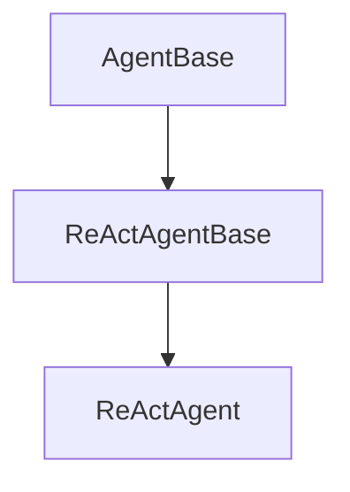
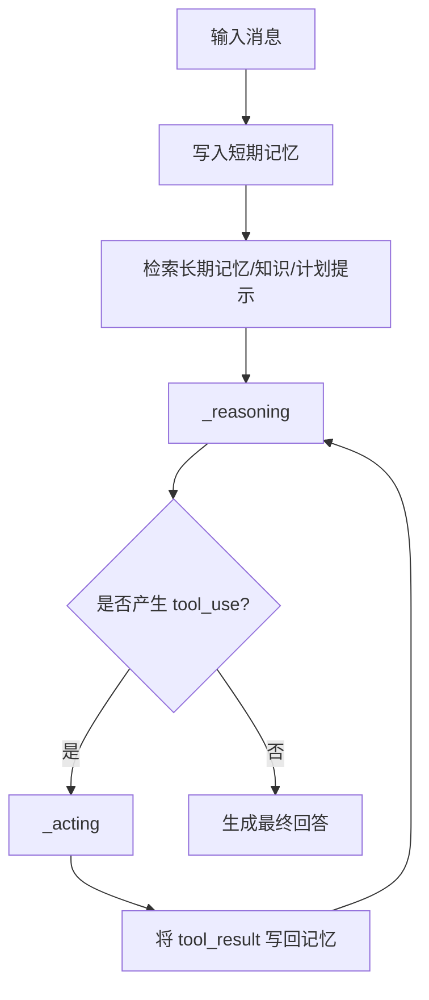

# Agent 运行时

## 先看源码层次：`AgentBase` -> `ReActAgentBase` -> `ReActAgent`

AgentScope 的 Agent 不是一堆 prompt 模板，而是一套逐层加能力的运行时。

从源码类层级看，主线就是三层：

1. `AgentBase` 定义一个可调用、可观察、可广播、可挂 hook 的运行时壳。
2. `ReActAgentBase` 在这个壳上显式加上 `_reasoning` 和 `_acting` 两个阶段。
3. `ReActAgent` 把 memory、toolkit、knowledge、plan_notebook、structured output、compression、TTS 都接入这条执行链。

## `AgentBase` 在源码里真正负责什么

如果只看接口，`AgentBase` 似乎只是要求你实现 `reply` 和 `observe`。但源码里更重要的是它把很多横切能力收进了同一个基类：

1. 继承 `StateModule`，所以 Agent 天然可以注册和恢复状态。
2. 维护 `_subscribers`，所以一次 reply 可以广播给订阅者。
3. 维护消息队列和流式打印前缀，所以 Agent 不只是“返回一个结果”，还可以流式输出执行过程。
4. 定义 `supported_hook_types` 与实例级、类级 hook 容器，所以生命周期拦截点是运行时内建能力，而不是外部猴子补丁。

因此 `AgentBase` 更像一个 Actor 风格的运行时外壳，而不是一个“让你继承一下的抽象父类”。

## 为什么 `observe` 和 `reply` 要分开

这是多 Agent 场景能成立的关键。

1. `reply` 表示“收到输入后产生响应”。
2. `observe` 表示“只接收环境消息，不立即发言”。

如果没有 `observe`，群聊里每次广播都要触发一次自动回复，系统会很难控。`MsgHub` 正是依赖 `observe` 才能把“看到消息”和“轮到你发言”拆开。

## `ReActAgentBase` 为什么单独存在

源码里它只多做了一件事，但这件事非常关键：把 ReAct 拆成 `_reasoning()` 和 `_acting()` 两个抽象阶段，并为这两个阶段增加 pre/post hooks。

这样拆的好处是：

1. ReAct 不再只是 prompt 技巧，而是显式运行时状态机。
2. 模型决策和外部动作执行的边界更清楚，调试时更容易定位问题。
3. 自定义 ReAct Agent 时，可以只改 reasoning 或 acting，而不必重写整条 reply 主循环。

## `ReActAgent.reply()` 在源码里怎么串起整条链路

`ReActAgent` 的核心不是构造函数参数多，而是 `reply()` 真正把这些能力接成了一个闭环。源码主线可以概括成：

1. 先把输入消息写入 `memory`。
2. 再执行长期记忆检索和知识检索。
3. 如果要求结构化输出，就把 `generate_response` 一类 finish tool 注册进 `Toolkit`。
4. 然后进入 reasoning/acting 迭代，直到产出最终回答或达到 `max_iters`。
5. 中间所有工具结果会被重新写回消息流，继续参与下一轮 reasoning。

这个循环体现了 AgentScope 对 ReAct 的工程化理解：

1. reasoning 不是直接产出最终文本，而是产出“下一步动作决策”。
2. acting 不是黑盒执行，而是把工具结果重新注入对话状态。
3. 工具结果回流后，再进入下一轮 reasoning。

也就是说，ReAct 在这里不是 prompt 技巧，而是运行时状态机。

## 为什么结构化输出也被接进工具链

从源码实现看，`structured_model` 不是旁路能力，而是通过 finish function 的方式接入 `Toolkit`。这说明框架作者刻意不想为“普通工具调用”和“最终结构化落地”维护两套完全不同的协议。

这样做的收益是：

1. ToolUseBlock、ToolResponse、metadata 这套协议可以复用。
2. 最终回答、工具调用、结构化结束动作都落在统一执行循环中。
3. 验证和失败重试可以走同一套运行时逻辑。

## 为什么压缩逻辑放在 `ReActAgent` 而不是 `MemoryBase`

源码里 `CompressionConfig` 在 `ReActAgent` 内部，而不是在 memory 子模块里。这说明作者把上下文压缩定义为“继续执行任务的一部分”，而不是“底层存储优化”。

压缩需要知道：

1. 当前对话是不是已经逼近 token 阈值。
2. 哪些消息是最近上下文，不能压掉。
3. 压缩结果要用什么结构继续喂回模型。

这三件事都依赖 Agent 执行语义，所以放在 Agent 层是合理的。

## 并行工具调用的边界

`parallel_tool_calls=True` 并不代表任何工具都能天然并行提速。

真正成立需要两层条件：

1. 模型层支持一次返回多个工具调用。
2. 工具函数本身是 async 且内部 I/O 也是异步的。

这说明 AgentScope 在这里没有夸大能力，而是把并行当成“运行时协调器”，而不是魔法开关。

## Hook 与 Interrupt 的位置

AgentScope 给 Agent 预留了两种扩展方式：

1. hook：插入生命周期节点。
2. interrupt：从外部打断当前执行，并进入自定义后处理。

这两者对应两种完全不同的工程需求：

1. hook 面向扩展与观测。
2. interrupt 面向实时介入与控制权回收。

## 怎么使用

1. 想最快落地，直接实例化 `ReActAgent`，把 `toolkit`、`memory`、`knowledge`、`plan_notebook` 作为组合式能力接进去。
2. 想控制输出协议，用 `structured_model` 驱动最终结构化结果。
3. 想控制长任务稳定性，开启 `compression_config`，并给出和主模型兼容的 token counter。
4. 想做检索增强，优先把 `KnowledgeBase` 接入 `knowledge`，而不是自己手工在 prompt 里塞检索结果。

## 怎么扩展

1. 只想改 reasoning/acting 之一，优先继承 `ReActAgentBase`。
2. 只想插入观测或轻量改写，优先使用 hooks。
3. 想改工具执行策略，改 `Toolkit` 或 tool middleware，不要把工具控制逻辑塞进 Agent 主循环。
4. 想引入新的辅助能力，优先沿着 `memory`、`knowledge`、`plan_notebook` 这种组合参数扩展，而不是直接 fork `reply()`。

## 一句话理解

AgentScope 里的 `ReActAgent` 不是“一个会调工具的大模型对象”，而是一个把消息、状态、记忆、工具、结构化输出、计划、长期记忆统一编排进单条执行循环的运行时。