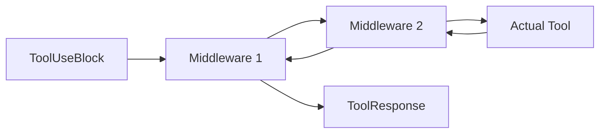

# 工具、MCP 与技能

## 从源码职责看，`Toolkit` 才是能力中枢

这一章如果只从教程看，容易理解成“AgentScope 支持 function calling、MCP 和 skill”。但从源码看，真正的中枢是 `agentscope.tool._toolkit.Toolkit`。

`Toolkit` 同时继承 `StateModule`，并维护：

1. `tools`：已注册工具。
2. `groups`：工具分组与激活状态。
3. `skills`：技能目录元信息。
4. `_middlewares`：工具执行链中间件。

这说明工具系统在 AgentScope 里不是零散函数集合，而是一块独立运行时。

## `Toolkit` 在源码里具体做什么

从 `register_tool_function()` 的接口就能看出，Toolkit 不只是 registry。它还负责：

1. 从函数签名和 docstring 解析 JSON schema。
2. 处理同名函数冲突策略，例如 `raise`、`override`、`rename`。
3. 用 `preset_kwargs` 把开发者参数从模型可见参数中剥离出去。
4. 通过 `set_extended_model` 一类能力在运行时补充额外 schema。
5. 把 sync、async、generator、async generator 统一包装成 ToolResponse 流。
6. 在 `_apply_middlewares` 中为工具执行动态拼接洋葱中间件链。

所以 Tool 在 AgentScope 里不是“某个函数被模型调用一下”，而是“进入 Toolkit 管理的一次受控执行”。

## 为什么从 docstring 生成 schema

这是一个非常务实的设计。

优点：

1. 开发者写工具时只维护 Python 签名和文档。
2. 工具说明天然和实现靠近，降低 schema 漂移。
3. 同一工具既能本地直接调用，也能暴露给 LLM 调用。

缺点是文档字符串质量变成了工具质量的一部分。但这恰好逼着工具接口更清晰。

## 为什么允许动态扩展 schema

源码里这类能力的价值在于：工具协议并不总是静态的。框架作者预留运行时补丁位，就是为了让工具系统能随着任务模式变化而变化，而不需要你每次重新注册一遍工具。

典型用途：

1. 为工具临时加上 `thinking` 字段。
2. 为一次特定任务附加额外控制参数。
3. 把 structured-output 风格的约束下沉到工具层。

这相当于给工具系统加了一层“运行时协议补丁”能力。

## 为什么 middleware 放在工具执行层

从 `_apply_middlewares` 的实现可以看到，中间件被包在实际工具执行外层，而且每次调用都会动态构造链条。这非常像服务端请求中间件，不像 Agent 生命周期 hook。

因为工具调用最像典型服务端请求链：

1. 有明确输入。
2. 有明确输出。
3. 非常适合做日志、鉴权、缓存、限流、重试。

这就是官方教程说的“洋葱模型”。

## 为什么工具组管理不是花哨 feature

工具组与 `reset_equipped_tools` 元工具的设计，本质上是在解决上下文窗口污染问题。

如果一个 Agent 同时暴露 50 个工具：

1. schema 很大。
2. 选择空间过宽。
3. LLM 更容易误选工具。

AgentScope 的做法是让 Agent 先管理“装备什么工具”，再解决“调用哪个工具”。这实际上是在把大工具空间分层。

## MCP：把远程能力纳入同一套协议

MCP 的关键不在“连远程”，而在“连进 Toolkit 之后它就和本地工具一样参与统一调度”。这意味着 schema、分组、middleware、追踪、tool response 这些能力都可以沿用。

官方教程把 MCP 分成两层控制：

1. MCP 级别：整组注册进 Toolkit。
2. 函数级别：拿到可调用函数对象，自己包装后再决定怎么接入。

这说明 AgentScope 并没有把 MCP 硬绑成一种使用方式，而是提供两种粒度。

## Stateful vs Stateless MCP Client

这个区分不是实现细节，而是资源模型差异：

1. Stateful client 适合长会话、需要持续上下文或本地进程持有的服务。
2. Stateless client 适合按次调用、调用后立即释放的轻量工具。

这和数据库连接池、HTTP 长连接的设计哲学很像。

## Skill 的本质是什么

从源码设计看，skill 被放进 Toolkit 管理，但它不是可调用函数，而是“可被系统提示暴露给 Agent 的外部能力包”。也就是说，skill 的作用是告诉 Agent：某个目录里有一套现成说明、脚本和资源，你可以按规则去读取和使用。

官方教程特别强调：

1. skill 必须有 `SKILL.md`。
2. Agent 必须配备读取文件或 shell 工具，才能真正使用 skill。

这说明 skill 的设计非常现实：框架不假装 LLM 天然“理解一个目录”，而是显式要求 Agent 去读说明。

## 怎么使用

1. 普通本地函数优先通过 `register_tool_function()` 接入。
2. 需要控制暴露范围时，先建 tool group，再决定哪些 group 激活。
3. 需要统一日志、鉴权、缓存、限流时，优先挂 middleware。
4. 需要远程服务时，优先把 MCP client 接到 Toolkit，而不是自己另起一套远程调用协议。
5. 需要领域能力包时，使用 skill，但要确保 Agent 具备读取目录和执行脚本所需的基础工具。

## 怎么扩展

1. 想改 schema 生成与参数暴露策略，优先扩展 Toolkit 注册层。
2. 想改调用前后处理，优先加 middleware 或 `postprocess_func`。
3. 想做动态能力装配，优先使用 tool group 和 meta tool，而不是在 Agent prompt 里硬编码工具名单。
4. 想支持新的远程工具协议，优先仿照 MCP 接入 Toolkit，不要绕过统一执行接口。

## 一句话总结

AgentScope 的工具系统不是“function calling 封装”，而是一套把本地函数、远程 MCP 服务、技能目录、执行中间件、工具组管理统一进同一运行时接口的能力编排层。