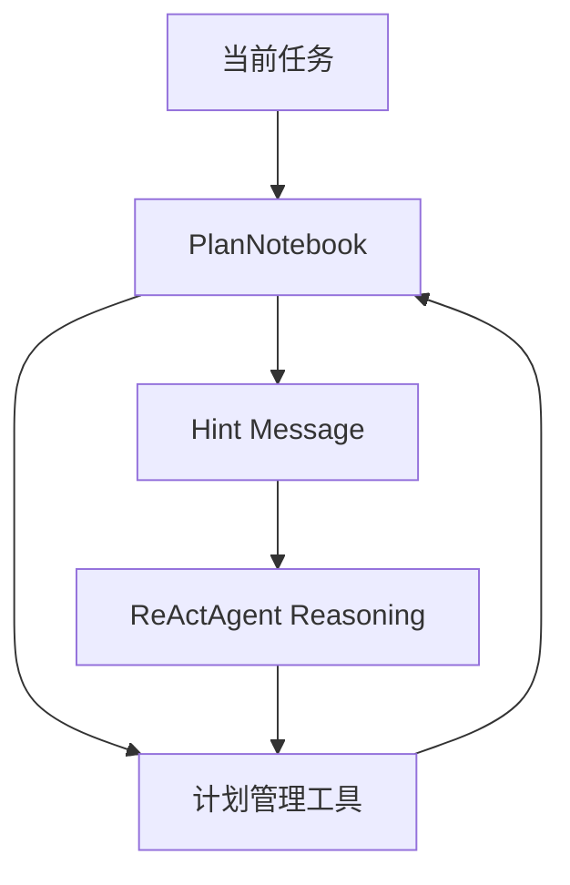

# 计划、RAG 与知识增强

## 为什么这两章要放在一起

如果从源码职责看，Plan 和 RAG 虽然属于两个子模块，但它们在 `ReActAgent` 里扮演的是同一类角色：在模型直接上下文之外，为 Agent 补充额外结构。

1. `PlanNotebook` 补任务结构。
2. `KnowledgeBase` 补知识结构。

它们都不是替代模型，而是在降低“纯靠当前上下文即时推理”的不稳定性。

## 先看 `PlanNotebook` 的源码职责

`agentscope.plan._plan_notebook.PlanNotebook` 不是简单待办列表，它本质上是一个继承自 `StateModule` 的计划运行时。

源码里它至少做四件事：

1. 持有 `current_plan`，并通过 `register_state()` 把它纳入状态管理。
2. 暴露 `create_plan`、`revise_current_plan`、`update_subtask_state`、`finish_subtask`、`finish_plan` 等工具函数。
3. 通过 `DefaultPlanToHint` 在每轮执行前生成 hint message，引导 Agent 进入下一步。
4. 通过 `_plan_change_hooks` 在计划变化时触发外部联动，例如前端显示。

### 设计思想

很多框架把计划只写在 prompt 里；AgentScope 刻意不这么做，而是把计划建模成 `Plan` 和 `SubTask` 两个 Pydantic 模型，再让 `PlanNotebook` 用工具方式去修改它们。

这种设计的收益很直接：

1. 计划变成显式状态，而不是 LLM 文本幻觉。
2. 计划可以序列化、恢复、观察和前端展示。
3. 计划推进规则可以在代码里被强约束，而不是完全交给模型自觉遵守。

## 为什么当前计划偏顺序执行

从源码细节能看出这种收敛是刻意的。比如 `update_subtask_state()` 会检查前面的 subtask 是否已经 `done` 或 `abandoned`，并且只允许一个 subtask 处于 `in_progress`；`finish_subtask()` 在完成当前子任务后，还会自动激活下一个子任务。

这说明框架作者当前优先保证的是“线性推进可靠性”，而不是一开始就引入复杂 DAG、并行依赖与回滚。对通用 LLM Agent 来说，这是很合理的工程取舍。

## 再看 RAG 的源码分层

RAG 在源码里拆得很清楚：

1. `ReaderBase` 负责读取原始材料、切块并转成 `Document`。
2. `KnowledgeBase` 负责定义 `retrieve()` 和 `add_documents()` 抽象接口。
3. `SimpleKnowledge` 给出一版通用实现：先用 `embedding_model` 编码，再用 `embedding_store` 检索或写入。
4. `VDBStoreBase` 一层负责和具体向量数据库交互。

这种拆法的核心思想是，把“如何读数据”“如何向量化”“如何检索存储”分成不同变化频率的层。

## 为什么 Reader 强烈建议自定义

从 `ReaderBase` 的接口就能看出作者故意把读取和切块单独抽出来：它只要求你实现 `__call__()` 和 `get_doc_id()`，也就是说，框架默认认为“文档怎么切”是高度业务相关的，不适合统一封装死。

这背后的理念是对的：RAG 质量常常先输在 reader，而不是输在向量库。切块粒度、元数据设计、文档 ID 方案，往往比换一个数据库更影响检索效果。

## Agentic RAG vs Generic RAG

这是 AgentScope 文档里最值得注意的一组架构选择。

### Agentic RAG

把 `retrieve_knowledge` 当工具交给 Agent。

优点：

1. Agent 可以决定何时查。
2. Agent 可以自己改写查询词。
3. 不会每轮都查，成本更低。

缺点：

1. 更依赖模型能力。
2. 如果模型不会用工具，检索质量就会下降。

### Generic RAG

每次 reply 开始前自动检索，再把结果插进 prompt。

优点：

1. 简单稳定。
2. 对模型能力要求更低。

缺点：

1. 容易产生不必要检索。
2. 数据库大时延迟更高。

这个设计说明 AgentScope 没有把 RAG 绑死为唯一范式，而是把“检索控制权”当作显式架构选择暴露出来。

## Embedding 与缓存说明了什么

Embedding 在 AgentScope 里被单独抽象，这让知识检索不会和某个具体向量库实现绑死。embedding cache 的存在又说明框架作者默认你会在真实工程里反复建索引、重复处理文档，因此缓存不是可有可无的小优化，而是成本控制的一部分。

它实际解决的是：

1. 向量生成可能贵。
2. 相同文本会重复出现。
3. 真实系统里重建索引和重复召回都需要缓存。

所以 `FileEmbeddingCache` 的存在，并不是辅助优化，而是把 embedding 从“纯在线调用”变成“可复用资产”。

## 为什么多模态 RAG 可以自然成立

AgentScope 的多模态 RAG 不是额外外挂出来的特殊系统，而是底层抽象自然推出来的结果：

1. `Document.metadata.content` 本身支持 text/image/video block。
2. embedding 模型本身支持多模态输入。

换句话说，多模态 RAG 不是外挂，是消息模型和 embedding 抽象自然推出来的结果。

## 怎么使用

1. 任务明显超过单轮推理时，把 `PlanNotebook` 接进 `ReActAgent(plan_notebook=...)`。
2. 需要知识增强时，先定义 reader 和 knowledge，再把 `knowledge` 接进 Agent，而不是手工每轮拼检索结果。
3. 数据源复杂时，优先自定义 Reader，而不是先纠结换什么向量库。
4. 如果模型工具使用能力弱，优先用 generic RAG；如果模型足够强且希望控制成本，优先 agentic RAG。

## 怎么扩展

1. 想改计划提示策略，优先自定义 `plan_to_hint`，不要改 Agent 主循环。
2. 想把计划同步到界面，挂 `PlanNotebook` 的 plan-change hook。
3. 想支持新数据源，先实现新的 Reader。
4. 想支持新的知识检索策略，继承 `KnowledgeBase` 而不是直接改 Agent。
5. 想做更复杂的混合检索或 rerank，把它放在 KnowledgeBase 层，而不是 prompt 层。

## 一句话总结

Plan 负责让 Agent 知道“先做什么、后做什么”，RAG 负责让 Agent 知道“去哪里找补充知识”。前者强化任务结构，后者强化知识结构，两者一起把 ReAct 从“即时对话器”提升成“可持续执行器”。