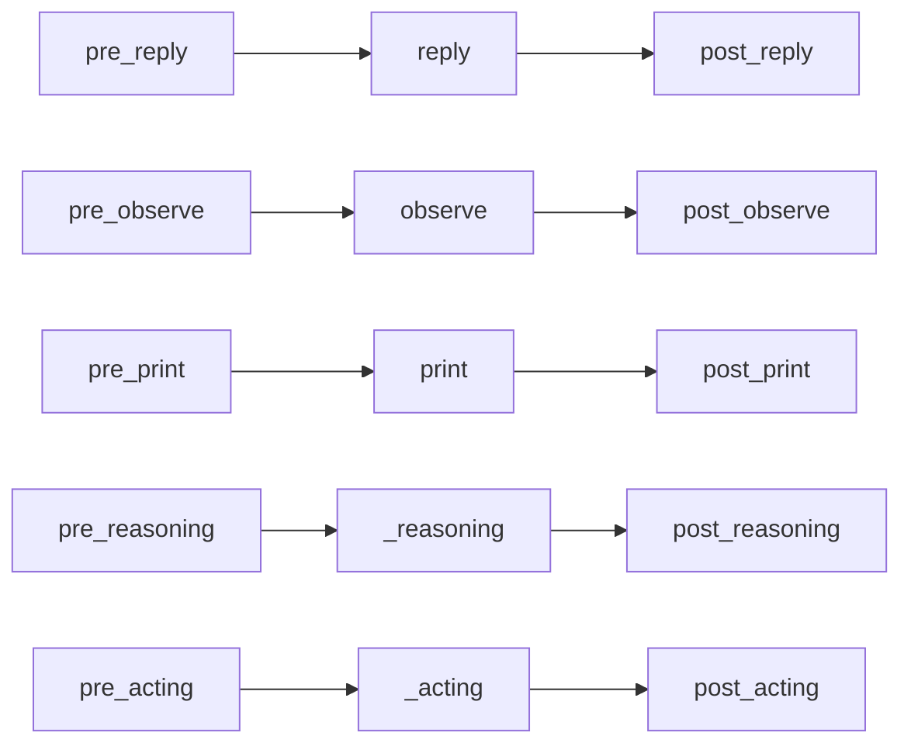

# Hook 与 Middleware

## 为什么这两个扩展点必须分开理解

从源码结构看，hook 和 middleware 分别落在两条不同执行链上：

1. hook 属于 `AgentBase` / `ReActAgentBase` 生命周期。
2. middleware 属于 `Toolkit` 的工具执行链。

如果不先把这层边界看清楚，后面做扩展时很容易把“改 Agent 运行时”和“改工具调用行为”混为一谈。

## Hook：改 Agent 生命周期

源码里 `AgentBase.supported_hook_types` 已经把 hook 位点写得很清楚，`ReActAgentBase` 再额外增加 reasoning/acting 四个 hook。这说明 hook 从一开始就是 Agent 运行时内建能力，不是后加的事件系统。

官方教程把 hook 分成两类：

1. 实例级 hook。
2. 类级 hook。

并且围绕不同核心函数提供 `pre_` 和 `post_` 钩子。

### Hook 所在位置

### 设计理念

Hook 的核心目标不是承载主要业务逻辑，而是承载横切修改。

典型用途：

1. 在打印前把消息转发到前端。
2. 在 reply 前对输入进行轻量清洗。
3. 在 reasoning 后记录决策信息。

官方教程特别提醒不要在 hook 里再次调用核心函数，这本质上是在避免递归地破坏运行时边界。

## 为什么 hook 分实例级和类级

因为源码里这两类 hook 要解决的是不同作用域的问题：

1. 实例级 hook 用于本次对象定制。
2. 类级 hook 用于同类 Agent 的统一行为注入。

这种区分使得“全局扩展”和“局部试验”可以同时存在，而不相互污染。

## Middleware：改工具执行链

`Toolkit` 里的 `_apply_middlewares()` 很值得看。它会在每次工具调用时按注册顺序动态拼接洋葱链，这意味着 middleware 是围绕“单次工具调用请求”生效的，而不是围绕整个 Agent reply 生效的。

典型能力包括：

1. 日志记录。
2. 输入改写。
3. 输出改写。
4. 鉴权。
5. 短路执行。

### 洋葱模型的意义

middleware 采用洋葱模型，预处理按注册顺序进入，后处理按相反顺序退出。

这种模式特别适合工具，因为工具调用天然像一次可拦截的请求链。

## 什么时候用 hook，什么时候用 middleware

一个简单判断：

1. 你要改 Agent 的输入、输出、显示、推理或行动生命周期，用 hook。
2. 你要改工具调用的输入、输出、权限和执行策略，用 middleware。

## 怎么使用

1. 想在 reply、observe、reasoning、acting 前后做日志、透传、轻量改写，用 hook。
2. 想对工具调用做鉴权、缓存、限流、回放、参数重写，用 middleware。
3. 想做一次性实验，优先用实例级 hook；想给一类 Agent 统一加行为，再用类级 hook。

## 怎么扩展

1. 不要在 hook 里重新递归调用核心函数。
2. 不要把完整业务流程塞进 middleware，middleware 适合围绕一次工具调用做包裹。
3. 想要更细粒度扩展点时，优先在已有生命周期附近加钩子，而不是在业务层打补丁。

## 一句话总结

Hook 是 Agent 级扩展点，middleware 是工具级扩展点。前者改运行时节点，后者改执行链。把这两层分清，AgentScope 的工程接入就会稳定很多。