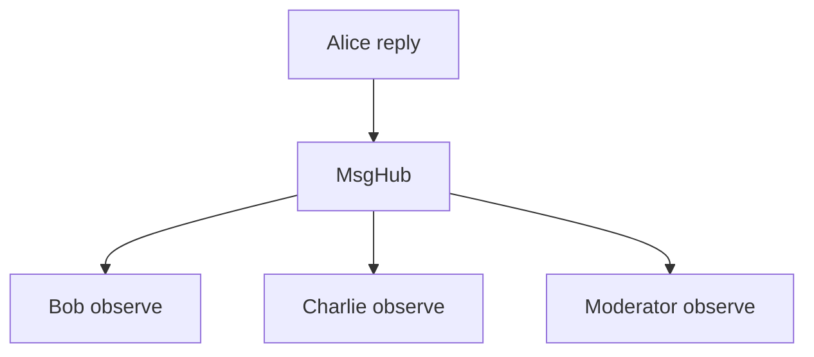
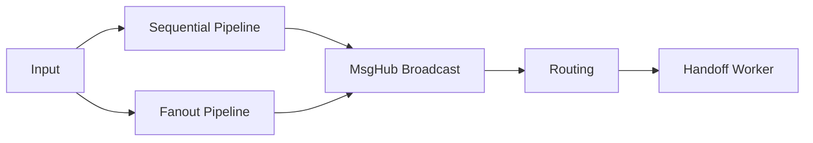

# 对话工作流与 Pipeline

## 先把“多 Agent”还原成源码里的消息拓扑

AgentScope 对多 Agent 的理解并不神秘。它没有先发明一套很重的 workflow DSL，而是先保留一个更底层、更真实的事实：多 Agent 协作本质上是消息如何传播、谁 observe、谁 reply、谁接管控制权。

所以官方教程里的 Conversation、Debate、Routing、Handoffs、Concurrent Agents、Pipeline，本质上都是不同的消息流拓扑。

## Conversation：最基本的协作单元

Conversation 页强调两件事：

1. user-assistant 对话用 `ChatFormatter`。
2. 多实体对话用 `MultiAgentFormatter` + 显式消息共享。

这说明 AgentScope 并不把“多 Agent”藏在黑盒 orchestration 后面，而是明确把它还原成：

1. 如何构建提示。
2. 如何传播消息。

## `MsgHub`：把广播变成显式运行时语义

`MsgHub` 的关键价值不是少写几行广播代码，而是把“群聊上下文同步”定义成框架级行为：在 hub 内 reply 的消息，会自动分发给订阅者的 `observe()`。

它解决的是三个一直容易写乱的问题：

1. 谁在 hub 里，谁就自动接收别人的回复。
2. 不在 hub 里的人不会自动获得上下文。
3. `announcement` 提供进入上下文时的公共起始条件。

这就是为什么官方 debate 示例把 moderator 的最终裁决放到 hub 外调用，因为“听讨论”和“把裁决再广播给所有辩手”是两个不同需求。

## Concurrent Agents：为什么只是 `asyncio.gather`

官方教程对并发非常克制，直接展示 `asyncio.gather`。这从设计上是对的，因为 AgentScope 并没有把 Python 自带 async 生态包起来再发明一层调度黑箱。

因为它说明 AgentScope 没有强行发明一套新的并发模型，而是复用 Python async 生态。这样更透明，也更容易推理性能和失败模式。

## Routing 与 Handoffs 的区别

这两个词很容易混，但源码层面它们属于两类不同决策：

### Routing

决定“把请求送到哪个后续处理路径”。

两种模式：

1. 显式 routing：输出结构化选择。
2. 隐式 routing：把下游能力包成工具，由 Agent 自己调用。

### Handoffs

决定“把一段任务交给子 Agent 去完成”。

它更像 orchestrator-worker 模式，而不是简单分类器。

所以：

1. Routing 关注分流。
2. Handoffs 关注委派。

## Pipeline：把常见拓扑封成轻量原语

官方教程把 pipeline 明确称为“多智能体编排的语法糖”，这个表述很准确。这里的重点不是做一门工作流语言，而是给常见模式一个稳定封装。

### 顺序管道

一个 Agent 的输出成为下一个 Agent 的输入。

适合：

1. 分阶段加工。
2. 线性审阅链。
3. planner -> coder -> reviewer。

### 扇出管道

同一个输入发给多个 Agent，收集多份结果。

适合：

1. 多视角回答。
2. 多候选生成。
3. 并行专家咨询。

### `stream_printing_messages`

它解决的是另一个问题：如何把 Agent 在执行过程中通过 `print` 产出的中间消息流式暴露给外部。

这对前端和日志系统很关键，因为用户往往不只想看最终答案，还想看工具调用、推理过程中的可见输出。

## 一个统一视角

可以把这些 workflow 放进一张图里看：

它们不是彼此替代，而是可组合关系。

## 设计思想

AgentScope 在 workflow 上的设计很务实：

1. 不定义过重的 orchestration DSL。
2. 保留 Python async 的直接表达力。
3. 只把最常见的模式抽象成 `MsgHub`、`sequential_pipeline`、`fanout_pipeline` 这种轻量原语。

这样做的好处是，框架给出足够多的拼装件，但不把应用绑进一套难以调试的“工作流元语言”里。

## 怎么使用

1. 几个 Agent 共享上下文时，优先用 `MsgHub`，不要手动给每个 Agent 重放消息。
2. 阶段性串联处理时，用 sequential pipeline。
3. 多专家并行给意见时，用 fanout 或直接 `asyncio.gather`。
4. 只是分流请求时，用 routing；需要一个 Agent 真正接管后续任务时，用 handoff。

## 怎么扩展

1. 需要复杂编排时，优先在 Python async 层组合这些原语，而不是先设计一套自定义 DSL。
2. 需要共享上下文但不希望自动发言时，优先利用 `observe`/`reply` 分离语义。
3. 需要调试多 Agent 行为时，把 tracing 接上，不要只看最终输出。