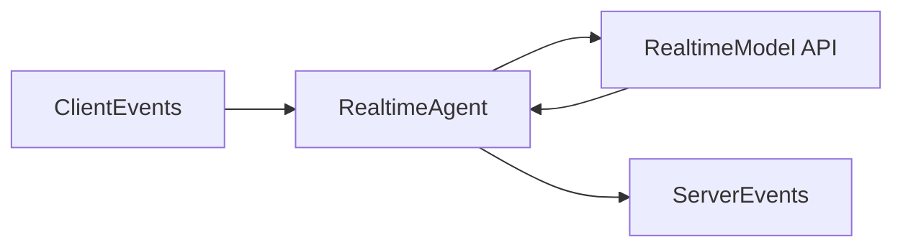

# 实时智能体、A2A 与 TTS

## 为什么这三块放在一起

它们都在处理“Agent 如何越过普通文本聊天边界”。

1. Realtime Agent 处理持续事件流。
2. A2A 处理远程 Agent 间互操作。
3. TTS 处理语音输出链路。

这三者共同说明：AgentScope 不只想做同步文本问答框架。

## `RealtimeAgent` 在源码里是一个桥接运行时

从 `agentscope.agent._realtime_agent.RealtimeAgent` 可以看出，它并不是 `AgentBase` 的实时版，而是一套专门为事件流场景设计的运行时。

它的核心职责有四个：

1. 持有 `RealtimeModelBase` 与 `Toolkit`。
2. 用 `_incoming_queue` 接来自前端或其他 Agent 的输入事件。
3. 用 `_model_response_queue` 接实时模型返回的事件。
4. 用 `_forward_loop()` 和 `_model_response_loop()` 在“外部事件 <-> 实时模型 <-> 工具执行”之间做桥接。

这个桥接层的价值在于：

1. 前端不用直接理解不同厂商的实时 API。
2. 模型事件被统一翻译成 Agent 语义事件。
3. 同一套前后端协议可以适配多家实时模型。

## 为什么 realtime 要做事件模型，而不是继续用 `Msg`

因为实时场景里，最小单元不再是“一条完整消息”，而是：

1. 音频 delta。
2. transcript delta。
3. tool use delta。
4. 输入开始/结束事件。

也就是说，实时系统天然是事件驱动，而不是 message driven。AgentScope 承认这一点，所以没有强行拿 `Msg` 覆盖所有实时交互。`RealtimeModelBase` 的 `connect()`、`send()`、`parse_api_message()` 这套接口，也是在围绕事件流而不是完整消息设计。

## `ChatRoom` 在源码里负责什么

`agentscope.pipeline._chat_room.ChatRoom` 不是复杂编排器，它只是把多个 `RealtimeAgent` 放进一个共享转发空间里。

源码里它承担：

1. 生命周期统一管理。
2. 消息广播。
3. 单一前端队列输出。

这相当于把 `MsgHub` 的广播思想，扩展到了实时事件域。

## A2A：远程 Agent 互操作边界

AgentScope 对 A2A 的支持很克制。官方教程明确列了限制：

1. 偏 chatbot 场景。
2. 不支持实时打断。
3. 不支持 agentic structured output 对齐到本地 ReAct 那么完整。

这很重要，因为它表明 A2AAgent 不是“远程 ReActAgent 的完全等价替身”，而是“通过 A2A 协议访问远程 Agent 的兼容适配器”。设计上它强调互操作，而不是完美还原本地语义。

## Agent Card 为什么是第一步

A2A 先拿 Agent Card，再建立连接，这和 MCP 先拿工具描述很像。

本质上都是先获取远端能力声明，再决定如何接入。这种两阶段设计能避免把“发现远端能力”和“实际调用远端能力”混在一起。

## 为什么 TTS 也被当成模型层能力

AgentScope 里的 TTS 不是前端插件，而是模型抽象的一部分。这样做有两个好处：

1. Agent 在 `print` 阶段就能统一处理文本与语音输出。
2. 实时 TTS 和非实时 TTS 能共享一致接口。

## 实时 TTS 与非实时 TTS 的根本差异

### 非实时 TTS

适合已有完整文本时调用 `synthesize()`。

### 实时 TTS

适合 LLM 文本还在持续生成时，使用 `push()` 累积推进，再在末尾 `synthesize()` 收尾。

这里的关键设计点是“状态由 `msg.id` 标识”，说明实时 TTS 本质是一个会话化流式处理器，而不是简单函数。

## 怎么使用

1. 需要实时语音或实时多模态交互时，用 `RealtimeAgent`，不要拿普通 `ReActAgent` 去模拟事件流。
2. 多个实时 Agent 共享前端通道时，用 `ChatRoom` 管转发和广播。
3. 需要远端 Agent 协作但不追求完整本地语义对齐时，用 A2A。
4. 需要语音输出时，把 TTS 当成统一模型能力接进 Agent，而不是只在前端拼接播放器。

## 怎么扩展

1. 想适配新的实时模型，优先继承 `RealtimeModelBase`，实现会话配置、发送和事件解析。
2. 想扩展新的实时事件协议，先定义事件模型，再接到 `RealtimeAgent` 转发链路。
3. 想扩展远程互操作协议，保持“能力声明”和“实际调用”分离，不要把协议发现和执行混成一步。

## 一句话总结

这三个模块一起说明 AgentScope 的边界在向外扩展：

1. 从离线文本扩展到实时事件。
2. 从本地运行时扩展到远程 Agent 协议。
3. 从文本结果扩展到语音结果。

但它们并没有破坏原有体系，而是都以“统一接口 + 显式边界层”的方式接入。