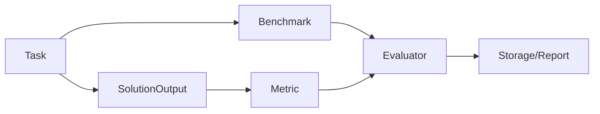

# 观测、Studio 与评测

## 先看源码想解决什么问题

Agent 比普通请求处理系统更难调试，因为同一次任务里往往同时包含：

1. 模型调用。
2. 工具调用。
3. 多轮消息状态变化。
4. 可能的多 Agent 协作。

所以 AgentScope 没把 tracing 和 evaluation 当成附加功能，而是单独拉成一层工程能力。它解决的问题不是“多打点”，而是“让一次 Agent 运行可解释、可比较、可复现”。

## Tracing：把一次运行拆成可观察 span

从 `agentscope.tracing._trace` 可以看到，AgentScope tracing 的核心不是一个专门的日志格式，而是一组围绕 Agent、Formatter、Toolkit、ChatModel、EmbeddingModel 的装饰器，例如 `trace_reply`、`trace_toolkit`、`trace_llm`。

这说明 tracing 是沿着框架关键抽象层预埋的，而不是事后从日志里反推。

AgentScope 的 tracing 基于 OpenTelemetry，这个选择非常工程化。

原因是：

1. OTel 已经是标准生态。
2. 可以无缝接入 Studio、Langfuse、Phoenix、阿里云等后端。
3. 自定义 span 与框架内置 span 可以共存。

官方教程提供了 `@trace_llm`、`@trace_reply`、`@trace_format`、`@trace` 等装饰器，本质是在框架关键节点上预埋语义化 span。

## Studio 的定位

Studio 不是单纯“可视化皮肤”，而是把 tracing 结果以更适合开发者调试的形式组织出来的本地工作台。

它主要承担：

1. 项目管理。
2. 运行追踪展示。
3. token 与模型调用观察。
4. 内置实验性 Agent `Friday`。

这说明 Studio 更像“本地 Agent 开发台”，而不只是一个日志面板。

## Evaluation：为什么单独成体系

Agent 的正确性不只等于“程序没报错”。从架构上看，tracing 和 evaluation 解决的是两种不同问题：

1. tracing 记录发生了什么。
2. evaluation 衡量结果好不好。

所以评测必须单独成体系。

AgentScope 评测框架把评测拆成：

1. `Task`
2. `Metric`
3. `Benchmark`
4. `Evaluator`
5. `Storage`

这其实是把“模型评估”升级成“Agent 应用评估”。

## 为什么 `SolutionOutput` 要包含 trajectory

因为很多 Agent 的成败不只看最终答案，还要看过程：

1. 是否走了正确工具。
2. 是否发生了异常绕路。
3. 是否出现危险行为。

trajectory 的存在让 metric 可以评最终答案，也可以评行为路径。

## OpenJudge 的作用

AgentScope 自带评估框架，但复杂语义评价很难手写。OpenJudge 集成解决的是“高阶 grader 复用”问题。

官方教程里最关键的设计是 `OpenJudgeMetric` 适配器：

1. 外层仍然是 AgentScope 的 `MetricBase`。
2. 内层调用 OpenJudge 的 `BaseGrader`。
3. 通过 mapper 把 AgentScope 数据映射成 grader 所需字段。

这实际上是把“Agent 执行框架”和“语义评估框架”松耦合接起来。

## 为什么评测和 tracing 要一起看

因为它们分别回答不同问题：

1. tracing 回答“发生了什么”。
2. evaluation 回答“结果好不好”。

只有两者一起存在，开发者才能完成闭环：

1. 看到失败。
2. 定位失败路径。
3. 修复后复测。

## 怎么使用

1. 开发期优先把 tracing 接上，再开始调 prompt 和工具。
2. 做 benchmark 时同时保存最终结果和 trajectory，不要只存答案文本。
3. 有复杂语义判分需求时，用 OpenJudge 适配器，而不是把所有评分规则手写死在本地。
4. 先用 tracing 定位失败路径，再用 evaluation 比较修复前后的质量变化。

## 怎么扩展

1. 想观察自定义函数或阶段，优先复用 tracing 装饰器体系。
2. 想接别的观测后端，优先沿 OpenTelemetry 输出，而不是再造埋点协议。
3. 想加新的评分逻辑，优先实现 Metric 或做 OpenJudge mapper，而不是侵入 Agent 运行时代码。

## 一句话总结

AgentScope 的观测与评测体系说明它不把 Agent 当 demo，而是当长期运行的软件系统：要能看、能量化、能复现、能比较。