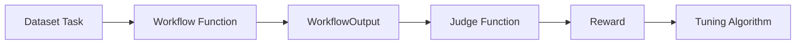

# Tuner 与训练闭环

## 为什么 AgentScope 要做 Tuner

前面的 tracing、evaluation 解决的是“看清 Agent 表现”。`tuner` 解决的是下一步：“如何系统性提高 Agent 表现”。

官方教程把 tuner 定位成通过强化学习训练 Agent 应用，而不是只训练单个 prompt。这一点很关键。

## 从源码接口看 Tuner 的最小闭环

从 `agentscope.tuner` 的导出接口来看，核心入口是 `tune()`，而它依赖三组最关键的类型：

1. 任务数据集。
2. 工作流函数。
3. 评判函数。

这三个组件共同定义了一个可训练闭环：

在源码里，这个闭环被明确拆成：

1. `WorkflowType`：输入 task、主模型、辅助模型和 logger，输出 `WorkflowOutput`。
2. `JudgeType`：输入 task 和 workflow response，输出 `JudgeOutput`。
3. `tune()`：把这些配置组装成 Trinity-RFT 可执行配置并启动训练。

## 为什么 workflow function 是中心

很多训练框架默认训练对象是“模型前向过程”。AgentScope 不一样，它把训练对象定义成 workflow function。

这意味着被优化的不只是某一轮文本生成，而是整个 Agent 应用执行逻辑。

例如一个 workflow 可以包含：

1. 创建 ReActAgent。
2. 走工具调用。
3. 生成结构化输出。
4. 汇总最终响应。

也就是说，调优单位从“模型回答一句话”升级成“Agent 完成一类任务的方式”。

## 为什么 judge function 单独暴露

这是为了把“任务执行”和“奖励定义”彻底拆开。

1. workflow 关心怎么做。
2. judge 关心做得怎么样。

这样一来，同一个 workflow 可以接多个 judge，或者同一个 judge 可以评多个 workflow，组合空间会很大。

## 为什么底层依赖 Trinity-RFT

从 `tune()` 的实现可以直接看到，AgentScope 并不自己重写底层训练引擎，而是把 workflow、judge、dataset、model、algorithm 这些 Agent 级抽象转换成 Trinity-RFT 配置，再调用其 `run_stage()`。

这说明 AgentScope 在训练上采取了务实路线：

1. 自己定义 Agent 级训练接口。
2. 底层复用更专业的 RL 训练引擎。

这避免了框架重复造一个底层训练系统，同时保留 Agent 应用层的抽象。

## 与 Evaluation 的关系

`tuner` 实际上站在 evaluation 的下一步。

1. evaluation 告诉你当前质量。
2. tuner 让你定义 reward，持续优化 workflow。

因此一个成熟闭环通常是：

1. 先建 benchmark。
2. 再写 workflow。
3. 再写 judge。
4. 最后交给 tuner 跑训练。

## 适合什么场景

`tuner` 更适合：

1. 有较稳定任务分布。
2. 能定义 reward 或 judge。
3. 希望持续提升某类 Agent 任务表现。

不太适合：

1. 任务定义还不稳定。
2. 评估目标不明确。
3. 工作流本身还没跑通。

## 怎么使用

1. 先把 workflow 跑通，再考虑 tuner；不要一边训练一边找主流程 bug。
2. workflow 输出里如果已经能直接给 reward，就可以弱化 judge；否则用 judge 统一打分。
3. 把辅助模型看成评审或配角模型，不要和主调优模型混淆。
4. 先从稳定的数据集和明确 reward 开始，不要在任务定义还漂移时上 tuner。

## 怎么扩展

1. 想优化新的 Agent 应用，不要直接改底层训练器，先定义新的 workflow function。
2. 想换评分标准，优先换 judge function，而不是改 workflow。
3. 想接新的训练算法或配置，沿 `AlgorithmConfig` 和 Trinity 配置转换层扩展。
4. 注意当前包入口是 `agentscope.tuner`，`agentscope.tune` 已经是弃用兼容层。

## 一句话总结

AgentScope 的 `tuner` 让 Agent 开发从“手工调 prompt”进入“以 workflow 为单位做可重复训练”的阶段。这是它面向工程落地而不是 Demo 使用的又一个信号。