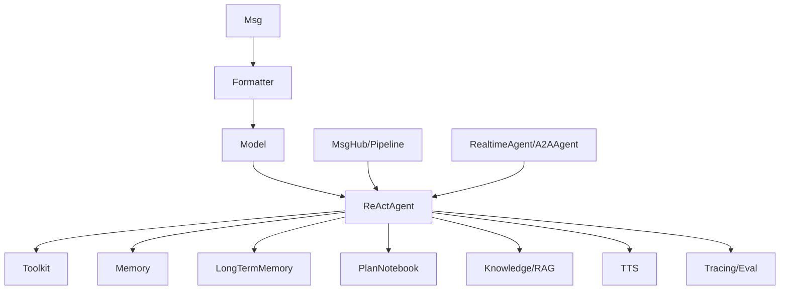

# AgentScope 文档总览

这套文档不是官方教程的重排版，而是结合官方教程与当前项目环境中的 AgentScope 源码，对运行时结构做一轮偏源码视角的解读。

主线不是“这个 API 怎么调”，而是四个更接近工程落地的问题：

1. 这个能力在源码里由哪些类和方法负责。
2. 为什么框架要把职责拆成现在这个样子。
3. 使用时应该把它放在整个 Agent 运行链的什么位置。
4. 如果你要扩展，应该改哪一层，而不是在哪一层硬塞逻辑。

因此，主线章节会尽量按统一结构书写：

1. 源码入口与运行职责。
2. 设计思想与边界。
3. 典型使用方式。
4. 推荐扩展点。

## 建议阅读顺序

### 一、基础层

1. [01-foundations/01-overview.md](01-foundations/01-overview.md)
2. [01-foundations/02-messages-formatters-models.md](01-foundations/02-messages-formatters-models.md)
3. [01-foundations/03-state-memory-session.md](01-foundations/03-state-memory-session.md)
4. [01-foundations/04-agent-runtime.md](01-foundations/04-agent-runtime.md)

### 二、能力层

5. [02-capabilities/01-tools-mcp-skills.md](02-capabilities/01-tools-mcp-skills.md)
6. [02-capabilities/02-plans-and-rag.md](02-capabilities/02-plans-and-rag.md)
7. [02-capabilities/03-hooks-and-middleware.md](02-capabilities/03-hooks-and-middleware.md)

### 三、工作流层

8. [03-workflows/01-conversation-and-pipeline.md](03-workflows/01-conversation-and-pipeline.md)

### 四、高级能力层

9. [04-advanced/01-realtime-a2a-and-tts.md](04-advanced/01-realtime-a2a-and-tts.md)
10. [04-advanced/02-observability-and-evaluation.md](04-advanced/02-observability-and-evaluation.md)
11. [04-advanced/03-tuner.md](04-advanced/03-tuner.md)

## 整体结构图

## 如何理解 AgentScope

如果只看公开 API，AgentScope 很像“一个功能很多的 Agent 框架”；但从源码结构看，它更像一套逐层拼起来的运行时：

1. `agentscope.message` 解决统一消息表示。
2. `agentscope.formatter` 和 `agentscope.model` 解决模型厂商差异。
3. `agentscope.module.StateModule` 解决长生命周期对象的状态快照。
4. `agentscope.agent` 解决一次 reply 如何组织成可恢复、可观测、可插拔的执行循环。
5. `agentscope.tool`、`agentscope.rag`、`agentscope.plan` 解决外部能力接入。
6. `agentscope.workflow`、`agentscope.tracing`、`agentscope.evaluate` 解决协作和工程化落地。

这也是为什么本目录的阅读顺序不是从 feature 开始，而是从消息、状态、运行时开始。前面三层如果没读清楚，后面的工具、RAG、评测都会看成“功能堆叠”；读清楚之后，就会发现它们其实都只是挂在统一运行时上的能力模块。

## 适合怎么用这套文档

1. 想知道框架整体脉络，先读基础层四篇。
2. 想把 Agent 接进工具、计划、RAG，重点看能力层三篇。
3. 想做多 Agent 协作，看工作流层。
4. 想做可观测、评测、实时交互或训练，再看高级层。

如果你是要二次开发 AgentScope 应用，而不是只跑示例，建议把每篇文档里的“如何扩展”一节当成重点，因为那部分是在回答“这个需求应该落在哪一层改”。

## 专题深挖

下面这些文档保留为按类名组织的细读材料，适合在读完主线后回查：

1. [01-state-module.md](01-state-module.md)
2. [02-agent-base.md](02-agent-base.md)
3. [03-agentbase-subclass.md](03-agentbase-subclass.md)
4. [04-msghub.md](04-msghub.md)
5. [05-react-agent-base.md](05-react-agent-base.md)
6. [06-react-agent-loop.md](06-react-agent-loop.md)