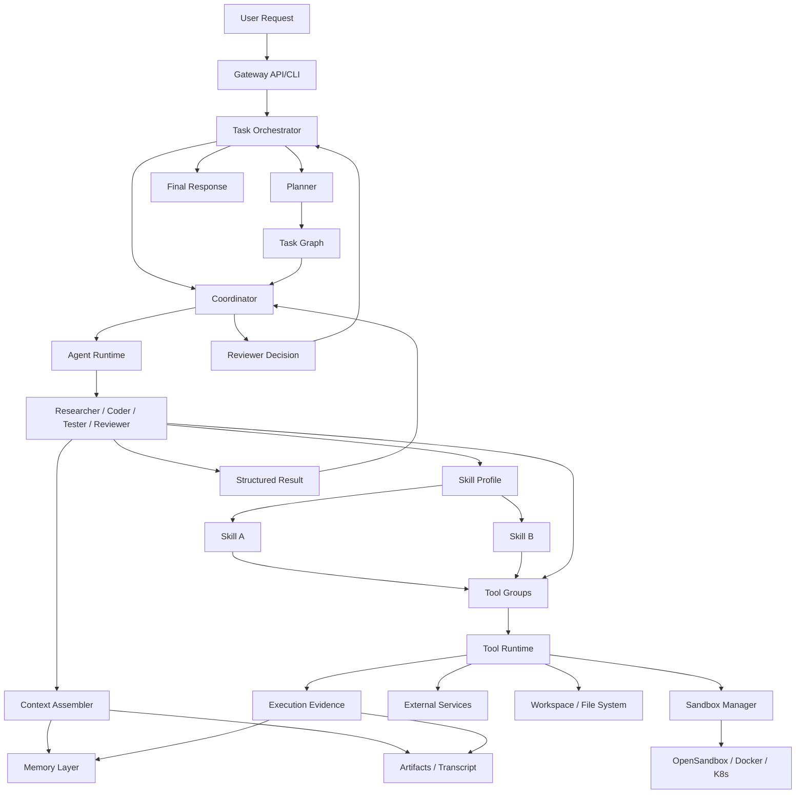

# 多智能体任务执行系统完整方案

> 这份文档回答两个核心问题：
>
> 1. SwarmMind 的多智能体到底应该怎么协作，什么才是核心模式。
> 2. 一个用户任务进入系统后，系统到底怎么拆解、调度、执行、审查、交付。

这部分是平台核心，不只是“调用几个 Agent”，而是一套完整的执行系统。

---

## 1. 核心判断

SwarmMind 不应该采用“所有 Agent 一起聊天，然后希望它们自然协作”的模式。

这个模式有三个明显问题：

1. 上下文污染严重，所有 Agent 会看到过多无关信息。
2. 责任不清晰，出了问题很难知道是谁决策失误。
3. token 成本和推理噪声会快速上升。

更合适的路线是：

**Coordinator 驱动的分阶段、按需唤起、多角色协作执行系统。**

也就是：

- 不是所有 Agent 永远在线。
- 不是每个任务都走完全相同的角色链。
- 不是所有上下文都广播给所有人。

而是由 Coordinator 根据任务状态决定：

- 当前需要谁参与。
- 该 Agent 能看到哪些上下文。
- 该 Agent 输出什么结构化结果。
- 结果如何进入下一阶段。

这套模型本质上是：

**Planner 负责拆解，Coordinator 负责调度，专业 Agent 负责产出，Reviewer 负责把关，Memory 和 Sandbox 作为执行基础设施。**

---

## 2. 设计目标

1. 支持复杂任务拆解为可执行 DAG。
2. 支持顺序和并行混合调度。
3. 支持不同 Agent 角色明确分工。
4. 支持沙箱隔离执行和结果回收。
5. 支持局部失败重试，而不是整单任务重跑。
6. 支持全链路可审计、可回放、可观测。
7. 支持后续扩展到多 Worker 和多租户部署。

---

## 3. 推荐多智能体协作思路

### 3.1 不是群聊模式，而是控制流模式

多智能体系统常见有两种思路：

1. **群聊模式**
   多个 Agent 在一个共享上下文里持续对话。

2. **控制流模式**
   一个中心调度器决定何时调用哪个 Agent，并把产出结构化地传递给下游。

SwarmMind 应优先采用第二种，把第一种只作为局部能力。

原因：

- 群聊适合 brainstorm、辩论、多方案生成。
- 控制流更适合工程任务执行、状态管理、审计与回放。

对于“实现功能并测试”“生成报告并审阅”“构建脚本并验证”这类任务，控制流比群聊稳定得多。

### 3.2 MsgHub 只在局部使用

AgentScope 的 `MsgHub` 很适合两个场景：

1. 多专家并行讨论同一问题。
2. Planner 和 Reviewer 之间进行有限轮次的方案辩论。

但不适合做整个系统的全局总线。

这里要特别区分两类“广播”能力，避免后续实现时把边界混掉：

1. `MsgHub` 是 AgentScope 运行时里的会话广播机制，解决的是“同一组 Agent 如何共享上下文”。
2. 平台 `EventBus` 是 SwarmMind 的领域事件传播机制，解决的是“task/run/subtask/sandbox 等状态变化如何跨模块传播、审计和回放”。

两者虽然都表现为 publish / subscribe，但抽象层级不同：

- `MsgHub` 传递的是 Agent 对话消息。
- `EventBus` 传递的是带 `tenant_id`、`task_id`、`run_id`、`subtask_id`、`sandbox_id` 的领域事件 envelope。

因此，SwarmMind 不应该尝试用 `MsgHub` 替代全局事件总线。更合理的边界是：

- Agent 内部协作、有限轮讨论，用 `MsgHub`。
- 平台级状态推进、异步解耦、重试、审计、回放，用 `EventBus`。

SwarmMind 的正确使用方式应该是：

- 全局上用 Orchestrator 控制状态机和阶段流转。
- 局部上用 `MsgHub` 做小范围协作。

例如：

- Planner 先出任务图。
- Researcher 和 Architect 在一个局部 hub 里各给一份技术方案。
- Coordinator 收敛方案，再继续后续执行。

### 3.3 Pipeline 才是主干

整个平台的骨架应该是“动态 pipeline”，而不是静态链条。

意味着：

- 默认有一套标准阶段。
- 但不同任务可以跳过某些阶段，或者增加额外阶段。

标准阶段建议：

1. Intake
2. Plan
3. Prepare
4. Execute
5. Verify
6. Review
7. Deliver

每个阶段内部再由一个或多个 Agent 执行。

---

## 4. 推荐角色体系

### 4.1 必选角色

1. **PlannerAgent**
   负责把用户目标转成结构化任务图。

2. **CoordinatorAgent**
   负责阶段推进、任务分配、失败重试、上下文裁剪、结果汇总。

3. **ExecutorAgent**
   泛化执行角色。MVP 中可以先只实现一个，再逐步拆成 Coder、Writer、Researcher。

4. **TesterAgent**
   负责验证执行结果，运行测试、检查约束、给出失败证据。

5. **ReviewerAgent**
   负责对阶段产出做验收判断，决定是否返工、通过或降级交付。

### 4.2 推荐扩展角色

1. **ResearcherAgent**
   负责文档搜索、信息收集、外部依赖确认。

2. **ArchitectAgent**
   负责方案设计、接口定义、目录结构和关键技术决策。

3. **CoderAgent**
   专职改代码、生成 patch、运行格式化和静态检查。

4. **WriterAgent**
   专职报告、邮件、PPT 等文档产出。

### 4.3 角色不是固定人数，而是固定责任

MVP 里不需要一开始就有 6 个完全独立的 Agent 实现。

更现实的路线是：

- 先有 3 个逻辑角色：Planner、Coordinator、Worker。
- 再逐步把 Worker 拆成 Researcher、Coder、Tester、Writer。

这样可以先稳定执行链路，再增强专业性。

---

## 5. 系统核心原则

在进入原则之前，需要先把 `tool` 和 `skill` 的位置说清楚。

### 5.0 Tool 和 Skill 的分工

这是多智能体系统里非常关键的一层。

如果不区分 `tool` 和 `skill`，系统最后会退化成两种坏味道之一：

1. 所有能力都做成零散工具，Agent 每次都要自己临时拼流程。
2. 所有能力都做成大而全技能，系统失去可组合性和可审计性。

SwarmMind 更合适的定义是：

- **Tool**：原子能力，完成一次明确动作。
- **Skill**：面向任务模式的复合能力，负责把多个 tool 和步骤组织成一个稳定套路。

### 5.0.1 什么是 Tool

Tool 是最小执行单元，通常具备这些特点：

- 输入输出明确
- 可单次调用
- 可审计
- 可被沙箱或外部服务承接

典型例子：

- `bash`
- `search`
- `browser`
- `read_file`
- `write_file`
- `send_mail`
- `generate_pptx`

也就是说，tool 回答的是：

**“我现在要执行哪个具体动作？”**

### 5.0.2 什么是 Skill

Skill 是复合能力包，通常包含：

- 一类任务的执行套路
- 参数 schema
- 若干内部步骤
- 对多个 tool 的组织方式
- 可选的模板、脚本、最佳实践、策略约束

结合当前仓库里的实现，`build_app`、`write_report` 这类就已经接近 skill 的雏形：

- `build_app` 不是单一步动作，而是“生成代码 -> 写文件 -> 测试”的组合流程。
- `write_report` 不是单一步动作，而是“调研 -> 写作 -> 保存”的组合流程。

所以 skill 回答的是：

**“面对某一类任务，我应该按什么套路做事？”**

### 5.0.3 Tool 和 Skill 的推荐关系

推荐关系如下：

```text
Agent Role
   -> equips Skill Profile
   -> Skill chooses Tool Set
   -> Tool invokes Sandbox / External Service / File System
```

也就是说：

- 角色决定职责。
- skill 决定做事方法。
- tool 决定具体执行动作。

### 5.0.4 为什么两者都要有

只用 tool 的问题：

- Agent 每次都要从零规划。
- 容易漏步骤。
- 不同任务结果不稳定。

只用 skill 的问题：

- 技能会越来越大。
- 很难灵活应对边界情况。
- 失去工具级追踪和中间证据。

因此正确做法是：

- **skill 提供稳定套路**
- **tool 提供原子执行**

### 5.0.5 在系统中的层级位置

建议每个 Agent 都用下面这个装备模型：

```text
Agent = Role + Prompt + Memory + Skill Profile + Tool Groups + Policy
```

其中：

- `Role` 规定这个 Agent 对什么结果负责。
- `Prompt` 规定行为边界和输出格式。
- `Memory` 提供上下文。
- `Skill Profile` 提供领域套路。
- `Tool Groups` 提供可执行动作。
- `Policy` 控制权限、预算、可访问资源。

### 5.0.6 模块关系图

下面这张图建议作为后续实现时的统一心智模型：



这张图表达的是六层关系：

1. **入口层**：用户请求先进入 Gateway，再由 Orchestrator 接管。
2. **控制层**：Orchestrator 和 Coordinator 决定当前阶段该调用哪个 Agent。
3. **智能层**：Agent 基于上下文执行推理，但不直接裸调环境。
4. **套路层**：Skill Profile 给 Agent 提供任务套路。
5. **动作层**：Tool Groups 和 Tool Runtime 提供原子能力。
6. **基础设施层**：Sandbox、Memory、Artifacts、External Services 支撑实际执行和回放。

如果后续代码设计偏离这张图，通常意味着边界开始混乱。

### 5.1 任务图先行

用户任务进入系统后，第一步不是直接执行，而是先生成任务图。

任务图至少包括：

- 子任务列表
- 依赖关系
- 每个子任务的目标
- 每个子任务的输入
- 每个子任务的输出
- 每个子任务的验收标准
- 推荐角色
- 推荐 sandbox profile

### 5.2 Agent 只拿“最小必要上下文”

每次调用 Agent 时，只注入它真正需要的内容：

- 当前子任务描述
- 依赖子任务输出摘要
- 相关记忆
- 相关文件或工件引用
- 限定的工具集

不要把整条 transcript 全塞进去。

### 5.3 产出必须结构化

每个 Agent 的输出不应该只是自由文本，而应尽量结构化。

例如：

```json
{
  "decision": "accept",
  "summary": "Implementation passes unit tests but lacks CLI docs.",
  "artifacts": ["artifact://patch/001", "artifact://test-report/001"],
  "next_action": "request_doc_update"
}
```

这样 Coordinator 才能稳定推进状态机。

### 5.4 工具执行与思考分离

Agent 负责：

- 推理
- 计划
- 决策
- 工具调用选择

Sandbox 和 Tool Runtime 负责：

- 运行命令
- 写文件
- 执行测试
- 抓取网页
- 回传结果

Agent 不直接拥有执行环境，必须通过统一工具层进入沙箱。

### 5.4.1 Skill 也不能绕过 Tool Runtime

即使某个 skill 内部封装了一组步骤，也不应该绕过统一工具层。

正确做法是：

- skill 负责编排步骤
- 每一步仍然通过 tool 执行
- transcript 仍然记录具体 tool 调用

例如 `build_app` skill 的内部步骤可以是：

1. 生成代码草案
2. 调 `write_file` 写入文件
3. 调 `bash` 或 `run_tests` 执行验证
4. 返回结构化结果

这样系统仍然可审计、可重放。

### 5.5 验证必须独立于执行

执行者不能自己给自己最终验收。

所以建议：

- Coder 写代码。
- Tester 跑测试。
- Reviewer 做最终判断。

哪怕 MVP 里同一个模型承担多个角色，也要在逻辑上做分离。

---

## 6. 一个用户任务进入系统后的完整处理流程

下面用“实现一个功能并测试”举例，但这套流程也适用于写报告、写邮件、做分析等任务。

### 阶段 1: Intake

输入：

- 用户 goal
- constraints
- 附件
- profile

处理：

1. API/CLI 接收请求。
2. Gateway 创建 `task_id`、`session_id`、`run_id`。
3. 写入初始 task record。
4. 初始化 transcript 和 task memory。
5. 判断是否命中已有模板或 skill。

输出：

- 初始任务对象
- 初始上下文

### 阶段 2: Plan

执行者：PlannerAgent

输入：

- 用户原始目标
- 用户约束
- 历史记忆摘要
- 可用工具和 profiles

处理：

1. Planner 识别任务类型。
2. Planner 生成 DAG 子任务。
3. Planner 为每个子任务补充：
   - description
   - dependencies
   - role
   - preferred_skill
   - required_tool_groups
   - sandbox_profile
   - acceptance_criteria
   - estimated_cost

输出：

- `TaskGraph`
- `ExecutionPlan`

如果 Planner 给出的计划不满足约束，Coordinator 可以触发一次 replanning。

### 阶段 3: Prepare

执行者：CoordinatorAgent + SandboxManager

处理：

1. 根据 DAG 找到无依赖的 ready subtasks。
2. 为每个 subtask 选择执行角色。
3. 为每个 subtask 选择 skill profile。
4. 按 skill profile 激活需要的 tool groups。
5. 选择工具权限和 sandbox profile。
4. 准备输入工件：
   - 工作目录
   - 模板文件
   - 上游结果摘要
   - 必要环境变量

输出：

- 可执行 subtask queue

### 阶段 4: Execute

执行者：Researcher/Coder/Writer/ExecutorAgent

处理：

1. Coordinator 给某个 Worker 分配 subtask。
2. Worker 读取该 subtask 的最小上下文。
3. Worker 根据当前 subtask 选择直接调用 tool 或执行 skill。
4. skill 内部再按步骤调用 sandbox、搜索、文件、浏览器等 tool。
4. 产出结果：
   - 代码 patch
   - 文档草稿
   - 搜索摘要
   - 产物文件
5. 输出结构化执行结果。

输出：

- `SubtaskResult`
- `artifact_refs`
- `execution_summary`

### 阶段 5: Verify

执行者：TesterAgent

处理：

1. 对执行结果做独立验证。
2. 运行自动测试、规则检查、格式校验。
3. 生成验证证据。

输出：

- `VerificationResult`
  - passed / failed / partial
  - evidence
  - failure_reason
  - suggested_fix

### 阶段 6: Review

执行者：ReviewerAgent

处理：

1. 汇总执行结果和验证结果。
2. 对照 acceptance criteria 判断是否达标。
3. 决定：
   - accept
   - rework
   - escalate
   - deliver_with_warning

输出：

- `ReviewDecision`

### 阶段 7: Rework，可选

触发条件：

- 测试失败
- Reviewer 拒绝
- 关键工件缺失

处理：

1. Coordinator 提取失败证据。
2. 生成 repair task。
3. 仅重跑失败链路相关 subtasks。
4. 达到阈值后停止，避免无限循环。

### 阶段 8: Deliver

处理：

1. 汇总最终工件。
2. 写入 transcript 和 artifacts 索引。
3. 将关键经验沉淀进 memory。
4. 返回最终结果给用户。

输出：

- `TaskResult`
- `artifact_index`
- `replay_ref`

---

## 7. 推荐消息拓扑

### 7.0 能力拓扑：Role / Skill / Tool

除了消息拓扑，还需要一个能力拓扑。

```text
Coordinator
   -> selects Agent Role
   -> binds Skill Profile
   -> equips Tool Groups
   -> runs Subtask
```

这一步非常关键，因为系统不是“Agent 自己拥有无限工具”，而是：

- Coordinator 为这次 subtask 临时装备最合适的 skill 和 tool。
- subtask 结束后可以卸载这批能力。

这样可以减少上下文污染和误用工具。

### 7.1 全局消息拓扑

```text
User Request
   -> Gateway
   -> Task Orchestrator
   -> Planner
   -> Coordinator
   -> Worker Agent(s)
   -> Tester
   -> Reviewer
   -> Coordinator
   -> Final Response
```

这是主干控制流。

### 7.2 局部协作拓扑

在某些阶段内部，再局部启用群聊或 fanout：

1. **方案辩论**
   Planner + Architect + Researcher 用 `MsgHub` 讨论技术路径。

2. **多方案生成**
   同一输入发给多个 Worker，并行产出候选结果。

3. **并行验证**
   Tester 同时跑单元测试、静态检查、约束检查。

所以正确理解是：

- 全局是状态机。
- 局部是 MsgHub / fanout / gather。

---

## 8. 状态机设计

### 8.1 Task 状态

推荐：

```text
PENDING -> INTAKE -> PLANNING -> PREPARING -> EXECUTING -> VERIFYING -> REVIEWING -> SUCCEEDED
                                                                                   -> FAILED
                                                                                   -> CANCELLED
```

当前代码里的状态机还偏粗，建议从现有 `PENDING/PLANNING/RUNNING/REVIEWING/...` 扩展成更细粒度版本。

### 8.2 Subtask 状态

推荐：

```text
QUEUED -> READY -> ASSIGNED -> SANDBOX_CREATING -> EXECUTING -> VERIFYING -> DONE
                                                              -> ERROR
```

这样 Coordinator 才能做更稳定的并发调度与失败恢复。

---

## 9. DAG 与调度策略

### 9.1 为什么必须是 DAG

因为真实任务不是纯串行链。

例如一个开发任务：

1. Research API docs
2. Design interface
3. Implement backend
4. Implement tests
5. Run verification
6. Review output

其中：

- 3 和 4 可以部分并行。
- 5 依赖 3 和 4。
- 6 依赖 5。

所以 subtask 需要显式 `dependencies`。

### 9.2 调度规则

Coordinator 的调度循环建议如下：

1. 找出所有依赖已满足的 subtasks。
2. 根据优先级、资源额度、sandbox profile 做排序。
3. 按并发额度派发。
4. 监听结果回流。
5. 更新图状态。
6. 如有失败，决定 repair / retry / fallback / abort。

### 9.3 并发控制

建议控制维度：

- 每个 task 最大并发 subtask 数
- 每类 sandbox profile 最大实例数
- 每个租户总并发额度
- 每个 Agent 类型最大并发调用数

---

## 10. Sandbox 在执行链路中的位置

沙箱不是“附属能力”，而是执行系统的基础设施。

### 10.1 每个 subtask 绑定执行策略

每个 subtask 至少要有：

- `sandbox_profile`
- `network_policy`
- `timeout_sec`
- `cpu_limit`
- `memory_limit`

### 10.2 推荐使用方式

1. Planner 提建议 profile。
2. Coordinator 最终确认 profile。
3. SandboxManager 创建环境。
4. Tool Runtime 通过 sandbox-aware tools 执行。
5. 结果写回 transcript 和 artifacts。
6. subtask 结束后决定保留还是清理。

### 10.3 为什么不能让 Agent 直接操作 Docker/K8s

因为这样会造成：

- 安全边界失控
- 工具调用不可审计
- 执行状态无法统一管理

所以必须统一走 `SandboxProvider` 抽象。

---

## 10.5 每个 Agent 应该如何使用 Skill 和 Tool

这部分是实际落地时最重要的设计之一。

### 10.5.1 PlannerAgent

职责：

- 理解用户目标
- 拆解任务图
- 识别依赖和验收标准

Planner 更依赖：

- **skills**：任务拆解 skill、项目分析 skill、需求归纳 skill
- **tools**：读配置、读项目文件、搜索文档、查询历史任务

Planner 不应该默认拥有：

- 任意 bash 执行权限
- 大范围文件写权限

原因：

- Planner 的核心是规划，不是执行。

### 10.5.2 CoordinatorAgent

职责：

- 状态推进
- 任务分配
- 结果收敛
- 重试和 repair

Coordinator 更依赖：

- **skills**：调度 skill、重试策略 skill、结果汇总 skill
- **tools**：任务状态读写、事件总线、artifact 索引、memory summary 查询

Coordinator 不应该直接干重度执行工作。

### 10.5.3 ResearcherAgent

职责：

- 搜索信息
- 阅读文档
- 输出证据摘要

Researcher 更依赖：

- **skills**：research skill、doc synthesis skill
- **tools**：search、browser、fetch、read_file

Researcher 通常不需要：

- 文件写入代码仓库
- 执行构建命令

### 10.5.4 CoderAgent

职责：

- 修改代码
- 生成 patch
- 运行局部验证

Coder 更依赖：

- **skills**：build_app、code_fix、refactor、test_addition
- **tools**：read_file、write_file、bash、git diff、sandbox exec

Coder 的特点是：

- skill 决定开发套路
- tool 落地具体编辑和执行动作

### 10.5.5 TesterAgent

职责：

- 运行测试
- 检查约束
- 分析失败证据

Tester 更依赖：

- **skills**：verification skill、regression skill、failure triage skill
- **tools**：bash、test runner、artifact reader、log parser

Tester 一般不应直接写业务代码，最多生成修复建议。

### 10.5.6 ReviewerAgent

职责：

- 对照验收标准做最终判断
- 决定 accept/rework/escalate

Reviewer 更依赖：

- **skills**：review skill、acceptance checking skill、delivery summary skill
- **tools**：read artifact、read transcript、read test report、memory lookup

Reviewer 通常不需要：

- bash 执行权限
- 大范围写权限

### 10.5.7 WriterAgent

职责：

- 生成邮件、报告、PPT、对外文档

Writer 更依赖：

- **skills**：write_report、write_email、presentation authoring
- **tools**：search、file write、mail、pptx

---

## 10.6 Skill Profile 与 Tool Group 的推荐模型

建议不要给每个 Agent 固定死一组能力，而是采用：

- **Role**：角色身份
- **Skill Profile**：该次任务所需套路包
- **Tool Group**：该次任务允许使用的原子能力集合

例如：

```text
CoderAgent
  role = coder
  skill_profile = [build_app, code_fix]
  tool_groups = [repo_read, repo_write, sandbox_exec, git_basic]
```

```text
ResearcherAgent
  role = researcher
  skill_profile = [research, summarize_docs]
  tool_groups = [web_search, browser_read, local_read]
```

这样做的好处：

1. Agent 复用率更高。
2. 不同 subtask 可以动态装配能力。
3. 可以严格做最小权限控制。

---

## 10.7 执行时到底先用 Skill 还是先用 Tool

推荐规则：

1. **遇到明确任务模式，优先 skill**
   例如“写报告”“构建应用”“修复测试失败”。

2. **遇到单一步动作，直接 tool**
   例如“读取文件”“执行命令”“搜索网页”。

3. **skill 执行中需要具体动作时，再调用 tool**
   这是最常见的实际形态。

所以在实际系统里，最合理的结构通常是：

```text
Coordinator chooses subtask
  -> Agent chooses skill if task pattern is known
      -> Skill orchestrates multiple tools
  -> otherwise Agent calls tools directly
```

---

## 10.8 Skill 和 Tool 在审计中的记录方式

为了后续回放和诊断，transcript 里建议同时记录两层：

1. **skill event**
   例如：`skill.execute(build_app)`

2. **tool events**
   例如：
   - `tool.read_file(...)`
   - `tool.write_file(...)`
   - `tool.bash(...)`

这样回放时才能同时看到：

- 这个 Agent 当时选了什么套路
- 套路内部具体做了哪些动作

---

## 11. 记忆在任务执行系统中的位置

记忆不是单独存在的，它和执行系统强耦合。

在这套架构里：

1. Planner 读取历史模式，帮助拆解。
2. Coordinator 读取共享事实，避免重复决策。
3. Worker 读取上下文记忆，提高执行稳定性。
4. Reviewer 读取过去失败模式，降低重复返工。
5. 每个任务完成后，把高价值经验反向沉淀进长期记忆。

所以最终关系是：

**Task Execution System 决定工作流，Memory System 决定上下文质量。**

---

## 12. 失败处理与恢复策略

### 12.1 失败分类

建议分成四类：

1. **Planning Failure**
   任务图不合法、缺关键步骤、依赖错误。

2. **Execution Failure**
   工具调用失败、命令失败、沙箱异常。

3. **Verification Failure**
   测试失败、规则不满足、输出不合规。

4. **Review Failure**
   虽然执行成功，但不满足用户目标或验收标准。

### 12.2 恢复策略

1. 规划失败：重新规划一次。
2. 工具失败：重试同一步，必要时切换 profile。
3. 测试失败：生成 repair subtask。
4. 审核失败：回退到最近可修复阶段。

### 12.3 停止条件

必须设置：

- 最大重试次数
- 最大 token 预算
- 最大沙箱数
- 最大总耗时

否则系统会陷入自我修复循环。

---

## 13. 可观测与回放

这部分是生产系统必需，不是附加项。

### 13.1 必记日志字段

- `task_id`
- `run_id`
- `session_id`
- `subtask_id`
- `agent_id`
- `sandbox_id`
- `tool_name`
- `artifact_ref`
- `memory_ref`

### 13.2 Transcript 至少记录

- 用户输入
- 规划结果
- 状态迁移
- Agent 调用
- 工具调用
- 沙箱命令
- 验证结果
- 审核决策
- 最终交付

### 13.3 回放目标

用户或开发者应该可以回答：

- 这个任务为什么这样拆解。
- 哪个 Agent 做了哪个决定。
- 哪一步出错。
- 为什么最终被接受或拒绝。

---

## 14. 对当前代码的差距判断

当前仓库已有基础骨架，但距离目标系统还差几个关键层。

### 14.1 当前已有的

- `Task`
- `SubTask`
- `TaskStateMachine`
- `TaskDecomposer`
- `TaskOrchestrator`
- `AgentFactory`
- `SandboxManager`
- `Transcript`

### 14.2 当前明显不足的

1. `TaskOrchestrator` 还是串行执行，没有真正的 DAG 调度。
2. `SubTask` 缺少 role、acceptance criteria、artifacts、budget 等关键字段。
3. 还没有真正的 Coordinator 逻辑。
4. 还没有局部重试和 repair task 机制。
5. 还没有标准化的 Agent 输出 schema。
6. 还没有执行证据回流和 review decision 机制。

---

## 15. 建议的数据结构

### 15.1 TaskGraph

```json
{
  "task_id": "task_001",
  "goal": "实现导出 Excel 功能并补测试",
  "subtasks": [
    {
      "id": "st_1",
      "name": "analyze_requirement",
      "role": "planner",
         "preferred_skill": "task_planning",
         "required_tool_groups": ["project_read", "memory_lookup"],
      "dependencies": [],
      "acceptance_criteria": ["明确输入输出", "识别影响模块"]
    },
    {
      "id": "st_2",
      "name": "implement_feature",
      "role": "coder",
         "preferred_skill": "build_app",
         "required_tool_groups": ["repo_read", "repo_write", "sandbox_exec"],
      "dependencies": ["st_1"],
      "acceptance_criteria": ["代码可运行", "导出格式正确"]
    },
    {
      "id": "st_3",
      "name": "add_tests",
      "role": "tester",
         "preferred_skill": "verification",
         "required_tool_groups": ["repo_read", "sandbox_exec", "artifact_read"],
      "dependencies": ["st_2"],
      "acceptance_criteria": ["新增测试覆盖主路径"]
    }
  ]
}
```

### 15.2 AgentResult

```json
{
  "agent_id": "coder",
  "subtask_id": "st_2",
  "status": "completed",
  "summary": "Added export service and route handler.",
  "artifacts": ["artifact://patch/002"],
  "evidence": ["artifact://cmd/pytest.log"],
  "next_action": "verify"
}
```

### 15.3 ReviewDecision

```json
{
  "decision": "rework",
  "reason": "Edge case for empty dataset is not covered.",
  "target_subtasks": ["st_2", "st_3"],
  "repair_instructions": [
    "Handle empty rows in exporter",
    "Add regression test for empty dataset"
  ]
}
```

---

## 16. MVP 版本建议

### 16.1 MVP 不要一开始就做全量角色

先实现这套最小闭环：

1. Planner
2. Coordinator
3. Worker
4. Tester
5. Reviewer

其中 Worker 可以先承接 Researcher/Coder/Writer 的通用执行。

### 16.2 MVP 工作流

```text
User -> Planner -> Coordinator -> Worker -> Tester -> Reviewer -> Final
```

### 16.3 MVP 要先打通的能力

1. 结构化 task graph
2. Coordinator 调度 ready subtasks
3. role -> skill -> tool 的动态装配
4. sandbox-aware tool execution
5. verification + review loop
6. transcript + artifact collection

### 16.4 MVP 的 Skill / Tool 最小集

建议先有这几类 skill：

- `task_planning`
- `research`
- `build_app`
- `verification`
- `review`
- `write_report`

建议先有这几组 tool：

- `project_read`
- `project_write`
- `web_search`
- `browser_read`
- `sandbox_exec`
- `artifact_read`
- `memory_lookup`

这样就可以让每个 Agent 在最小能力集下完成分工。

---

## 17. 最终推荐结论

SwarmMind 的核心不应定义为“多 Agent 聊天平台”，而应定义为：

**一个以 Coordinator 为核心、以任务图为驱动、以沙箱为执行基础、以记忆为上下文增强、以 Reviewer 为质量闸门的多智能体执行系统。**

在这个系统里，`tool` 和 `skill` 的正确位置是：

- `tool` 是原子动作层
- `skill` 是任务套路层
- `agent` 是责任承担层
- `coordinator` 是调度控制层

对于“一个用户任务怎么处理”，推荐答案是：

1. 先 Intake，建立 task/session/run。
2. 再 Plan，生成 DAG 子任务和验收标准。
3. 再 Prepare，分配角色、工具和 sandbox。
4. 再 Execute，由专业 Agent 完成具体工作。
5. 再 Verify，独立验证结果。
6. 再 Review，做质量门禁。
7. 必要时 Rework，只修失败链路。
8. 最后 Deliver，并沉淀记忆和回放记录。

这套模式相比简单串行 Agent 链的优势是：

- 更稳定
- 更可控
- 更容易调试
- 更利于扩展
- 更适合生产化

---

## 18. 下一步建议

基于这份方案，最值得继续推进的不是再写概念文档，而是下面两项之一：

1. 把这套方案进一步细化成数据模型和模块设计。
2. 直接把现有 `TaskOrchestrator` 重构成真正的 Coordinator + DAG Scheduler 骨架。
