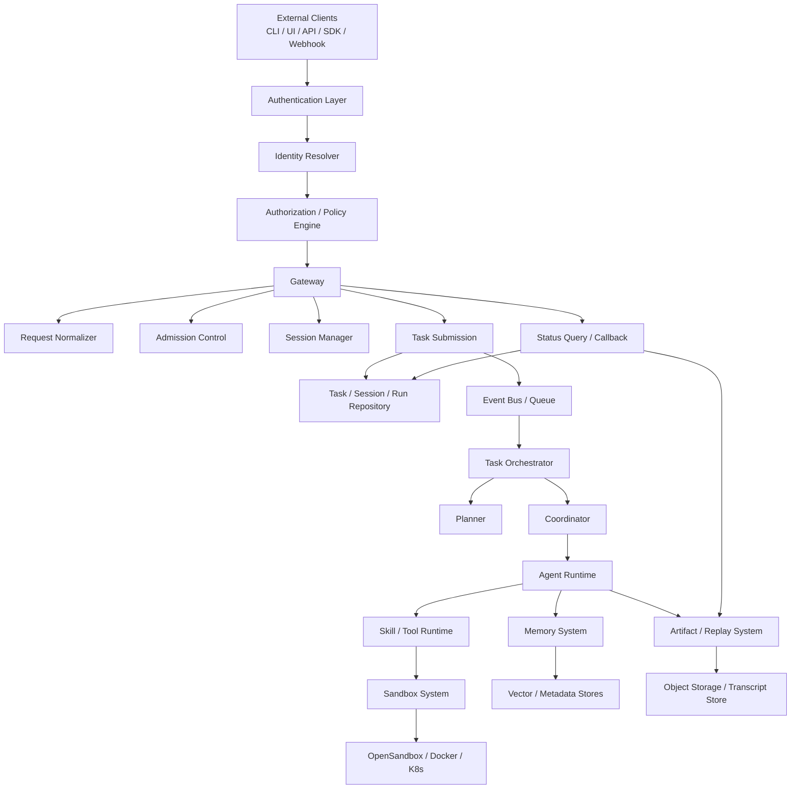

# Gateway 系统设计

> 这份文档专门说明 SwarmMind 的 Gateway 应该承担什么职责，不应该承担什么职责，以及它与租户、用户、认证体系之间的关系。

---

## 1. 结论先说

SwarmMind 里的 Gateway 不应该只是一个“任务 CRUD 类”，而应该是：

**统一入口层 + 准入控制层 + Session 管理层 + 任务提交层 + 查询与回调层。**

它的职责不是执行任务，而是：

1. 接住外部请求。
2. 校验请求是否合法、是否允许执行。
3. 归一化成内部标准任务模型。
4. 建立 `tenant / user / session / task / run` 上下文。
5. 把任务提交给 orchestrator 或 queue。
6. 对外提供状态查询、事件流和结果交付。

---

## 2. 当前代码里的 Gateway 是什么

当前实现位于：

- `swarmmind/gateway/gateway.py`

它现在的能力非常轻，主要只有：

1. 内存中创建和保存 `Task`
2. 内存中保存 `session`
3. 为 task 绑定 `Transcript`
4. 提供简单的查询和更新接口

换句话说，现在它更接近：

**进程内任务表 + 进程内 session 表 + 一个轻量 facade**

这在 demo 或本地 MVP 初期是合理的，但它还不是生产意义上的 gateway。

---

## 3. 当前方案的边界问题

如果继续沿用当前 Gateway 结构，会很快遇到以下问题：

### 3.1 没有租户边界

当前 `Task` 和 `session` 都没有 `tenant_id`，因此：

- 无法多团队隔离
- 无法配额控制
- 无法做组织级策略

### 3.2 没有用户边界

当前请求没有稳定 `user_id`，因此：

- 无法做用户级记忆
- 无法做权限控制
- 无法做用户会话恢复

### 3.3 没有认证与授权

当前 API 层没有认证校验，因此：

- 任何调用方都可直接提交任务
- 无法判断谁可以用哪些 tool / sandbox
- 无法审计调用人身份

### 3.4 没有 admission control

当前没有：

- 限流
- 预算检查
- profile 白名单
- 工具权限限制
- 幂等控制

### 3.5 没有 submission / dispatch 分离

当前 Gateway 还是偏“直接存一下然后下游自己处理”，缺少：

- 统一入队
- 异步提交
- 状态推进事件
- webhook / streaming 分发

### 3.6 没有 read model

当前查询接口只能拿到 task 基本状态，还拿不到：

- subtask 状态
- 当前所处阶段
- artifacts 索引
- 失败原因分类
- replay/transcript 摘要

---

## 4. 推荐的 Gateway 定位

Gateway 应该是系统的**边界控制层**，不是执行层。

它要解决的核心问题是：

**如何把外部世界的不稳定输入，变成内部执行系统可以稳定消费的标准化任务。**

也就是说，Gateway 负责：

- 面向外部：协议、身份、接入方式、限流、回调
- 面向内部：标准任务 envelope、session/run 上下文、dispatch

而具体的任务拆解、Agent 调度、Skill/Tool 装配、Sandbox 执行，不应放在 Gateway 中。

---

## 5. 推荐总体架构

```text
                +--------------------------------+
                |       External Clients         |
                | CLI / API / Webhook / UI / SDK |
                +---------------+----------------+
                                |
                                v
                 +-------------------------------+
                 |            Gateway            |
                 |                               |
                 |  Request Normalizer           |
                 |  AuthN / AuthZ                |
                 |  Admission Control            |
                 |  Session Manager              |
                 |  Task Submission              |
                 |  Status Query / Callback      |
                 +---------------+---------------+
                                 |
                +----------------+----------------+
                |                                 |
                v                                 v
      +---------------------+          +----------------------+
      |   Task Repository   |          | Event / Queue Layer  |
      | task/session/run    |          | task.created etc.    |
      +---------------------+          +----------------------+
                                 |
                                 v
                     +---------------------------+
                     |  Orchestrator / Planner   |
                     |  Coordinator / Runtime    |
                     +---------------------------+
```

### 5.1 统一平台边界图

为了把 `003 Gateway` 和 `004 Identity` 两份设计收束起来，建议后续都以这张图作为平台边界总图。



这张图表达的是五个最重要的边界：

1. **Identity Boundary**
   外部调用必须先经过认证、身份解析和授权策略，再进入 Gateway。

2. **Gateway Boundary**
   Gateway 只负责入口控制、归一化、准入、session、提交和查询，不负责任务执行。

3. **Execution Boundary**
   真正的任务推进发生在 Orchestrator / Coordinator / Agent Runtime 内部。

4. **Capability Boundary**
   Agent 不直接接触底层资源，而是通过 Skill / Tool Runtime 间接调用。

5. **Infrastructure Boundary**
   Memory、Sandbox、Artifact 都是底层支撑系统，不应反向侵入 Gateway 逻辑。

如果后续实现时某一层开始跨边界直接调用另一层，通常说明设计正在失控。

---

## 6. Gateway 应该包含的核心模块

### 6.1 Request Normalizer

职责：

- 把 CLI / HTTP / Webhook / SDK 的不同请求形态统一成一个内部对象。

建议产物：

```json
{
  "request_id": "req_001",
  "tenant_id": "tenant_a",
  "user_id": "user_123",
  "session_id": "sess_456",
  "goal": "实现一个导出 Excel 功能并补测试",
  "constraints": {"language": "python"},
  "attachments": [],
  "priority": "normal",
  "preferred_skill": null,
  "requested_profile": "py-basic",
  "callback": null,
  "metadata": {}
}
```

### 6.2 Authentication

职责：

- 验证调用方是谁。

建议支持：

- API Key
- JWT / OIDC
- 内部服务 Token

认证只解决“你是谁”，不解决“你能做什么”。

### 6.3 Authorization

职责：

- 判断调用方是否有权限使用某些资源。

例如：

- 是否允许调用 `research-net` profile
- 是否允许使用 `project_write` 工具组
- 是否允许访问某个 tenant 的任务

### 6.4 Admission Control

职责：

- 决定这个任务能不能进入执行系统。

应检查：

- 限流
- 租户额度
- 用户额度
- profile 是否被允许
- tool group 是否被允许
- 附件大小和类型
- 是否重复提交

### 6.5 Session Manager

职责：

- 统一管理会话生命周期，而不是只存一个内存字典。

需要管理：

- `session_id`
- `user_id`
- `tenant_id`
- 当前活动任务
- session 元数据
- transcript 引用
- memory scope 初始化

### 6.6 Task Submission

职责：

- 创建 `task_id` 和 `run_id`
- 写入初始任务记录
- 发送 `task.created`
- 把任务提交给 orchestrator 或异步队列

Gateway 不应该直接在这里执行任务。

### 6.7 Status Query Model

职责：

- 对外提供查询接口。

建议能查：

- 任务总体状态
- 当前阶段
- 子任务列表
- 当前执行角色
- 最新错误
- artifacts 列表
- transcript/replay 摘要

### 6.8 Response Delivery

职责：

- 将任务结果以合适的方式返回给调用方。

建议支持：

- 短任务同步响应
- 长任务返回 `task_id`
- polling 查询
- SSE / WebSocket 流式状态
- webhook 回调

---

## 7. Gateway 不应该做什么

为了避免系统边界混乱，Gateway 不应该做下面这些事：

1. 不负责任务拆解
2. 不负责 DAG 调度
3. 不负责选择哪个 Agent 执行子任务
4. 不负责 skill/tool 装配
5. 不负责 memory 检索策略
6. 不负责 sandbox 生命周期
7. 不负责 review 判定

这些都应该属于 orchestrator、coordinator、runtime、memory、sandbox 子系统。

---

## 8. 推荐数据对象

### 8.1 TaskEnvelope

Gateway 层建议统一用 `TaskEnvelope` 表示外部请求进入系统后的标准对象。

建议字段：

- `request_id`
- `idempotency_key`
- `tenant_id`
- `user_id`
- `session_id`
- `task_id`
- `run_id`
- `goal`
- `constraints`
- `attachments`
- `priority`
- `preferred_skill`
- `requested_tool_groups`
- `requested_profile`
- `callback`
- `metadata`

### 8.2 SessionContext

建议字段：

- `session_id`
- `tenant_id`
- `user_id`
- `current_task_id`
- `context_summary`
- `memory_scope_refs`
- `transcript_ref`
- `created_at`
- `last_active_at`

### 8.3 RunContext

建议字段：

- `run_id`
- `task_id`
- `attempt`
- `trigger_source`
- `submitted_by`
- `callback`
- `status_channel`

---

## 9. 一个请求进入 Gateway 后的流程

### 阶段 1: Receive

1. 接收 API/CLI/UI 请求。
2. 生成 `request_id`。
3. 记录原始请求日志。

### 阶段 2: Authenticate

1. 验证 API Key / JWT。
2. 解析出 `tenant_id`、`user_id`、`scopes`。

### 阶段 3: Authorize

1. 判断该用户是否可提交任务。
2. 判断是否允许使用请求中的 profile 或 tool groups。

### 阶段 4: Normalize

1. 归一化输入。
2. 生成或恢复 `session_id`。
3. 生成 `task_id`、`run_id`。
4. 形成 `TaskEnvelope`。

### 阶段 5: Admit

1. 检查租户额度。
2. 检查用户额度。
3. 检查系统负载。
4. 检查是否重复请求。

### 阶段 6: Persist

1. 写 task record。
2. 写 session record。
3. 初始化 transcript。

### 阶段 7: Dispatch

1. 发出 `task.created`。
2. 交给 orchestrator 或 queue。

### 阶段 8: Respond

1. 同步返回 `task_id` 和初始状态。
2. 如有需要，启动 webhook / stream。

---

## 10. 当前代码到目标方案的演进建议

当前已有：

- `Gateway.create_task`
- `Gateway.get_task`
- `Gateway.update_task`
- `Gateway.create_session`

建议的演进顺序：

### Phase A: 抽象存储

先把当前内存表替换成 repository 抽象：

- `TaskRepository`
- `SessionRepository`
- `RunRepository`

这样未来可以从内存切到 Postgres / Redis 而不改 Gateway 接口。

### Phase B: 增加上下文对象

新增：

- `TaskEnvelope`
- `SessionContext`
- `RunContext`

### Phase C: 增加 admission hooks

在 `create_task` 前加入：

- auth hook
- policy hook
- quota hook
- idempotency hook

### Phase D: 分离 dispatch

不要在 Gateway 里直接控制执行，而是交给：

- `TaskDispatcher`
- `EventBus`

### Phase E: 增加 query model

补查询接口：

- 任务详情
- 子任务状态
- 最新执行进度
- artifacts/replay 信息

---

## 11. 是不是也要设计租户、用户、认证架构

答案是：**要，而且非常有必要。**

原因不是“为了完整”，而是 Gateway 方案本身就建立在这些系统之上。

如果没有租户、用户、认证体系，Gateway 会缺失最关键的基础：

1. 不知道请求属于谁
2. 不知道请求属于哪个组织
3. 不知道这个人能调用哪些资源
4. 不知道 memory 应该归到哪个 user / tenant 下
5. 不知道 sandbox/profile/tool group 是否允许使用

也就是说：

**Gateway 是入口控制层，而租户 / 用户 / 认证体系是入口控制层的身份基础。**

---

## 12. 租户、用户、认证体系应该怎么理解

### 12.1 Tenant

Tenant 是组织隔离边界。

典型对应：

- 一个公司
- 一个团队
- 一个项目空间

Tenant 决定：

- 数据隔离
- 配额与预算
- 组织级配置
- 可用模型、tool group、sandbox profile 白名单
- org-level memory / knowledge

### 12.2 User

User 是实际调用主体。

User 决定：

- 用户级身份
- 用户级偏好和记忆
- 用户级权限
- 用户会话恢复
- 操作审计归属

### 12.3 Authentication

Authentication 是验证“你是谁”。

常见方式：

- API Key
- JWT
- OAuth/OIDC
- 内部服务签名

### 12.4 Authorization

Authorization 是判断“你能干什么”。

建议控制范围：

- 哪些 API 可调用
- 哪些 task profile 可用
- 哪些 tool groups 可用
- 哪些 memory scope 可访问
- 是否可读写某 tenant 的数据

---

## 13. 推荐的身份架构分层

```text
External Caller
   -> Authentication Layer
   -> Identity Resolution
   -> Authorization Policy
   -> Gateway
   -> Orchestrator
```

建议拆成三个独立概念：

1. **Identity Provider**
   负责认证和 token 校验。

2. **Identity Resolver**
   把 token 解析成 `tenant_id / user_id / roles / scopes`。

3. **Policy Engine**
   决定该主体可以做什么。

这样 Gateway 只消费“身份和权限结果”，不自己实现所有认证细节。

---

## 14. 推荐最小落地方案

如果你想先做 MVP，我建议：

### Gateway MVP

1. 保留 `Gateway` facade
2. 引入 `TaskEnvelope`
3. 引入 `SessionContext`
4. 增加 `task_id / session_id / run_id`
5. 增加 dispatch hook
6. 增加 basic query model

### Identity MVP

1. 先支持 API Key
2. API Key 绑定到 `tenant_id + user_id`
3. 先做静态 role/scope
4. 先在 Gateway 做 basic policy check

这样可以最快打通：

- 多用户
- 多 tenant
- task/session/memory 归属
- 基本权限控制

---

## 15. 最终建议

对于 SwarmMind 来说，Gateway 不是一个小组件，而是平台边界。

正确的设计应该是：

- Gateway 负责入口和控制
- Orchestrator 负责执行编排
- Memory 负责上下文
- Sandbox 负责执行环境
- Identity 系统负责租户、用户、认证、授权

所以你的问题答案是：

1. **要先单独设计 Gateway。**
2. **也必须设计租户、用户、认证架构。**
3. **而且这两者不是并列可选项，身份体系是 Gateway 成立的前提之一。**

如果后续继续推进，推荐顺序是：

1. 先把 Gateway 文档和边界定清。
2. 再设计 Tenant / User / AuthN / AuthZ 架构。
3. 最后把 Gateway 重构到 repository + envelope + dispatch 模型。
