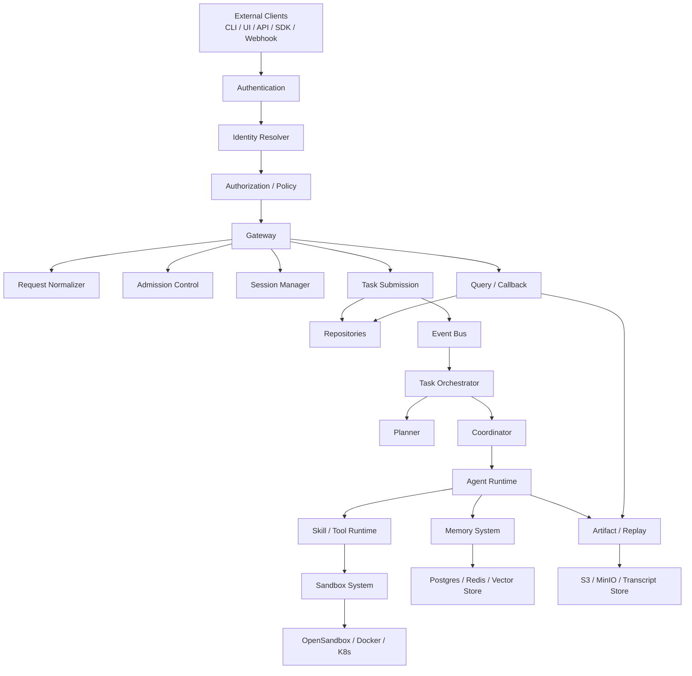
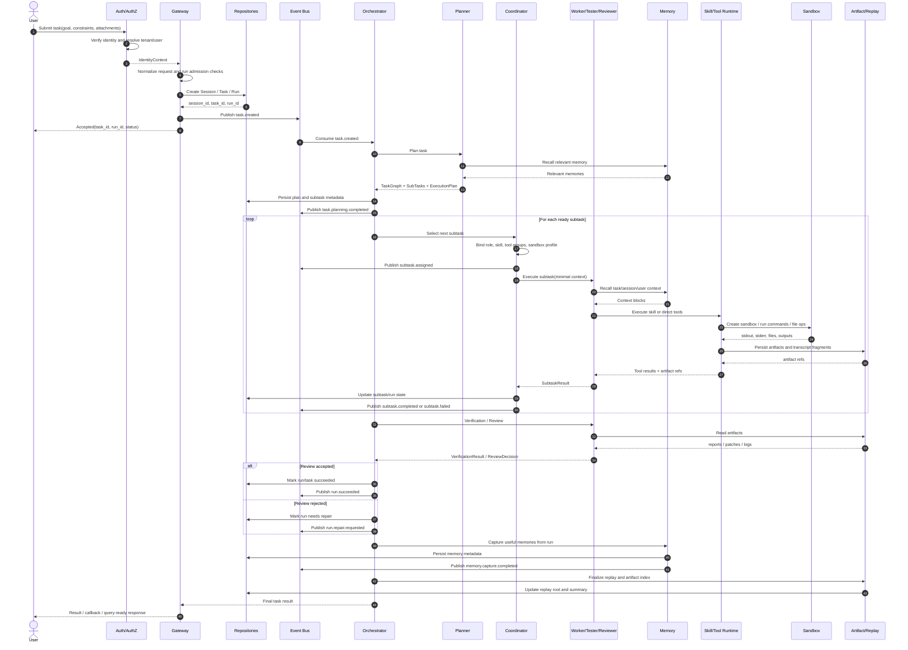
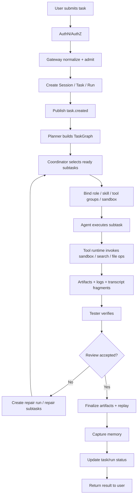

# SwarmMind 平台总体架构总览

> 这份文档把前面 `001-006` 的设计收束成一份总览，用于内部评审、对外讲解和后续代码改造时统一心智模型。

覆盖范围：

1. 平台总体边界
2. 核心子系统关系
3. 用户任务进入系统后的完整执行流程
4. 每个阶段会产出什么对象、事件和工件

---

## 1. 平台一句话定义

SwarmMind 是一个：

**以 Gateway 为入口、以 Identity 为边界、以 Task Graph 为驱动、以多智能体协作为执行核心、以 Memory 为上下文增强、以 Sandbox 为执行基础设施、以 Artifact/Replay 为结果与回放出口的任务执行平台。**

---

## 2. 平台总体边界图



这张图里每个模块的职责边界是：

- `Identity`：验证是谁，以及他能做什么
- `Gateway`：接请求、做准入、创建上下文、提交任务、对外查询
- `Orchestrator`：推进任务生命周期
- `Planner / Coordinator / Agent Runtime`：完成任务拆解和多智能体执行
- `Memory`：给 Agent 提供上下文、沉淀长期知识
- `Skill / Tool Runtime`：把智能决策落成实际动作
- `Sandbox`：提供隔离执行环境
- `Artifact / Replay`：输出结果和回放入口

---

## 3. 核心对象总览

平台里最核心的对象是：

1. `Tenant`
2. `User / ServicePrincipal`
3. `Session`
4. `Task`
5. `Run`
6. `SubTask`
7. `Artifact`
8. `Replay`
9. `MemoryRecord`
10. `DomainEvent`

它们的关系可以概括成：

```text
Tenant
  -> User / ServicePrincipal
      -> Session
          -> Task
              -> Run
                  -> SubTasks
                  -> Artifacts
                  -> Replay
                  -> Memory updates
                  -> Domain Events
```

---

## 4. 用户提交一个任务后的完整流程

下面以一个典型任务为例：

> “实现一个导出 Excel 功能并补测试”

系统完整流程建议分成 12 步。

### Step 1: 用户发送请求

输入：

- goal
- constraints
- attachments，可选
- preferred skill，可选

产出：

- 原始请求日志
- `request_id`

### Step 2: 认证与身份解析

系统动作：

- 校验 API Key / JWT
- 解析 `tenant_id`、`user_id`、`roles`、`scopes`

产出：

- `IdentityContext`
- 认证日志

### Step 3: Gateway 准入和归一化

系统动作：

- 限流
- 预算检查
- profile / tool group 权限检查
- 生成标准 `TaskEnvelope`

产出：

- `TaskEnvelope`
- `task_id`
- `session_id`
- `run_id`

### Step 4: 建立 Session / Task / Run

系统动作：

- 创建或恢复 session
- 创建 task
- 创建首个 run
- 初始化 transcript / replay 根引用

产出：

- `Session`
- `Task`
- `Run`
- `Transcript root`
- `Replay root`

### Step 5: 提交到 Orchestrator

系统动作：

- repository 落盘
- 发布 `task.created`
- Orchestrator 接管任务

产出：

- `task.created` event
- task 初始状态：`PENDING -> INTAKE -> PLANNING`

### Step 6: Planner 生成任务图

系统动作：

- 读取任务目标和约束
- 读取相关 memory
- 识别任务类型
- 生成 `TaskGraph`

产出：

- `ExecutionPlan`
- `TaskGraph`
- `SubTask[]`
- `task.planning.completed` event

### Step 7: Coordinator 做能力装配

系统动作：

- 选择 ready subtasks
- 为每个 subtask 选择 role
- 绑定 `preferred_skill`
- 激活 `required_tool_groups`
- 确定 `sandbox_profile`

产出：

- `ExecutionProfile`
- `subtask.ready` / `subtask.assigned` events

### Step 8: Agent 执行子任务

系统动作：

- Agent 读取最小必要上下文
- 根据 subtask 选择 skill 或直接调用 tool
- tool runtime 调用 sandbox / search / file / browser 等基础能力

产出：

- `SubtaskResult`
- 中间 tool logs
- sandbox command logs
- `artifact.created` events

### Step 9: Sandbox 执行与证据回流

系统动作：

- 创建 sandbox
- 执行命令 / 写文件 / 跑测试
- 读回 stdout / stderr / outputs

产出：

- `sandbox.created` / `sandbox.command.executed` / `sandbox.destroyed` events
- 代码 patch
- 测试报告
- 命令输出日志
- `Artifact`

### Step 10: Tester 验证

系统动作：

- 独立读取 artifacts 和执行结果
- 对照 acceptance criteria 做验证

产出：

- `VerificationResult`
- `subtask.completed` 或 `subtask.failed`
- 失败证据

### Step 11: Reviewer 做最终判断

系统动作：

- 汇总执行结果
- 汇总验证结果
- 判断是否通过 / 返工 / 降级交付

产出：

- `ReviewDecision`
- 如需返工：新的 repair run 或 repair subtasks
- 如通过：`run.succeeded`

### Step 12: 交付、沉淀、回放

系统动作：

- 汇总最终 artifacts
- 更新 replay
- 触发 memory capture
- Gateway 向用户返回结果或回调

产出：

- 最终响应
- `Artifact index`
- `Replay`
- `MemoryRecord updates`
- 完整审计日志

---

## 5. 完整时序图

下面这张图描述的是“用户发送一个任务后，系统如何一步一步完成”的主时序。



---

## 6. 完整流程图

这张图更适合做“业务流程说明”。



---

## 7. 每个阶段的主要产物

| 阶段 | 主要产物 |
|------|----------|
| 接入 | `request_id`, `IdentityContext` |
| Gateway | `TaskEnvelope`, `task_id`, `session_id`, `run_id` |
| 建模 | `Session`, `Task`, `Run` |
| 规划 | `TaskGraph`, `ExecutionPlan`, `SubTask[]` |
| 协调 | `ExecutionProfile`, `subtask assignments` |
| 执行 | `SubtaskResult`, sandbox logs, intermediate artifacts |
| 验证 | `VerificationResult`, failure evidence |
| 审核 | `ReviewDecision` |
| 交付 | `Artifact index`, final response |
| 回放 | `Replay`, transcript refs |
| 记忆 | `MemoryRecord updates`, memory events |
| 审计 | domain events, trace logs |

---

## 8. 一次成功任务最终会留下什么

如果一单任务成功完成，系统最终建议至少留下这些对象：

1. 一个 `Task`
2. 一个 `Session`
3. 至少一个 `Run`
4. 一组 `SubTask` 结果
5. 多个 `Artifact`
6. 一个 `Replay`
7. 一份 transcript 或 transcript root
8. 若干 `MemoryRecord` 更新
9. 一串领域事件与审计记录

也就是说，平台最终不是只给用户一段文本结果，而是会沉淀成一套完整的执行资产。

---

## 9. 对外可以怎么展示

如果后续要做 UI 或对外报告，这套流程最终可以被展示成四类视图：

1. **任务视图**
   用户看到任务状态、结果摘要、是否成功。

2. **执行视图**
   用户或开发者看到哪个阶段、哪个 Agent 在做什么。

3. **产物视图**
   用户直接看到 patch、测试报告、文档、PPT、日志。

4. **回放视图**
   开发者和平台管理员看到完整事件时间线。

---

## 10. 最终总结

当用户发送一个任务后，SwarmMind 的完整工作方式应该是：

1. 先确认身份和权限。
2. 再由 Gateway 接住请求并标准化。
3. 创建 `Session / Task / Run`。
4. 由 Planner 拆出 `TaskGraph`。
5. 由 Coordinator 选择角色、skill、tool 和 sandbox。
6. 由多个 Agent 分阶段执行子任务。
7. 通过 Tool Runtime 和 Sandbox 产出真实结果。
8. 由 Tester 和 Reviewer 独立把关。
9. 最后沉淀 `Artifact / Replay / Memory / Audit Events`。

一句话概括：

**用户提交的是一个目标，平台最终产出的是结果、证据、回放和记忆。**
