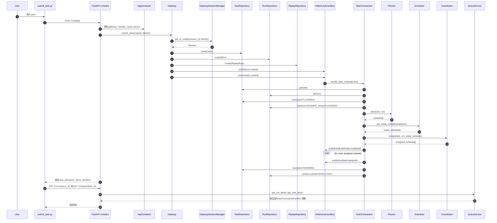

# SwarmMind 当前任务提交流程时序说明

> 本文档描述的是当前代码已经实现的真实时序。
>
> 它回答的问题是：
>
> 当用户在 `submit_task.py` 中输入一个问题并提交后，系统内部按什么顺序调用了哪些模块，创建了哪些对象，状态如何变化，以及流程目前停在哪里。

关联文档：

1. `011-current-code-implementation-status.md`
2. `010-v2-sandbox-query-execution-plan.md`

---

## 1. 适用范围

本文档覆盖当前这条真实链路：

1. `scripts/submit_task.py`
2. `swarmmind/api/server.py`
3. `swarmmind/app/container.py`
4. `swarmmind/gateway/gateway.py`
5. `swarmmind/events/in_memory_bus.py`
6. `swarmmind/orchestration/task_orchestrator.py`
7. `swarmmind/query/service.py`

不覆盖尚未接通的后续执行链，例如：

1. `subtask.assigned` 之后的真实 agent 执行
2. sandbox 实际命令执行主线
3. artifact / replay 持续回流

---

## 2. 一句话时序总结

当前系统在收到用户问题后，会完成：

1. 提交任务
2. 创建 session / task / run / replay root
3. 发布 `task.created`
4. 同进程立即触发 orchestrator 做 planning 和 coordinating
5. 生成 subtasks 并发布 `subtask.assigned`
6. 将 task 标记为 `running`，将 run phase 标记为 `executing`
7. 允许客户端通过 task/run 查询接口查看当前聚合状态

当前系统不会继续完成：

1. subtask 实际执行
2. run 最终完成
3. task 最终完成

---

## 3. 总体时序图



---

## 4. 详细时序说明

## 4.1 用户输入与脚本提交

入口在 `scripts/submit_task.py`。

脚本当前会做这些事：

1. 读取 `goal`
2. 解析 `constraints`
3. 组装请求 payload
4. 调用 `POST /v1/tasks`
5. 如果启用 `--poll`，就继续轮询 task 或 run

当前 payload 的核心字段是：

1. `goal`
2. `constraints`
3. `priority`
4. `profile`

---

## 4.2 FastAPI 接收请求

入口在 `swarmmind/api/server.py` 的 `create_task()`。

当前 API 层做的事情比较薄：

1. 从应用状态里拿到 container
2. 解析 identity
3. 将 HTTP 请求转换为 `TaskSubmitRequest`
4. 调用 `container.gateway.submit_task(...)`
5. 读取创建后的 task 并返回 summary response

当前 API 层本身不做：

1. subtasks 生成
2. sandbox 调度
3. agent 执行

这些都不在 API 层。

---

## 4.3 Container 装配阶段的关键事实

应用启动时，`swarmmind/app/container.py` 会构建一个内存版应用容器。

这个容器里当前装配了：

1. `InMemoryEventBus`
2. `StaticIdentityResolver`
3. `AuthorizationPolicy`
4. 所有 in-memory repositories
5. `Planner`
6. `Coordinator`
7. `Scheduler`
8. `TaskOrchestrator`
9. `QueryService`
10. `Gateway`

最关键的一步是：

1. `event_bus.subscribe("task.created", orchestrator.handle_task_created)`

这决定了 `task.created` 事件一旦发布，orchestrator 就会立刻被调用。

---

## 4.4 Gateway 创建控制面对象

`Gateway.submit_task()` 是当前系统的控制面创建入口。

它按顺序完成：

1. 调用 `AuthorizationPolicy.ensure_can_submit_task()`
2. 调用 `AdmissionController.validate()`
3. 调用 `RequestNormalizer.normalize()`
4. 调用 `GatewaySessionManager.get_or_create()`
5. 创建 `Task`
6. 持久化 `Task`
7. 将 task 绑定到 session
8. 创建 `Run`
9. 持久化 `Run`
10. 创建 `ReplayRoot`
11. 发布 `run.created`
12. 发布 `task.created`
13. 返回 `TaskSubmissionResult`

### 当前创建出的核心对象

在这一步会真正创建：

1. `Session`
2. `Task`
3. `Run`
4. `ReplayRoot`

其中：

1. `Task.metadata` 会写入 `tenant_id`、`principal_id`、`session_id`、`profile`、`preferred_skill`
2. `Run` 初始状态是 `PENDING`
3. `Run.phase` 初始状态是 `INTAKE`

---

## 4.5 事件总线如何触发 orchestrator

当前事件总线是 `InMemoryEventBus`。

它的 `publish()` 不是异步队列模型，而是：

1. 先记录 event
2. 找到所有匹配 topic 的 handler
3. 按顺序 `await handler(event)`

这意味着：

1. `Gateway.submit_task()` 发布 `task.created` 后
2. `TaskOrchestrator.handle_task_created()` 会在同一进程、同一调用链中被执行

所以现在没有独立 worker，也没有“稍后异步处理”的边界。

---

## 4.6 Orchestrator 进入 planning 阶段

`TaskOrchestrator.handle_task_created()` 的第一段逻辑负责把 task/run 推入 planning。

状态变化是：

1. `Task.status: PENDING -> PLANNING`
2. `Run.status: PENDING -> RUNNING`
3. `Run.phase: INTAKE -> PLANNING`

然后 orchestrator 会调用 planner。

---

## 4.7 Planner 生成 subtasks

当前 `Planner` 是规则式 planner，不依赖 LLM。

默认生成的 subtasks 是：

1. `analyze-requirement`
2. `prepare-implementation`
3. 如果 goal 中包含 `test` 或 `验证`，则再生成 `verify-result`

planner 在生成 subtask 时已经写入：

1. `role`
2. `preferred_skill`
3. `required_tool_groups`
4. `sandbox_profile`
5. `acceptance_criteria`
6. `metadata.run_id`

当前这些 subtasks 已经会真实保存到 `SubTaskRepository` 中，并且可以被 run detail 查询到。

---

## 4.8 Scheduler 与 Coordinator 的作用

Planner 生成 subtasks 后，orchestrator 会继续做两步。

### Scheduler

Scheduler 当前只做一件事：

1. 找出处于 `PENDING` 且依赖已满足的 subtasks

由于第一轮 subtasks 基本没有复杂依赖，所以通常会直接得到一批 ready subtasks。

### Coordinator

Coordinator 当前不会执行 subtasks，而是给每个 ready subtask 绑定 `ExecutionProfile`。

写入内容包括：

1. role
2. preferred skill
3. required tool groups
4. sandbox profile

这些信息会被写入 `subtask.metadata["execution_profile"]`。

---

## 4.9 Planning 完成后发布的事件

当前 orchestrator 在 planning/coordinating 结束后会发布两类事件：

1. `task.planning.completed`
2. `subtask.assigned`

其中：

1. `task.planning.completed` 的 payload 里会带 `subtask_count`
2. 每个 `subtask.assigned` 都会带上 subtask 名称、role、preferred_skill

但要注意一个关键事实：

**当前代码里没有任何地方继续订阅 `subtask.assigned`。**

这就是为什么当前系统在这里停住，不会进入真实执行。

---

## 4.10 当前链路停止的位置

当前主流程在控制面上会停在下面这个状态：

1. `Task.status = RUNNING`
2. `Run.status = RUNNING`
3. `Run.phase = EXECUTING`
4. `SubTask` 已经存在并带有 execution profile

但是不会自动发生：

1. subtask 执行
2. subtask 成功/失败状态更新
3. run 成功/失败状态更新
4. task 成功/失败状态更新
5. artifact 持续生成

换句话说，当前 phase 进入 `EXECUTING` 只是控制面含义上的“已进入执行阶段”，不是说明真正开始跑 agent/sandbox 了。

---

## 4.11 客户端如何查询当前状态

提交完成后，客户端当前可以走两条查询路径。

### 查询 task summary

接口：

1. `GET /v1/tasks/{task_id}`

可以看到：

1. task 基本状态
2. session_id
3. latest run_id
4. task.result / task.error

### 查询 run detail

接口：

1. `GET /v1/runs/{run_id}`

可以看到：

1. run 基本信息
2. subtasks 列表
3. artifacts 列表

目前 run detail 是最有价值的调试入口，因为它能显示 subtasks 是否已经生成。

---

## 5. 一个当前版本的实际例子

假设用户输入：

```text
实现一个导出 Excel 功能并补测试
```

那么当前系统会做：

1. 创建一个 task
2. 创建一个 run
3. 创建一个 replay root
4. 生成三个 subtasks：
   - `analyze-requirement`
   - `prepare-implementation`
   - `verify-result`
5. 给这些 subtasks 补 execution profile
6. 把 task 状态切成 `running`
7. 把 run phase 切成 `executing`

当前系统不会做：

1. 打开仓库分析代码
2. 创建 sandbox 跑命令
3. 写 patch
4. 运行 pytest
5. 把结果写回 artifact

这些步骤还没有接上。

---

## 6. 当前时序中的同步点与异步点

为了便于后续改造，这里单独说明当前链路中的同步/异步边界。

### 当前是同步推进的地方

1. HTTP 请求进入后，`submit_task()` 同步完成 task/run/replay 创建
2. `task.created` 发布后，同步触发 orchestrator
3. orchestrator 同步完成 planning/coordinating

### 当前没有后台消费的地方

1. `subtask.assigned`
2. `task.planning.completed`
3. `run.created`

这说明现在真正异步化的边界还没有建立，后续如果要接 execution runner / worker，这里会是最自然的切入点。

---

## 7. 对当前调试最有帮助的观察点

如果你现在要调试这条链路，最值得观察的是：

1. `POST /v1/tasks` 的返回里是否包含 `task_id/session_id/run_id`
2. `GET /v1/runs/{run_id}` 返回的 `run.phase` 是否从 `planning` 进入 `executing`
3. `subtasks` 是否已经生成
4. subtasks 的 `metadata.execution_profile` 是否已经被写入

如果以上都成立，说明当前控制面链路是正常的。

如果你期待的是代码真的开始执行，那么还需要继续补后半段执行链。

---

## 8. 当前时序图最重要的结论

当前版本最重要的事实不是“系统没有工作”，而是：

**系统已经完成了从用户请求到控制面规划与查询的闭环，但这个闭环停在 `subtask.assigned` 之后，没有进入真实执行面。**

这也是为什么当前版本非常适合继续往下接：

1. execution runner
2. sandbox lease / command execution
3. artifact collector
4. replay recorder
5. run/task 终态推进逻辑

因为前半段控制面主干已经存在，不需要再重搭入口和对象模型。
