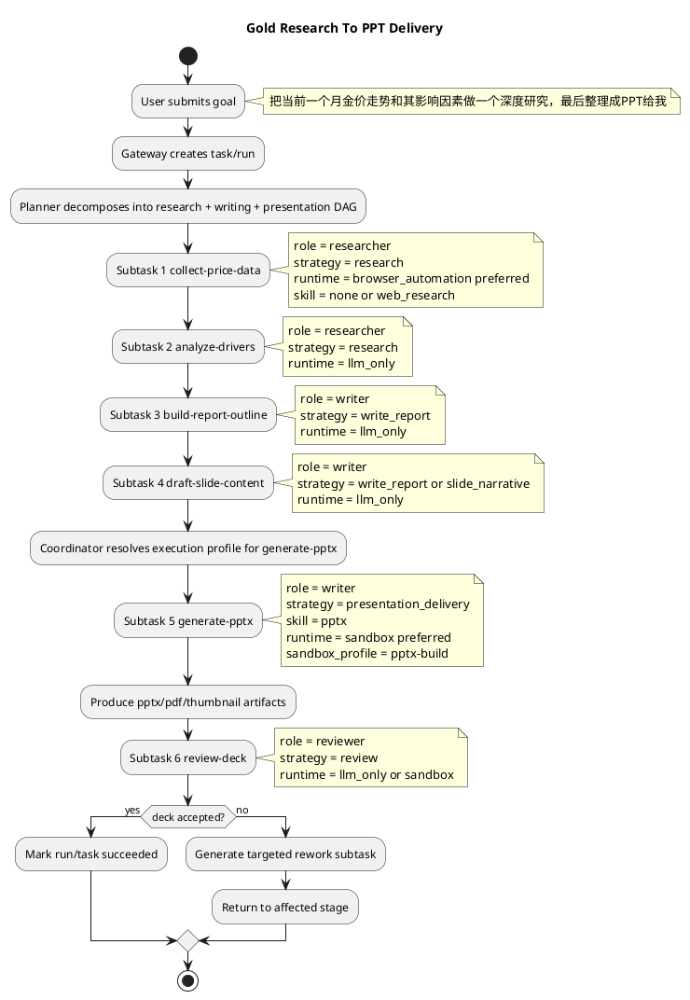

# SwarmMind 子任务运行时与能力模型设计

> 目的：把当前 `plan / strategy / skill / tool / sandbox / agent` 几个概念之间的边界重新定义清楚，作为后续代码重构的正式设计基线。

关联文档：

- [docs/design/v2/errors/planner-tool-and-sandbox-allocation-mismatch.md](/home/admin2/proj/SwarmMind/docs/design/v2/errors/planner-tool-and-sandbox-allocation-mismatch.md)
- [docs/design/v2/errors/task-execution-persistence-and-replay-gap.md](/home/admin2/proj/SwarmMind/docs/design/v2/errors/task-execution-persistence-and-replay-gap.md)
- [docs/design/v2/002-task-execution-system-implementation-status.md](/home/admin2/proj/SwarmMind/docs/design/v2/002-task-execution-system-implementation-status.md)
- [docs/design/v2/004-task-execution-remediation-todo.md](/home/admin2/proj/SwarmMind/docs/design/v2/004-task-execution-remediation-todo.md)

---

## 1. 为什么这份文档放在 `docs/design/v2/`

这份内容不再只是“发现了什么问题”，而是在回答：

1. 以后 `SubTask` 应该如何建模。
2. `strategy` 到底保留什么职责。
3. `skill` 与 `strategy` 是否重合。
4. 一个子任务到底是不是一个 agent。
5. runtime 该如何分层。

因此它应该进入正式设计目录 `docs/design/v2/`，而不是继续留在 `errors/`。

`errors/` 目录保留“问题发现与根因分析”，这份文档则作为“目标架构与字段边界定义”。

---

## 2. 一句话结论

SwarmMind 后续应采用一个分层模型：

1. `SubTask` 是调度单元。
2. `role` 是职责边界。
3. `strategy` 是工作流语义与结果契约。
4. `skill` 是可复用能力包。
5. `tool` 是原子动作。
6. `runtime_kind` 是执行形态。
7. `agent` 只是某些 `runtime_kind` 下的执行后端，而不是所有 subtask 的同义词。

换句话说：

1. 不是每个 subtask 都是 ReActAgent。
2. 不是每个 strategy 都对应一个 skill。
3. 不是每个知识型任务都需要 sandbox。

---

## 3. 当前问题总结

当前系统存在三个核心混淆：

1. `strategy` 同时承担了 workflow 语义和 runtime selector 两种职责。
2. `skill` 与 `strategy` 经常被配置成同名同向，看起来像重复字段。
3. `subtask` 在讨论中容易被误理解为“一个独立 agent 实例”，但运行时实际上并非如此。

这些混淆会导致：

1. plan 阶段一旦选了某个 strategy，后续运行时就容易被推成 sandbox。
2. skill 看起来只是 strategy 的别名，而不是能力层抽象。
3. 产品设计很难判断什么时候该用 agent，什么时候不该用。

---

## 4. 设计目标

这版设计要解决的目标是：

1. 让 planner 输出的字段职责明确。
2. 让 orchestrator 能稳定调度，不依赖隐式 fallback。
3. 让 runtime 决策从 strategy 中拆出来。
4. 让 skill 回到“能力封装”而不是“任务模板”。
5. 让 agent 成为可选执行后端，而不是默认执行语义。
6. 让审计与回放可以清楚回答“为什么这个 subtask 以这种方式执行”。

---

## 5. 核心概念定义

## 5.1 SubTask

`SubTask` 是系统中的最小调度与审计单元。

它负责表达：

1. 这段工作是什么。
2. 它依赖谁。
3. 它由谁负责。
4. 它需要哪些能力。
5. 它最终如何执行。

它不等于：

1. 一个 agent 实例。
2. 一次 sandbox lease。
3. 一个具体 tool 调用。

## 5.2 Role

`role` 是职责边界。

它回答的是：

1. 这段工作在逻辑上由谁负责。

例如：

1. `planner`
2. `researcher`
3. `writer`
4. `coder`
5. `tester`
6. `reviewer`

它不负责回答：

1. 这段工作具体怎么执行。
2. 是否需要 sandbox。

## 5.3 Strategy

`strategy` 是工作流语义与结果契约。

它回答的是：

1. 这类 subtask 属于哪种 workflow 模板。
2. 它应该输出什么类型的结果。
3. 它应该使用什么 prompt / schema / review 逻辑。

例如：

1. `task_planning`
2. `research`
3. `write_report`
4. `verification`
5. `review`
6. `build_app`

它不应该再负责：

1. 是否开 sandbox。
2. 是否注入 `sandbox_exec`。
3. 是否实例化 agent。

## 5.4 Skill

`skill` 是可复用能力包。

它回答的是：

1. 系统有哪些封装好的能力可以被复用。
2. 某个执行器可以加载哪些能力包。

在当前系统里，skill 有两种形态：

1. AgentScope native skill
2. formal skill script

后续产品设计上可以统一理解为：

1. 一种封装后的能力资源集
2. 可能包含 prompt、模板、脚本、工具限制、资源文件

## 5.5 Tool

`tool` 是运行时原子动作。

它回答的是：

1. 执行器实际调用了什么动作。

例如：

1. `web_search`
2. `browser_read`
3. `sandbox_exec`
4. `artifact_read`
5. `run_skill_script`

## 5.6 RuntimeKind

`runtime_kind` 是执行形态。

它回答的是：

1. 某一次具体执行尝试最终在哪个执行后端上跑。

建议的枚举：

1. `llm_only`
2. `host_tools`
3. `sandbox`
4. `browser_automation`
5. `agent_backed`

注意：`runtime_kind` 是这份文档提出的目标模型字段，当前代码里还没有作为一等字段真正实现。

当前仓库的真实现状是：

1. 运行分支主要还是通过 `strategy` 隐式决定。
2. `web_search`、`browser_read`、`sandbox_exec` 虽然存在，但还没有被统一收敛成一个显式的 runtime taxonomy。
3. 因此本文里出现的 `runtime_kind` 都应理解为“目标设计语义”，不是“当前代码已经具备的字段”。

### 5.6.1 `SubTask` 与 `runtime_kind` 的关系

你提到 `subtask` 和 `runtime_kind` 更像多对多，这个判断在设计上是对的，但需要区分两个层次。

#### A. 规划层 / 策略层

在规划阶段，一个 `SubTask` 往往不是只对应一种运行形态，而是对应一组候选运行形态。

例如：

1. `collect-price-data` 可能先尝试 `host_tools`
2. 如果发现页面强依赖 JS，再升级到 `browser_automation`
3. 如果还需要复杂依赖或隔离环境，再升级到 `sandbox`

所以在这个层面上：

1. 一个 `subtask` 可以声明多个 `candidate_runtime_kinds`
2. 一个 `runtime_kind` 也可以被多个 `subtask` 复用

这就是多对多关系。

#### B. 具体执行尝试层

但当某一个执行 attempt 真正开始跑时，系统必须解析出一个单一的执行形态。

也就是说，在某次具体执行里，应该有：

1. `resolved_runtime_kind`
2. `runtime_resolution_reason`
3. `runtime_fallback_chain`

因此更准确的建模是：

1. `SubTask -> candidate_runtime_kinds` 是多对多
2. `ExecutionAttempt -> resolved_runtime_kind` 是一对一

这样既保留了规划阶段的灵活性，也保留了运行时审计与回放所需的确定性。

## 5.7 Agent

`agent` 是某些 runtime 下的执行器实现。

在 SwarmMind 里，agent 不是控制面概念，而是运行时后端的一种。

只有在下面情况时，subtask 才需要真实 agent：

1. 需要多步推理。
2. 需要 agent 自主决定工具序列。
3. 需要 handoff / delegation。
4. 需要复杂 reasoning-acting loop。

因此：

1. `subtask != agent`
2. `subtask` 可能由 agent 执行，也可能完全不需要 agent。

---

## 6. 三层模型

为了避免继续混淆，建议把系统划成三层。

## 6.1 控制面：任务与调度语义

这一层包含：

1. `task`
2. `run`
3. `subtask`
4. `role`
5. `strategy`
6. `dependencies`
7. `acceptance_criteria`

这一层的职责是：

1. 规划
2. 调度
3. 审批
4. 生命周期管理
5. 回放与审计索引

## 6.2 能力面：可用能力与约束

这一层包含：

1. `skill`
2. `tool`
3. `tool_groups`
4. `agent_profile`
5. `allowed_skill_scripts`
6. `allowed_tool_groups`

这一层的职责是：

1. 表达“系统具备什么能力”。
2. 表达“这个 subtask 被允许用什么能力”。

## 6.3 执行面：实际运行后端

这一层包含：

1. `runtime_kind`
2. `sandbox_profile`
3. `browser runtime`
4. `agent runtime`
5. `llm-only executor`
6. `host-tools executor`

这一层的职责是：

1. 真正执行 subtask。
2. 记录执行证据。
3. 产生 artifact 和事件。

---

## 7. 正确的关系图

建议以如下关系理解：

1. 一个 `task` 产出多个 `subtask`
2. 一个 `subtask` 绑定一个 `role`
3. 一个 `subtask` 绑定一个 `strategy`
4. 一个 `subtask` 声明需要若干 `tool_groups`
5. 一个 `subtask` 声明 1..n 个 `candidate_runtime_kinds`
6. 某次具体执行 attempt 再从中解析出一个 `resolved_runtime_kind`
7. 该 `resolved_runtime_kind` 决定是否需要 `sandbox_profile` 或 `agent`
8. 一个 `strategy` 可以使用 0..n 个 `skill`
9. 一个 `skill` 可以复用到多个 `strategy`
10. 一个 `skill` 可以暴露 0..n 个 `tool` 或 `script`

关键结论：

1. `strategy` 和 `skill` 不是一一关系。
2. `subtask` 和 `agent` 不是一一关系。
3. `strategy` 和 `runtime_kind` 不是一一关系。
4. `subtask` 与 `runtime_kind` 在规划层是多对多，在执行 attempt 层是一对一解析结果。

---

## 8. 子任务到底是不是 ReActAgent

结论：不是。

更准确地说：

1. 每个 `subtask` 都应该是统一的调度对象。
2. 只有部分 `subtask` 在执行时会实例化 ReActAgent。

### 8.1 什么 subtask 适合 ReActAgent

适合 `agent_backed` 的场景：

1. 开放式研究任务
2. 多轮工具探索
3. 需要自主决定下一步动作
4. 需要跨技能组合和 handoff

### 8.2 什么 subtask 不适合 ReActAgent

不应默认做成 ReActAgent 的场景：

1. 写大纲
2. 写总结
3. 结构化 review
4. artifact-based verification
5. 简单脚本执行
6. 单次格式转换

这些任务更适合：

1. `llm_only`
2. `host_tools`
3. `sandbox`

### 8.3 产品层面的原则

Agent 是“高自主执行器”，不是“所有 subtask 的默认壳”。

否则会导致：

1. 成本上升
2. 不确定性上升
3. 审计复杂度上升
4. 调度边界变模糊

---

## 9. `strategy` 与 `skill` 的最终边界

这是本设计里最重要的概念拆分。

## 9.1 Strategy 代表什么

`strategy` 代表：

1. 一类 workflow 模板
2. 一类结果 schema
3. 一类审计分类

例如：

1. `task_planning`
2. `research`
3. `write_report`
4. `review`
5. `verification`

## 9.2 Skill 代表什么

`skill` 代表：

1. 一类可复用能力包
2. 可能包含脚本、模板、资源、能力限制

例如：

1. `web_research`
2. `headless_browser`
3. `report_writer`
4. `pytest_runner`
5. `pptx_export`

## 9.3 为什么当前会显得重合

因为当前默认配置里常出现：

1. `strategy = write_report`
2. `skill_profiles = [write_report]`

这在起步阶段方便，但会让系统长期保持概念重叠。

## 9.4 目标设计建议

后续不再要求：

1. 一个 strategy 对应一个同名 skill

而改成：

1. strategy 决定 workflow
2. runtime 决定执行器
3. skill 决定可装配能力
4. tool 决定原子动作

---

## 10. 推荐的目标字段

建议目标模型里，`SubTask` 增加或调整为：

```json
{
  "id": "...",
  "name": "draft-outline",
  "role": "writer",
  "strategy": "write_report",
  "required_tool_groups": ["artifact_read", "project_write", "memory_lookup"],
   "candidate_runtime_kinds": ["llm_only", "host_tools"],
  "sandbox_profile": null,
  "preferred_skill_profiles": ["report_writer"],
  "allowed_skill_scripts": [],
  "acceptance_criteria": ["..."]
}
```

而在执行层，建议单独落一个 `ExecutionProfile` 或 `ExecutionAttempt` 视角字段：

```json
{
   "subtask_id": "draft-outline",
   "resolved_runtime_kind": "llm_only",
   "runtime_resolution_reason": "writing task with no external dependency or environment isolation requirement",
   "runtime_fallback_chain": ["llm_only", "host_tools"],
   "sandbox_profile": null
}
```

关键变化：

1. `candidate_runtime_kinds` 成为规划层字段。
2. `resolved_runtime_kind` 成为执行层字段。
3. `sandbox_profile` 变成条件字段。
4. `skill_profiles` 不再默认等于 `strategy`。
5. `strategy` 可继续保留现名，后续视情况重命名为 `workflow_profile`。

---

## 11. 研究报告案例在新模型下的解释

用户输入：`做一个基于多agent产品的研究报告`

推荐子任务：

1. `collect-sources`
   - role: `researcher`
   - strategy: `research`
   - candidate_runtime_kinds: `host_tools`, `browser_automation`
   - skills: `web_research` 可选

2. `draft-outline`
   - role: `writer`
   - strategy: `write_report` 或 `outline_generation`
   - candidate_runtime_kinds: `llm_only`, `host_tools`
   - skills: `report_writer` 可选

3. `write-report`
   - role: `writer`
   - strategy: `write_report`
   - candidate_runtime_kinds: `llm_only`

4. `review-report`
   - role: `reviewer`
   - strategy: `review`
   - candidate_runtime_kinds: `llm_only`, `host_tools`

这个例子里：

1. 没有任何 subtask 默认需要 sandbox。
2. 没有任何 subtask 必然需要 ReActAgent。
3. strategy 与 skill 也不是必须同名。

---

## 12. 金价深度研究并产出 PPT 的案例

用户任务：

`把当前一个月金价走势和其影响因素做一个深度研究，最后整理成 PPT 给我`

这个例子比普通研究报告更复杂，因为它同时包含：

1. 金价走势研究
2. 影响因素归因
3. 结构化叙事组织
4. PPT 最终交付物生成

它正好适合用来验证：

1. 现有 `role` 是否足够
2. `pptx` skill 能不能用上
3. 网页研究和 PPT 生产是否一定需要两个 sandbox
4. 谁来协调多个子任务

### 12.1 这个任务在新设计下的顶层判断

系统首先应该把这个任务识别为一个“研究 + 内容生产 + 演示文稿交付”的复合任务，而不是单一的代码任务。

其核心目标不是运行程序本身，而是交付一份高质量的分析型演示文稿。

因此 Planner 的第一层判断应该是：

1. 主工作流是 research/reporting/presentation，而不是 build_app。
2. 网页搜索与资料整理是前半段。
3. PPT 生成是后半段。
4. sandbox 是否需要，取决于具体子任务的 runtime，而不是由总任务默认决定。

### 12.2 推荐的子任务拆分

建议拆成下面 6 个主子任务。

| subtask | role | strategy | required_tool_groups | candidate_runtime_kinds | skill |
|---|---|---|---|---|---|
| collect-price-data | researcher | research | web_search, browser_read, project_read | browser_automation, host_tools | web_research optional |
| analyze-drivers | researcher | research | web_search, browser_read, artifact_read, memory_lookup | llm_only, host_tools | none |
| build-report-outline | writer | write_report | artifact_read, project_write, memory_lookup | llm_only, host_tools | report_writer optional |
| draft-slide-content | writer | write_report | artifact_read, project_write, memory_lookup | llm_only | report_writer optional |
| generate-pptx | writer | presentation_delivery | presentation, artifact_read, project_write | sandbox, host_tools | pptx |
| review-deck | reviewer | review | artifact_read, memory_lookup, presentation | llm_only, sandbox | pptx optional |

其中关键点是：

1. 金价研究本身并不默认要求 sandbox。
2. PPT 交付这一步才是更可能需要 skill 或 sandbox 的环节。

### 12.2.1 正式字段绑定表

为了避免概念继续漂移，下面把这个任务的推荐字段绑定正式列出来。

| subtask | 目标输出 | role | strategy | preferred_skill_profiles | required_tool_groups | candidate runtime kinds | sandbox_profile |
|---|---|---|---|---|---|---|---|
| collect-price-data | 最近一个月金价数据、来源列表、关键行情摘要 | researcher | research | web_research optional | web_search, browser_read, project_read | browser_automation, host_tools | null unless upgraded |
| analyze-drivers | 影响因素分析结论 | researcher | research | none | artifact_read, memory_lookup, project_write | llm_only, host_tools | null |
| build-report-outline | 研究结构和 PPT 叙事大纲 | writer | write_report or outline_generation | report_writer optional | artifact_read, project_write, memory_lookup | llm_only, host_tools | null |
| draft-slide-content | 每页标题、结论、图表建议、备注文案 | writer | write_report or slide_narrative | report_writer optional | artifact_read, project_write, memory_lookup | llm_only | null |
| generate-pptx | 最终 `.pptx`、可选 `.pdf` 和缩略图 | writer | presentation_delivery | pptx | presentation, artifact_read, project_write | sandbox, host_tools | pptx-build |
| review-deck | deck 质量审查结论 | reviewer | review or presentation_review | pptx optional | artifact_read, memory_lookup, presentation | llm_only, sandbox | null unless deck QA requires conversion |

### 12.3 现有 role 是否够用

在这项任务上，现有 role 基本够用，但有一个可选增强点。

当前 role 可以这样使用：

1. `researcher`
   - 负责搜集过去一个月金价走势、央行购金、美元指数、实际利率、地缘风险等资料

2. `writer`
   - 负责把研究材料变成分析结构、叙事逻辑、页面文案、PPT 文本内容

3. `reviewer`
   - 负责检查论证是否完整、图表叙事是否清楚、PPT 是否达到交付标准

这已经能跑通主链。

但如果后续希望把“视觉呈现设计”从普通写作里单独抽出来，可以增加一个新 role：

1. `presenter` 或 `designer`

这个 role 不是当前阻塞项，但在“研究报告 -> 高质量 PPT”场景下是一个合理演进方向。

因此当前设计结论是：

1. 现有 role 能覆盖这项任务。
2. 未来可选新增 `presenter/designer`，但不是必须前置。

### 12.4 `pptx` skill 能不能用上

可以，而且这个任务正是 `pptx` skill 合适的使用场景。

原因很直接：

1. 用户最终明确要的是 PPT 交付物。
2. `swarmmind/skills/pptx/SKILL.md` 已经定义了：凡是触及 `.pptx` 创建、编辑、读取、模板套用、QA，都应触发这个 skill。

在新设计里，`pptx` skill 不应该被理解成一个 strategy，而应该理解成：

1. 一个 presentation capability package
2. 可被 `presentation_delivery` 这类 strategy 使用

也就是说：

1. `strategy = presentation_delivery`
2. `skill = pptx`

这两个是协作关系，而不是重复关系。

`pptx` skill 在这个任务里可以承担的能力包括：

1. 从头创建 PPTX
2. 基于模板编辑 PPTX
3. 生成缩略图与文本提取用于 QA
4. 转 PDF / 转图片做视觉检查
5. 检查占位符残留、版式错位、文本溢出

### 12.5 网页搜索和 PPT 制作是否一定需要两个 sandbox

不一定。

这是当前设计里必须明确纠正的一点。

你的直觉是：

1. 一个 sandbox 用于网页搜索
2. 一个 sandbox 用于代码转 PPT

这个在某些情况下是对的，但不应该成为默认假设。

更合理的判断是：

#### A. 网页研究部分

默认优先级应该是：

1. `host_tools`
   - `web_search`
   - `browser_read`

但这里必须补一个重要限定：这只适用于“数据源已知、页面可直接获取、页面内容静态可读”的情况。

对于你举的例子，例如：

1. 搜索“百度 近期 金价”
2. 搜索过去一个月黄金价格走势
3. 查找金融门户或行情站点上的最新图表

当前仓库里的这两个工具其实能力非常有限：

1. `web_search`
   - 当前实现不是百度搜索，也不是通用搜索 API
   - 只是对 DuckDuckGo HTML 页做一次 HTTP 请求，再用正则抽结果
   - 没有搜索引擎适配、没有时间过滤、没有结构化结果保证

2. `browser_read`
   - 当前实现不是无头浏览器
   - 只是对 URL 做普通 HTTP GET，然后抽取 HTML 文本
   - 对 JS 渲染页面、交互页面、图表页面、登录态页面都不可靠

所以如果问题是“当前实现里，查最近一个月金价走势能不能稳妥靠 `web_search + browser_read` 完成”，答案是：

1. 不能把它当成一个稳定、生产可依赖的方案。

因此，针对这类时效性金融研究任务，应该把判断规则写得更严格：

1. 如果已有可信、静态、直接可读的数据源 URL，研究子任务可以用 `host_tools`。
2. 如果首先要通过搜索引擎发现来源，或者页面是动态图表、强 JS 渲染、复杂抓取场景，研究子任务应优先升级到 `browser_automation`，必要时再进入 sandbox。
3. 如果后续接入稳定的金融数据 API，那么还可以增加一个更明确的 runtime 或 tool family，而不是继续混用通用搜索。

只有在下列情况下，才升级到 `browser_automation` 或 sandbox：

1. 需要动态页面渲染
2. 需要登录、点击、滚动、等待图表加载
3. 需要自动化抓取复杂页面数据

因此，网页研究子任务通常默认不需要 sandbox。

更严谨地说：

1. 对普通静态知识检索，默认可用 `host_tools`。
2. 对金价、股票、舆情、动态图表等时效性研究，不能武断默认 `host_tools`，而应由 planner 或 policy 根据数据源特征选择 `browser_automation` 或更强 runtime。

#### B. PPT 生成部分

这一段更可能需要 sandbox，但也不是绝对。

如果只是：

1. 用内置 `python-pptx` 工具生成简单 deck
2. 或者用 skill 驱动本地脚本生成 `.pptx`

那理论上可以在受控 host runtime 完成。

但如果需要：

1. 调用 Node / PptxGenJS
2. 调用 LibreOffice / `soffice`
3. 转 PDF、转图片做 QA
4. 安装字体、处理更多外部依赖

那更合理的做法是为 `generate-pptx` 或 `deck-qa` 使用 sandbox。

#### C. 结论

因此这项任务在目标设计下，不是“固定两个 sandbox”，而是：

1. 研究子任务默认 `host_tools`
2. PPT 生产子任务按依赖复杂度决定是否进入 sandbox
3. 只有需要复杂浏览器自动化时，研究子任务才额外使用 `browser_automation`

换句话说，这个任务可能是：

1. 0 个 sandbox
2. 1 个 sandbox
3. 2 个 sandbox

取决于具体执行策略，而不是任务名本身。

这个案例里，如果目标是“高质量、近期、可复核的金价研究”，更保守也更合理的默认是：

1. 研究子任务优先 `browser_automation`
2. PPT 生成子任务优先 `sandbox`

也就是说，在这个特定任务上，你理解成“很可能会有两个强执行 runtime”是成立的，只是这不应该上升成所有 research + presentation 任务的统一默认规则。

### 12.6 谁来协调这些子任务

协调者不是某个 skill，也不是某个具体 agent，而是 Orchestrator 控制面。

在这版设计里，协调关系应该是：

1. `Planner`
   - 产出 DAG 和 subtask 定义

2. `Coordinator`
   - 给每个 ready subtask 解析 `ExecutionProfile`
   - 也就是把 role、strategy、tool_groups、resolved_runtime_kind、skill allowlist、sandbox_profile 等真正落地

3. `Scheduler`
   - 根据依赖推进执行顺序

4. `ExecutionRunner` 或多执行器层
   - 按 `resolved_runtime_kind` 选择具体执行器

所以真正协调“研究 -> 分析 -> 写稿 -> 产出 PPT -> 审核”的，是：

1. `TaskOrchestrator + Scheduler + Coordinator`

而不是让某个顶层 agent 一口气从头做到底。

### 12.7 每个 subtask 的 strategy 应该怎么绑定

这个任务里，一个合理的 strategy 绑定可以是：

1. `collect-price-data`
   - `strategy = research`

2. `analyze-drivers`
   - `strategy = research`
   - 或未来细分成 `market_analysis`

3. `build-report-outline`
   - `strategy = write_report`
   - 或未来细分成 `outline_generation`

4. `draft-slide-content`
   - `strategy = write_report`
   - 或未来细分成 `slide_narrative`

5. `generate-pptx`
   - 不建议继续复用 `write_report`
   - 建议新增 `strategy = presentation_delivery`

6. `review-deck`
   - `strategy = review`
   - 或未来细分成 `presentation_review`

这个绑定正好说明：

1. `strategy` 是 workflow 语义
2. 它不需要等于 skill 名

例如：

1. `generate-pptx` 的 strategy 是 `presentation_delivery`
2. 它使用的 skill 是 `pptx`

这就是一个清晰的非同名绑定例子。

### 12.8 `generate-pptx` 这一步内部怎么做

这一步是整个任务里最适合体现 `strategy + skill + runtime` 三者分工的地方。

建议执行语义如下：

1. `strategy = presentation_delivery`
   - 决定这一步是“把研究结果交付成 PPT”
   - 定义输出契约：必须产出 `.pptx`，可选产出 `.pdf`、缩略图、QA 报告

2. `skill = pptx`
   - 提供 PPT 生成、模板编辑、缩略图、markitdown 提取、soffice 转换、QA 规约

3. `candidate_runtime_kinds`
   - 可以先声明 `host_tools`, `sandbox`
   - 本次执行再解析出 `resolved_runtime_kind`
   - 如果只需轻量生成，可解析到 `host_tools`
   - 如果需要 Node/LibreOffice/多文件 QA，则建议解析到 `sandbox`

4. `tool`
   - 可能使用 `run_skill_script`
   - 也可能使用内置 `generate_pptx`

这说明：

1. strategy 决定“为什么做”
2. skill 决定“拿什么能力做”
3. resolved runtime 决定“这次具体在哪里做”
4. tool 决定“具体调什么动作”

### 12.9 推荐的执行链

针对这个任务，推荐执行链如下：

1. `collect-price-data`
   - researcher
   - strategy: `research`
   - candidate runtimes: `browser_automation`, `host_tools`
   - resolved runtime: 对本次执行优先选 `browser_automation`，静态可信数据源场景可降级为 `host_tools`
   - 输出：最近一个月金价走势资料、关键数据源、相关新闻和报告链接

2. `analyze-drivers`
   - researcher
   - strategy: `research`
   - candidate runtimes: `llm_only`, `host_tools`
   - resolved runtime: 默认 `llm_only`
   - 输出：影响因素分析摘要，例如美元指数、实际利率、避险情绪、央行购金、通胀预期

3. `build-report-outline`
   - writer
   - strategy: `write_report`
   - candidate runtimes: `llm_only`, `host_tools`
   - resolved runtime: 默认 `llm_only`
   - 输出：研究框架与 PPT 叙事大纲

4. `draft-slide-content`
   - writer
   - strategy: `write_report`
   - candidate runtimes: `llm_only`
   - resolved runtime: `llm_only`
   - 输出：每页标题、关键结论、图表建议、讲述顺序

5. `generate-pptx`
   - writer
   - strategy: `presentation_delivery`
   - candidate runtimes: `sandbox`, `host_tools`
   - resolved runtime: 默认 `sandbox`
   - skill: `pptx`
   - 输出：`.pptx` 文件、可选 `.pdf` 和缩略图

6. `review-deck`
   - reviewer
   - strategy: `review`
   - candidate runtimes: `llm_only`, `sandbox`
   - resolved runtime: 默认 `llm_only`，需要文件转换或视觉 QA 时升级到 `sandbox`
   - 读取：研究 artifacts + deck artifacts
   - 输出：是否 accept / rework

### 12.9.1 当前实现与目标设计的差异说明

这个案例需要明确区分“目标设计”与“当前实现”：

1. 当前实现还没有 `candidate_runtime_kinds` / `resolved_runtime_kind` 这组字段。
2. 当前 `web_search` 只是 DuckDuckGo HTML 抓取，不是可靠的搜索基础设施。
3. 当前 `browser_read` 只是 HTTP 抓文本，不是浏览器自动化。
4. 当前 `pptx` skill 存在，但还没有被正式纳入 `presentation_delivery` 这样的 workflow 绑定模型。

因此，这个案例回答的是：

1. 新设计应该怎么支持这个任务。

它不代表：

1. 当前代码已经完整实现了这个执行链。

### 12.9.2 这个任务的正式流程图



### 12.10 这个案例对整体设计的验证结论

这个任务能够验证这套设计是否站得住，判断标准如下：

1. Planner 能不能把研究和 PPT 生产拆开。
2. 系统能不能不把网页研究默认塞进 sandbox。
3. 系统能不能把 `pptx` skill 作为能力包挂到 `presentation_delivery` 之下，而不是把它硬编码成 strategy。
4. Coordinator 能不能为不同 subtask 解析出不同 runtime。
5. Orchestrator 能不能协调研究、写作、生成 deck、review 这一串依赖。

如果这几个问题都能回答为“能”，那说明这套设计是可落地的。

如果还回答不了，通常说明系统还有以下缺口：

1. 缺少 `candidate_runtime_kinds` / `resolved_runtime_kind` 这组运行时字段
2. 缺少 `presentation_delivery` 这类 strategy
3. 仍然把 strategy 与 skill 绑死
4. 仍然把所有知识型任务都往 sandbox 推

---

## 13. 实施建议

## Phase 1：先定边界，不改太多能力

1. 新增 `candidate_runtime_kinds` 规划字段。
2. 在执行层新增 `resolved_runtime_kind`。
3. 把 `sandbox_profile` 改为条件字段。
4. 保留 `strategy`，但禁止它直接决定 sandbox。

## Phase 2：拆开 strategy 与 skill

1. `skill_profiles` 从 agent profile 默认值中与 strategy 解耦。
2. 重新命名内置 skill，避免与 strategy 同名。
3. 把 strategy 的职责收敛到 workflow 语义和结果 schema。

## Phase 3：引入多执行器模型

1. `llm_only executor`
2. `host_tools executor`
3. `sandbox executor`
4. `browser_automation executor`
5. `agent_backed executor`

## Phase 4：最后再做命名演进

如果团队认可，可以再考虑：

1. `preferred_strategy -> workflow_profile`
2. `skill_profiles -> capability_packages`

这一步不是必须，但有利于减少误解。

---

## 14. 开放问题

当前还需要团队后续确认的点：

1. `candidate_runtime_kinds` 是否直接放进 `SubTask`，而 `resolved_runtime_kind` 放进 `ExecutionProfile` / `ExecutionAttempt`。
2. `runtime_fallback_chain` 是 planner 产出，还是 coordinator 在解析 execution profile 时补充。
3. `strategy` 是否保留现名，还是直接改名 `workflow_profile`。
4. `skill` 是否继续区分 native agent skill 与 formal skill script，还是统一成一个 capability registry。
5. `browser_automation` 是独立 runtime，还是一种特殊 sandbox profile。

---

## 15. 最终结论

SwarmMind 的后续设计，不应该再围绕“一个 subtask 是否等于一个 agent”来组织，而应该围绕“一个 subtask 需要什么职责、什么能力、什么执行形态”来组织。

因此正式结论是：

1. `SubTask` 是调度对象。
2. `strategy` 是 workflow 语义。
3. `skill` 是能力封装。
4. `tool` 是原子动作。
5. `candidate_runtime_kinds` 是规划层候选执行形态集合。
6. `resolved_runtime_kind` 是某次执行 attempt 的最终执行后端选择。
7. `agent` 只是某些 runtime 下的一种执行器。

这套边界一旦明确，后续 planner、coordinator、execution runner、skill system、sandbox system 就可以按同一套语言继续收敛，而不会继续互相重叠。