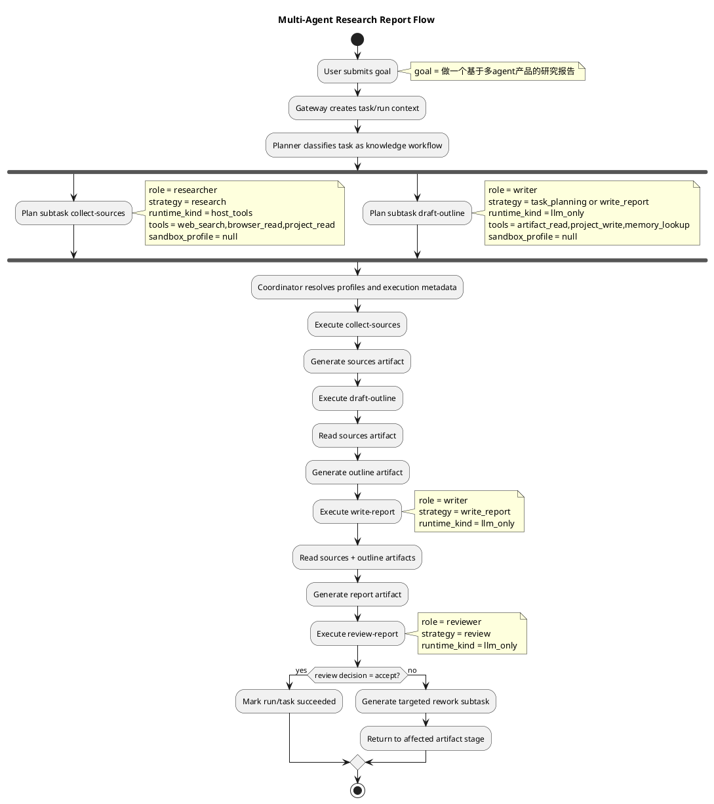

# Planner 的 tool / sandbox 决策与任务语义不匹配

## 1. 问题概述

当前系统在 planner 到 execution 的链路上，对 `required_tool_groups`、`preferred_strategy`、`sandbox_profile` 的处理偏保守，也偏耦合。结果是很多本应直接走 LLM 推理或宿主机工具的子任务，被一路推成“需要 sandbox 执行，而且默认是 py-basic”。

这会带来两类明显问题：

1. 写大纲、写总结、做 review 这类纯认知型任务，被错误地当成 sandbox 任务。
2. research / search 这类任务没有区分“普通网页检索”和“必须无头浏览器/动态页面执行”的差异，sandbox 选择也因此失真。

---

## 2. 当前现状

## 2.1 Planner fallback 规则本身就偏向 sandbox

当前规则规划里：

1. `prepare-implementation` 默认带 `PROJECT_READ + PROJECT_WRITE + SANDBOX_EXEC`。
2. 一旦任务包含“测试/验证”，`verify-result` 默认带 `SANDBOX_EXEC + ARTIFACT_READ`。
3. 规则规划生成的实现子任务默认 `sandbox_profile=task.metadata.profile or py-basic`。

对于代码实现任务，这样做可以接受；但它奠定了一个全局倾向：只要不是非常明确的 review/tester 场景，就容易被归到 sandbox 执行范式。

## 2.2 LLM planner 的缺省补全也会把空 profile 拉回 py-basic

LLM 规划路径里，`_normalize_plan_subtask()` 会先把空字符串 `sandbox_profile` 规范化为 `null`，这一步本身没有问题。

但在真正构建 `SubTask` 时，逻辑仍然是：

1. `spec.sandbox_profile or task.metadata.get("profile", "py-basic")`

这意味着：

1. 只要 planner 没有显式给出 sandbox profile，最终就会继承任务级 profile。
2. 如果任务提交时默认 profile 是 `py-basic`，那很多本来不需要 sandbox 的子任务，最后也会携带 `py-basic`。

## 2.3 Coordinator 会继续按 profile 默认值补齐 sandbox

`Coordinator.assign()` 又会根据 agent profile 继续求一次 execution profile：

1. `subtask.sandbox_profile`
2. `agent_profile.default_sandbox_profile`
3. `task.metadata.profile`

内置 profile 里：

1. `coder-default` 的默认 sandbox 是 `py-basic`
2. `executor-default` 的默认 sandbox 是 `py-basic`
3. `tester-default` 的默认 sandbox 是 `py-basic`
4. `researcher-default` 的默认 sandbox 是 `research-net`

于是 planner 只要把角色或策略定得偏执行化，后续很容易被系统自动补成带 sandbox 的 execution profile。

## 2.4 ExecutionRunner 还会按 strategy 再次强制注入 runtime tool

当前运行时工具选择逻辑里，以下 strategy 会被强制加入 `sandbox_exec`：

1. `build_app`
2. `research`
3. `write_report`
4. `task_planning`

而默认策略注册又把这些 strategy 统一映射到 `_strategy_execute_sandbox()`：

1. `build_app -> sandbox`
2. `research -> sandbox`
3. `write_report -> sandbox`
4. `task_planning -> sandbox`

这意味着，即使 planner 没有显式说“我要开 sandbox”，只要子任务策略被判定为这些类型，ExecutionRunner 也会强制按 sandbox runtime 处理。

## 2.5 当前系统没有表达“无需 sandbox”的一等语义

系统现在有：

1. role
2. strategy
3. tool groups
4. sandbox profile

但没有一个明确字段表达：

1. 这个子任务是 `llm-only`
2. 这个子任务是 `host-tooling`
3. 这个子任务才是 `sandboxed`

因此 `strategy` 被迫同时承担“任务意图”和“运行时形态”两种职责，耦合度过高。

---

## 3. 为什么你观察到的现象会出现

你提到的两个例子，和现有实现是高度一致的。

## 3.1 写大纲某个部分，其实只需要 LLM，不需要 py-basic sandbox

这是当前系统最典型的误判类型。

类似任务的本质是：

1. 输入已有上下文或 artifacts
2. 模型基于语义进行整理、归纳、续写
3. 最多需要 `artifact_read`、`project_write` 或 memory lookup

它不需要：

1. 创建隔离环境
2. 执行 shell/python 命令
3. 使用 `py-basic` 镜像

但当前系统里，`write_report` 和 `task_planning` 都会被 ExecutionRunner 拉到 sandbox 执行，所以“写大纲”会被误当成 sandbox work。

## 3.2 搜索查询内容，不一定都需要 sandbox 或无头浏览器

当前系统里，research 类角色和 strategy 倾向使用：

1. `web_search`
2. `browser_read`
3. `research-net`
4. 甚至在 runtime 再加 `sandbox_exec`

但真实需求应该至少分三档：

1. `普通检索`：搜索结果页、普通网页抓取、文档摘要。只需要 `web_search` 和 `browser_read`。
2. `增强浏览`：需要动态页面渲染、滚动、点击、等待前端渲染，才需要无头浏览器。
3. `受控执行`：需要下载文件、运行脚本、做网页自动化提取，才应该进入 sandbox 或专用浏览器 runtime。

现在的问题是，系统没有把这三档能力区分开。

---

## 4. 根因分析

## 4.1 strategy 与 runtime 被绑定得过死

当前代码默认把 `task_planning`、`research`、`write_report` 都注册为 sandbox strategy。这会导致：

1. 语义上是“研究/写作/规划”的任务
2. 实际运行上却被等同于“需要 sandbox command execution”

这是当前问题的核心根因。

## 4.2 sandbox_profile 的 fallback 触发过早

当前系统在 planner 阶段就把缺失的 `sandbox_profile` 回退到了任务级 profile。这个时机太早。

更合理的顺序应该是：

1. 先判断任务是否真的需要 sandbox
2. 只有需要 sandbox 时，才去解析 `sandbox_profile`

现在是反过来的，所以会出现“不需要 sandbox，但字段里已经带了 py-basic”的污染。

## 4.3 tool 选择存在二次注入，planner 意图会被 runtime 覆盖

当前至少有三层会影响工具和 sandbox：

1. planner 生成 `required_tool_groups`
2. coordinator 结合 agent profile 生成 execution profile
3. execution runner 再按 strategy 强制补 runtime tool

这会让 planner 的输出不再是最终执行意图，而更像“一个初稿”。

问题不在于允许 runtime 修正，而在于这些修正缺少明确边界，导致过度修正。

## 4.4 “浏览器能力”与 “sandbox 能力” 没有清晰分层

当前系统里：

1. `browser_read` 更像一个 host-side fetch/summarize 工具
2. `sandbox_exec` 是真正的受控执行能力

但 planner 并没有被要求先区分：

1. 只需要 HTTP/页面读取
2. 需要 headless browser automation
3. 需要通用 sandbox command execution

所以会把“浏览网页”与“开沙箱执行”混在一起。

## 4.5 `strategy` 当前不是多余字段，但它的职责定义错了

这是这份方案里需要单独说明的一点。

如果只看现在 planner 的表面结构，确实会产生一个自然问题：

1. 既然 plan 已经决定了 `subtask.role`
2. 也已经决定了 `required_tool_groups`
3. 那为什么还需要 `preferred_strategy`

从当前代码实现看，`strategy` 现在并不冗余，因为它还承担了这些职责：

1. ExecutionRunner 用它决定走哪条执行分支。
2. 系统会发布 `strategy.started/completed/failed` 事件。
3. role 的默认行为仍然通过 strategy 做二次解析。
4. review、verification、build_app 这些子任务的结果结构和处理流程，当前也是按 strategy 区分的。

所以在“当前实现”里，`strategy` 不是死字段。

但问题在于，它现在承担了太多职责：

1. 它既像“任务语义标签”。
2. 又像“执行实现选择器”。
3. 还部分承担了“默认工具注入依据”。
4. 甚至间接影响了 `sandbox_profile`。

这才是它看起来冗余、实际又删不掉的原因。

换句话说，当前不是 `strategy` 存在本身有问题，而是 `strategy` 被赋予了错误的系统边界。

---

## 5. 设计决策：`strategy` 保留，但降级为“工作流语义”，不再决定 runtime

这一版设计建议不要直接删除 `strategy`，但要明确它以后只保留一种职责：

1. 表达该 subtask 属于哪类工作流语义或结果契约。

建议理解为：

1. `role` 解决“谁来做”。
2. `tool_groups` 解决“能用什么”。
3. `runtime_kind` 解决“在哪里、以什么执行形态运行”。
4. `strategy` 只解决“这一类子任务遵循什么处理模板和输出契约”。

### 5.1 为什么不建议直接删除 `strategy`

如果完全删除 `strategy`，只保留 `role + tool_groups + runtime_kind`，短期会丢掉一层很重要的语义抽象。

下面这些差异，单靠 role 很难表达完整：

1. `tester` 既可能做“跑真实测试”，也可能做“基于 artifacts 做验证”。
2. `writer` 既可能做“写报告正文”，也可能做“整理提纲”或“生成摘要”。
3. `researcher` 既可能做“普通检索”，也可能做“深度资料梳理”或“动态网页提取”。
4. `planner` 既可能做“任务分解”，也可能做“局部重规划”或“失败修复规划”。

这些差异背后通常对应：

1. 不同的 prompt 模板。
2. 不同的输出 schema。
3. 不同的验收逻辑。
4. 不同的 repair/rework 处理方式。

这层抽象是有价值的，只是不应该继续和 sandbox runtime 绑定。

### 5.2 `strategy` 真正应该表达什么

建议把 `preferred_strategy` 的含义收敛为：

1. `workflow_profile`
2. 或者继续保留名字 `strategy`，但文档中明确它表示“工作流模板”

它应该只负责这些事情：

1. 选择 prompt/template 家族。
2. 决定结果结构，例如 verification result、review decision、report draft。
3. 决定子任务的默认 acceptance schema。
4. 决定同类子任务的事件语义和审计分类。

它不应该再直接决定：

1. 是否开 sandbox。
2. 是否注入 `sandbox_exec`。
3. 使用哪个 `sandbox_profile`。
4. 是否走 headless browser。

### 5.3 新的职责边界

建议新的边界定义如下：

1. `role`
   - 逻辑职责边界
   - 例如 planner / coder / tester / reviewer / researcher / writer

2. `strategy`
   - 工作流语义与结果契约
   - 例如 task_planning / write_report / verification / review / build_app

3. `required_tool_groups`
   - capability 需求
   - 例如 project_write / artifact_read / web_search

4. `runtime_kind`
   - 执行形态
   - 例如 llm_only / host_tools / sandbox / browser_automation

5. `sandbox_profile`
   - 仅在 `runtime_kind=sandbox` 时生效

### 5.4 推荐结论

因此，这份方案的明确结论是：

1. `strategy` 不建议删除。
2. `strategy` 不应该再承担 runtime 决策职责。
3. 当前系统里真正冗余的不是 `strategy` 字段本身，而是“用 `strategy` 兼任 runtime selector” 这件事。

如果后续希望进一步降低歧义，可以考虑第二阶段重命名：

1. `preferred_strategy` -> `workflow_profile`

但这属于 API 和模型层的命名演进，不是这次设计重构的第一优先级。

### 5.5 `skill` 在当前服务里是怎么用的，以及它为什么看起来和 `strategy` 重合

这一点需要单独拆开，否则很容易把三个不同层次的概念混成一个：

1. `strategy`
2. `skill`
3. `tool`

#### A. 当前服务里 `skill` 的两种主要用法

从当前实现看，`skill` 主要有两种使用方式。

第一种是：作为 AgentScope 的原生 agent-skill 包。

这条链路大致是：

1. `AgentProfile` 上配置 `skill_profiles`
2. `Coordinator` 把 `skill_profiles` 写进 `ExecutionProfile`
3. `AgentFactory.create_toolkit()` 根据 `skill_profiles` 加载本地 skill 包目录
4. 这些 skill 会作为 agent 的可用能力一起挂到 AgentScope toolkit 上

这类 skill 更像：

1. 一组打包好的 agent 能力模块
2. 一种 prompt + 资源 + 工具约束的组合
3. 给 agent 提供“会做哪类事”的能力包

第二种是：作为 formal skill script 通过工具执行。

这条链路大致是：

1. `ExecutionRunner` 注册 `run_skill_script` 工具
2. subtask 在运行过程中显式调用 `run_skill_script`
3. `SkillExecutionService` 执行 skill script
4. 结果写成 artifact，并发布 `skill.script.*` 事件

这类 skill 更像：

1. 一组可声明、可审计、可落库的脚本化能力
2. 例如某个 skill 包里声明了 `script.py`
3. 执行时可以带 sandbox policy、artifact_paths、环境变量等

也就是说，当前服务里的 `skill` 不是一个单一概念，它同时覆盖了：

1. agent 的能力包
2. 可执行脚本包

#### B. 为什么你会觉得它和 `strategy` 重合

你的感觉是对的，当前系统里它们确实被做得很近。

最直接的证据是默认 profile 配置里，很多值几乎一一对应：

1. `default_strategy = write_report`，同时 `skill_profiles = ["write_report"]`
2. `default_strategy = research`，同时 `skill_profiles = ["research"]`
3. `default_strategy = verification`，同时 `skill_profiles = ["verification"]`

这会让整个系统呈现出一种表象：

1. strategy 叫 `write_report`
2. skill profile 也叫 `write_report`
3. 看起来像是同一个东西被写了两遍

因此你会自然觉得重合。

#### C. 但从产品设计上，它们不应该是同一个概念

更合理的边界应该是：

1. `strategy`
   - 控制面概念
   - 表达 subtask 属于哪种 workflow 语义
   - 关注“这类任务的输出契约是什么”

2. `skill`
   - 能力面概念
   - 表达系统有哪些可复用能力包或脚本包
   - 关注“系统能怎么做”

3. `tool`
   - 最小执行单元
   - 表达 agent 或执行器实际调用了什么动作

如果用一句话概括：

1. `strategy` 是任务模板
2. `skill` 是能力封装
3. `tool` 是原子动作

#### D. 正确的依赖关系应该是什么

更合理的关系应该是：

1. 一个 `strategy` 可以使用 0 个、1 个或多个 `skill`
2. 一个 `skill` 可以被多个 `strategy` 复用
3. 一个 `skill` 内部可以再暴露多个 `tool` 或 `script`

例如：

1. `write_report` strategy
   - 可能不用任何 skill，直接走 `llm_only`
   - 也可能使用一个 `report_writer` skill

2. `research` strategy
   - 可能只用 `web_search`、`browser_read`
   - 也可能在特定场景调用 `browse_headless` skill

3. `verification` strategy
   - 可能只读 artifacts
   - 也可能调用 `pytest_runner` skill script

这三者之间不应该是一一绑定关系。

#### E. 当前系统真正的问题是什么

当前系统的问题不是“同时存在 skill 和 strategy 一定错误”，而是：

1. 命名太像
2. 默认值太像
3. 运行时边界没写清楚

于是现在会出现一种事实上的耦合：

1. strategy 名字像 skill 名字
2. agent profile 默认同时绑定两者
3. 让人以为 strategy 就是 skill，skill 就是 strategy

从产品设计上看，这种耦合应该拆开。

#### F. 设计建议：保留 skill，但不要让它和 strategy 一一同名绑定

这份方案建议：

1. `strategy` 保留，作为 workflow 语义字段
2. `skill` 保留，作为能力包或脚本包字段
3. 取消“一个 strategy 默认等于一个 skill profile”的隐式约定

推荐改成下面这种关系：

1. `strategy`
   - 例如 `research_reporting`
   - `outline_generation`
   - `report_review`

2. `skill`
   - 例如 `web_research`
   - `headless_browser`
   - `report_writer`
   - `pytest_runner`

3. `tool`
   - 例如 `web_search`
   - `browser_read`
   - `run_skill_script`

这样一来：

1. strategy 描述工作类型
2. skill 描述可复用能力包
3. tool 描述实际动作

三者就不会继续重名和重义。

#### G. 最终结论

如果按产品设计来讲，`skill` 和 `strategy` 不应该视为同一个概念。

1. `strategy` 决定这段 subtask 的 workflow 语义与结果契约。
2. `skill` 决定执行器可复用哪些封装能力。
3. `tool` 决定运行时最终调用什么原子动作。

你现在会觉得它们重合，是因为当前默认 profile 把两者做成了近乎同名的一一映射。这种实现方便起步，但不适合作为最终产品设计。

---

## 6. 用具体任务解释：`做一个基于多agent产品的研究报告` 时系统应该怎么做

这一节不再抽象讨论字段，而是直接用一个真实输入，把整条链路按目标设计走一遍。

假设用户提交：

```json
{
  "goal": "做一个基于多agent产品的研究报告"
}
```

在这版设计里，系统的理解应该是：

1. 这是一个“研究 + 写作 + 审核”的知识型任务。
2. 默认不包含“运行代码”“编译项目”“执行脚本”的要求。
3. 因此默认不应该进入通用 sandbox runtime。
4. 它主要依赖的是检索、阅读、整理、写作和审查能力。

### 6.1 Gateway 接到请求后应该先生成什么顶层意图

Gateway 在这一层只负责接收请求和补齐控制面元数据，不负责决定具体怎么执行。

它会形成一个顶层任务上下文，核心上包括：

1. `task.goal = 做一个基于多agent产品的研究报告`
2. `task.metadata.profile`
   - 可以保留用户提交的默认 profile
   - 但这个值此时只表示“如果后续真的需要 sandbox，可优先参考的默认 profile”
   - 不能理解成“所有 subtask 都必须继承它”
3. `task.metadata.preferred_strategy`
   - 如果用户没显式指定，可以为空
   - 不应默认塞成 `build_app`

这个阶段最重要的设计原则是：

1. 不要因为任务请求里有一个默认 profile，就提前把所有子任务推向 sandbox。

### 6.2 Planner 应该如何理解这个任务

Planner 看到这个 goal 后，应该先做任务语义判断，而不是先选 sandbox。

它应该把任务判定为一个知识型 DAG，大致包含 4 类工作：

1. 收集资料
2. 整理研究框架和报告大纲
3. 撰写正文
4. 审核和定稿

这里最关键的是，Planner 输出时要同时分清四类字段：

1. `role`
   - 谁负责这类工作
2. `strategy`
   - 这类工作属于哪种工作流模板
3. `required_tool_groups`
   - 需要哪些能力
4. `runtime_kind`
   - 实际运行形态是什么

### 6.3 这个任务在目标设计下应当被拆成什么 subtasks

推荐拆成下面 4 个主子任务：

| subtask | role | strategy | required_tool_groups | runtime_kind | sandbox_profile |
|---|---|---|---|---|---|
| collect-sources | researcher | research | web_search, browser_read, project_read | host_tools | null |
| draft-outline | writer | task_planning 或 write_report | artifact_read, project_write, memory_lookup | llm_only | null |
| write-report | writer | write_report | artifact_read, project_write, memory_lookup | llm_only | null |
| review-report | reviewer | review | artifact_read, memory_lookup | llm_only | null |

这里要特别解释两点。

第一，`draft-outline` 不应该进 sandbox。

原因是它的本质是：

1. 读取前一步研究产出
2. 基于已有材料组织报告结构
3. 输出一份结构化大纲

这完全属于 LLM 语义整理任务，不需要 shell，不需要 Python，不需要镜像环境。

第二，`collect-sources` 也不应该默认进通用 sandbox。

原因是它默认只是在做：

1. 搜索信息
2. 阅读网页
3. 归纳来源

这应该属于 `host_tools`。只有在子任务明确变成下面这种情况时，才考虑进入专门 runtime：

1. 需要动态网页渲染
2. 需要登录态或点击交互
3. 需要网页自动化抓取
4. 需要下载并执行提取脚本

### 6.4 每个子任务实际会怎么执行

#### A. `collect-sources`

系统行为应当是：

1. Coordinator 选择 `researcher` 角色对应的 agent/profile。
2. ExecutionProfile 解析出：
   - `role=researcher`
   - `strategy=research`
   - `runtime_kind=host_tools`
   - `required_tool_groups=web_search,browser_read,project_read`
   - `sandbox_profile=null`
3. ExecutionRunner 进入 `host_tools` 分支，而不是 sandbox 分支。
4. Agent 可以调用：
   - `web_search` 搜索多 agent 产品和框架
   - `browser_read` 读取官网、文档、案例页
5. 输出一份 sources artifact，例如：
   - 产品名单
   - 来源链接
   - 每个产品的核心特点摘要

#### B. `draft-outline`

系统行为应当是：

1. 读取 `collect-sources` 的 artifact。
2. 使用 writer/planner 类型提示词，把信息压缩成报告结构。
3. runtime 选择 `llm_only`。
4. 不分配 sandbox，不解析 `sandbox_profile`。
5. 输出 outline artifact，例如：
   - 引言
   - 关键概念
   - 代表性产品分析
   - 技术架构对比
   - 应用场景与趋势
   - 结论

#### C. `write-report`

系统行为应当是：

1. 读取 sources artifact 和 outline artifact。
2. 使用 `write_report` 工作流模板扩展成完整正文。
3. runtime 仍然是 `llm_only`。
4. 写出 report artifact。

这里的关键是：

1. `write_report` 只表示“这是写作型 workflow”。
2. 它不再自动意味着“去开一个 sandbox”。

#### D. `review-report`

系统行为应当是：

1. reviewer 读取已有 artifact。
2. 基于事实完整性、结构合理性、引用可信度做审查。
3. runtime 仍然是 `llm_only`。
4. 输出 review decision，例如：
   - `accept`
   - `rework`
   - `escalate`

如果需要返工，返工的对象通常是：

1. sources 不足
2. outline 不完整
3. 正文缺少对比分析

而不是默认触发“重新开一个 py-basic sandbox”。

### 6.5 这个例子里为什么 `strategy` 仍然有必要

这个例子恰好能说明为什么 `strategy` 不该删除。

因为 `draft-outline` 和 `write-report` 很可能都是：

1. `role=writer`
2. `runtime_kind=llm_only`
3. 需要 `project_write`

如果没有 `strategy`，系统很难知道它们之间的差别：

1. `draft-outline` 的输出应该是结构化提纲
2. `write-report` 的输出应该是完整正文

它们在以下方面都不同：

1. prompt 模板不同
2. 输出格式不同
3. 验收标准不同
4. 后续 review 的关注点不同

所以在这个例子里，`strategy` 的价值不是决定 sandbox，而是决定“同样是 writer，这一轮到底在执行哪种工作流模板”。

### 6.6 这个例子里什么时候才应该真的进入 sandbox

只有在任务语义发生变化时，才应该进入 sandbox。例如用户把需求改成：

1. “抓取若干多agent产品的在线 demo 页面，并自动提取页面中的交互流程”
2. “下载各框架示例代码并跑 benchmark，附到报告里”
3. “把报告自动导出成 pptx 和 pdf，并执行转换验证”

这时才会出现：

1. 需要浏览器自动化 runtime
2. 需要通用 sandbox runtime
3. 需要真正的 `sandbox_profile`

也就是说，sandbox 是任务演化出来的执行需求，不是研究报告任务的默认前提。

### 6.7 这个任务的目标执行流程图



### 6.8 用这一例子反推字段设计结论

如果这条链路看起来是清楚的，那么字段职责也就清楚了。

1. `goal`
   - 用户要什么
2. `role`
   - 谁负责这类工作
3. `strategy`
   - 这类工作是什么 workflow 模板
4. `required_tool_groups`
   - 需要哪些能力
5. `runtime_kind`
   - 真正怎么执行
6. `sandbox_profile`
   - 只在 sandbox runtime 下有效

反过来说，如果系统无法把这个研究报告例子稳定地落成上面的 4 个子任务和 3 种执行形态，那就说明我们当前字段边界仍然没有设计清楚。

---

## 7. 解决方案建议

## 7.1 第一层：把 runtime 类型从 strategy 中拆出来

建议为 subtask 或 execution profile 增加一个显式字段，例如：

1. `runtime_kind = llm_only`
2. `runtime_kind = host_tools`
3. `runtime_kind = sandbox`
4. `runtime_kind = browser_automation`

这样可以把两个问题拆开：

1. `strategy` 只表达任务语义，例如 `task_planning`、`research`、`write_report`
2. `runtime_kind` 只表达执行形态

只有 `runtime_kind=sandbox` 时，`sandbox_profile` 才是必填。

## 7.2 第二层：重新定义 strategy 的默认 runtime

建议默认映射改为：

1. `task_planning -> llm_only`
2. `write_report -> llm_only` 或 `host_tools`
3. `research -> host_tools`
4. `review -> llm_only`
5. `verification -> artifact_only` 或 `sandbox`，按是否真的要跑命令决定
6. `build_app -> sandbox`

只有像下面这些任务，才应该默认进 sandbox：

1. 编译、运行、测试代码
2. 执行 shell/python/node 命令
3. 生成需要隔离环境的文件
4. 运行受控脚本或 skill script

## 7.3 第三层：把 research 再细分成三档能力

建议引入更细的研究/搜索分类：

1. `search-basic`
   - 工具：`web_search`
   - 不需要 sandbox

2. `browse-basic`
   - 工具：`browser_read`
   - 不需要 sandbox

3. `browse-headless`
   - 需要真正的无头浏览器能力
   - 可以是专用 browser runtime，也可以是专门的 sandbox profile

4. `web-extraction-exec`
   - 需要下载、脚本执行、DOM 自动化、文件提取
   - 才进入 sandbox 或 browser automation runtime

这样 planner 在处理“搜索查询内容”时，就不会默认走错到 `py-basic`。

## 7.4 第四层：为 planner 增加硬性校验规则

建议加入以下校验：

1. 如果 `required_tool_groups` 不包含 `sandbox_exec`，则 `sandbox_profile` 必须为 `null`。
2. 如果子任务是 `task_planning`、`review`、`outline`、`summarize` 等纯认知任务，禁止自动注入 `sandbox_exec`。
3. 如果子任务是 `research`，默认只允许 `web_search`、`browser_read`、`project_read`；只有显式声明动态浏览或受控执行时，才允许 sandbox。
4. 如果 strategy 是 `write_report`，角色应优先为 `writer`，且默认不附带 sandbox。
5. 如果 verification 只是检查 artifacts 和依赖状态，可只使用 `artifact_read`；只有需要真实跑测试时，才附加 `sandbox_exec`。

## 7.5 第五层：让 runtime 注入变成“可见的修正”，不是隐式覆盖

当前 runtime 对工具的强制注入可以保留，但必须记录清楚：

1. planner 原始 `required_tool_groups`
2. runtime 增补的工具
3. 为什么增补
4. 原始 `sandbox_profile`
5. 最终 `resolved_runtime_kind`
6. 最终 `resolved_sandbox_profile`

建议在 subtask metadata 中增加：

1. `original_required_tool_groups`
2. `runtime_injected_tools`
3. `runtime_resolution_warnings`
4. `resolved_runtime_kind`

这样用户就能看出：到底是 planner 选错了，还是 runtime 自动把任务升级成了 sandbox。

## 7.6 第六层：重构 ExecutionRunner 的默认 strategy 注册

这是实现层最关键的一步。

建议把当前这组注册：

1. `task_planning -> _strategy_execute_sandbox`
2. `research -> _strategy_execute_sandbox`
3. `write_report -> _strategy_execute_sandbox`

改成分层实现：

1. `_strategy_execute_llm_only`
2. `_strategy_execute_host_tools`
3. `_strategy_execute_browser_automation`
4. `_strategy_execute_sandbox`

否则即使 planner 变好，runtime 仍然会把很多任务重新拉回 sandbox。

---

## 8. 推荐落地顺序

1. 先修改运行时策略映射，切断 `task_planning/research/write_report -> sandbox` 的默认绑定。
2. 再新增 `runtime_kind` 字段，把 `sandbox_profile` 变成条件字段。
3. 保留 `strategy`，但把它从 runtime selector 收敛为 workflow 语义字段。
4. 给 planner prompt 和 normalization 增加新的分类规则。
5. 给 research/browser/headless 场景补专门的 profile 和命名。
6. 最后补回归测试，覆盖“写大纲不创建 sandbox”和“普通搜索不落 py-basic”。

---

## 9. 结论

当前问题的本质不是 planner 纯粹“写错 JSON”，而是系统把“任务语义”和“执行形态”耦合得太紧，导致很多只需要 LLM 或宿主机工具的任务，被默认推成 sandbox 任务。

在这个前提下，`strategy` 的设计结论也应该明确：它不是应该被直接删除的冗余字段，而是应该从“执行形态选择器”收缩为“工作流语义和结果契约”。

要真正修复这个问题，关键不是继续给 planner 加提示词，而是先把运行时语义拆清楚：

1. 哪些任务是纯推理。
2. 哪些任务是网页读取。
3. 哪些任务才需要无头浏览器。
4. 哪些任务才需要通用 sandbox。
5. 哪些字段负责 workflow，哪些字段负责 runtime。

只有把这层分类变成一等模型，tool 和 sandbox 的选择才会稳定下来。